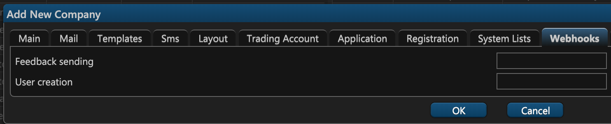

# 10. Webhooks

## Introduction


Webhooks are user-defined HTTP callbacks that POST some data to a specified URL.


On the tenth tab of the company creation tab — **Webhooks** — you can configure webhooks that get triggered in response to some event like user creation or user feedback.

In ETNA Trader, webhooks can be configured for two types of events:

* User feedback;
* User creation.

These two events have corresponding text fields where you need to specify the URL to which the data will be sent. The data is sent in the JSON format.



Following are examples of what you can expect to be sent to the specified URLs.

## User Creation Data

```javascript
{
    "Id" : "int"
    "SecretQuestionId" : "int"
    "Enabled" : "boolean"
    "Login" : "string"
    "AddedDate" : "date"
    "FirstName" : "string"
    "Middle" : "string"
    "LastName" : "string"
    "EmailAddress" : "string"
    "Suffix" : "string"
    "LastLoginDate" : "date"
    "Deleted" : "boolean"
    "IsDemo" : "boolean"
    "TimeZoneInfoId" : "string"
    "AvatarName" : "string"
    "PhoneNumber" : "string"
    "CustomData" : [
        {
            "name" : "string"
        }
    ]
}
```

## FeedBack Data

```javascript
{
    "Id" : "int"
    "Contacts" : "string"
    "Comment" : "string"
    "BrowserName" : "string"
    "BrowserVersion" : "string"
    "UserAgent" : "string"
    "Timestamp" : "int"
    "UserId" : "int"
    "SupportTicketId" : "string"
    "CompanyId" : "int"
    "Subject" : "string"
    "BuildVersion" : "string"
    "Files" : [
        {
            "Link" : "string",
            "Filename" : "string"
        }
    ]
}
```

