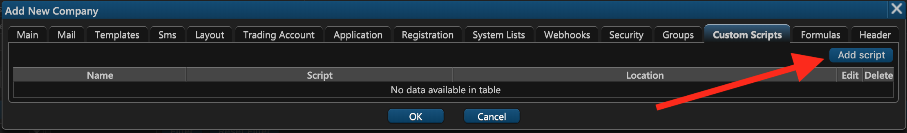
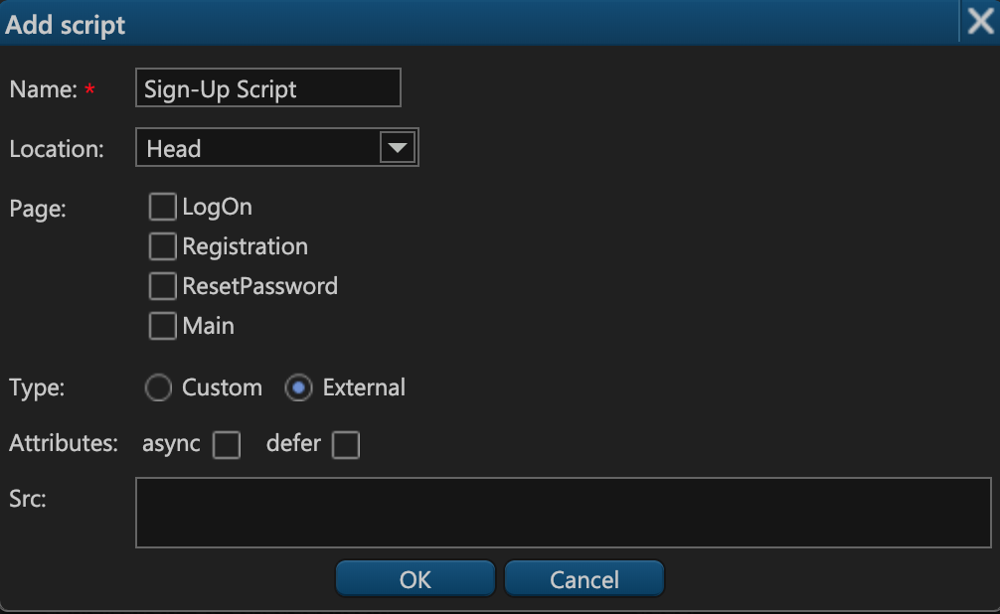

# 13. Custom Scripts

On the thirteenth tab of the company creation window — **Custom Scripts** — you can specify the scripts that must be embedded into the ETNA Trader's source page.

To add a new script, click **Add script**.

In the appeared pop-up window specify the following parameters:

1. **The name of the script**.
2. **Location**. The script can be embedded in either the **head** or the **body** tag.
3. **Page**. Select the pages into which the script should be embedded. There are four pages to choose from: the login page, the sign-up page, the password reset page, and finally the main page.
4. **Type**. This indicates whether the script will be provided here or referenced externally. If you go with the external source, indicate if you want the script to execute asynchronously \(**async checkbox**\) and/or after the page is loaded \(**defer checkbox**\). Finally, specify the script source by entering it into the **Src** text field.

When done, click **OK**.

