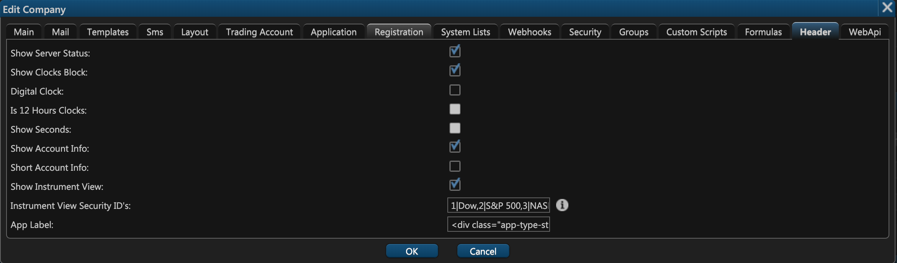
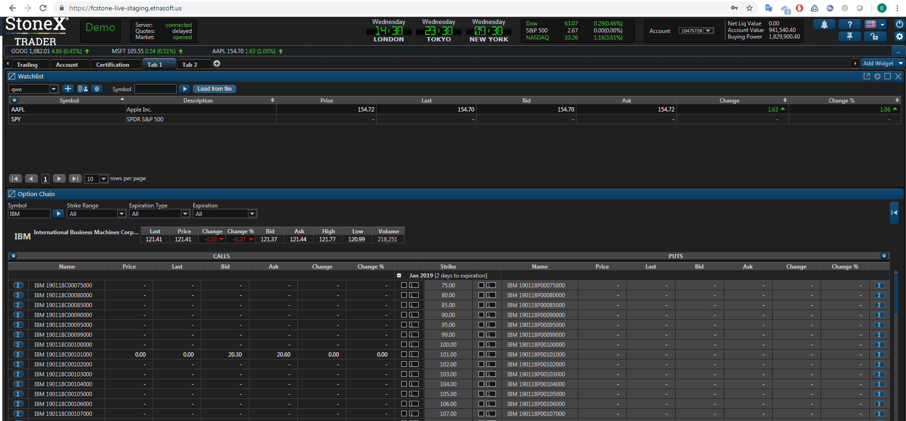
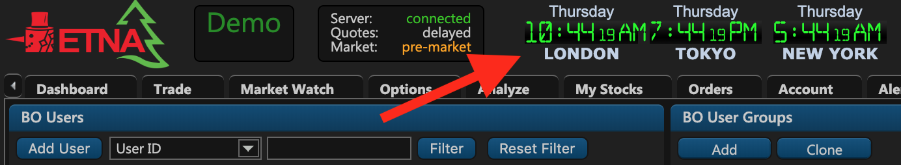
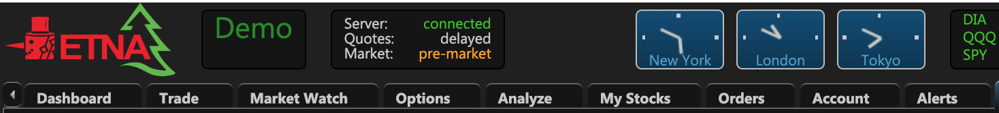
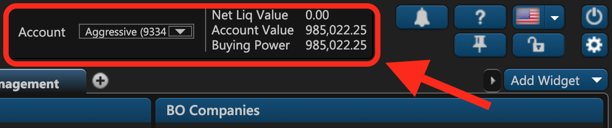
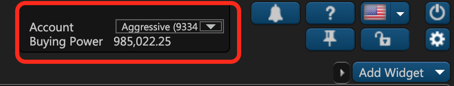
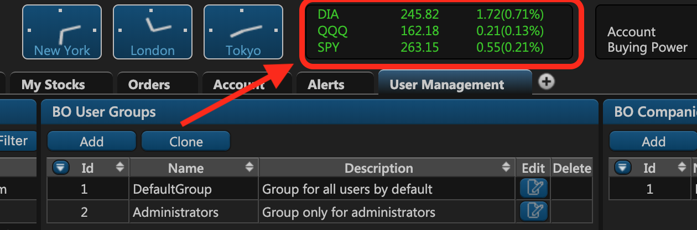

# 15. Header

On the fifteenth tab of the company creation window — **Header** — you can configure layout settings for the web terminal:

* **Show Server Status**. Disabling this option will hide the server status block from the web terminal's header view.

* **Show Clocks Block**. Select this checkbox to display clocks in the header view.

* **Digital Clock**. With this option disabled, the clock faces will transform from digital to analog. 

* **Is 12 Hour Clocks** \(Only available for the digital clock\). Select this checkbox to use the 12-hour time convention.
* **Show Seconds** \(Only available for the digital clock\). Select this checkbox to display the seconds indicator on the digital clocks. 
* **Show Account Info**. Select this checkbox to display the account information block in the header view.

* **Short Account Info**. This option is an extension of the previous option, and it allows you to condense the account information to preserve space in the header view:

* **Show Instrument View**. Select this checkbox to display a list of securities in a separate block in the header view. The list of securities is to be specified in the following text field.

* **Instrument View Security IDs**. Related to the previous option, use this text field to specify the list of securities you want to be displayed in the instrument view. The syntax for this notation is as follows: `securityID|Displayed name`. For example: `4|Apple`.
* **App Label**. This is the label displayed in the header view to the right of the company logo:

