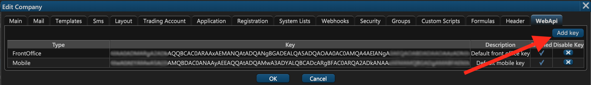
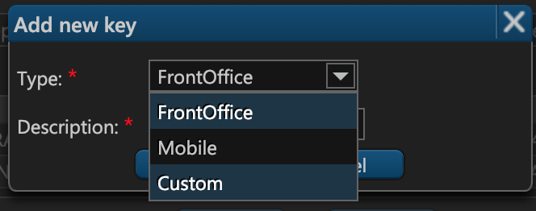

# 16. Web API

While ETNA Trader provides both the web and the mobile interfaces for executing trades and analyzing markets, some of our customers choose to implement their own custom interfaces that meet certain requirements. For this purpose, ETNA Trader provides a [special API](https://etnatraderapi.atlassian.net/wiki/spaces/PAPI/overview) which can be invoked to perform various trading-related procedures like creating users, getting quotes, and placing orders.

In order to use this API, you have to first authenticate yourself by providing a special token using a POST method from our documentation. This token can be generated on the sixteenth tab of the company creation window — **WebAPI**.

Here you have two default tokens already generated for you — FrontOffice and Mobile. The **FrontOffice** token is intended for the web terminal functionality while the **Mobile** token is reserved for mobile applications.

If you want to generate a new key, click **Add key**.

Select the required key type, enter the key's description, and click **OK**.

