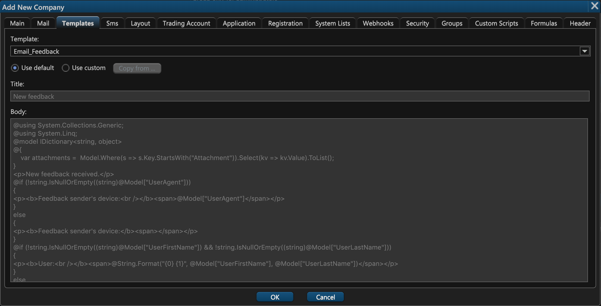
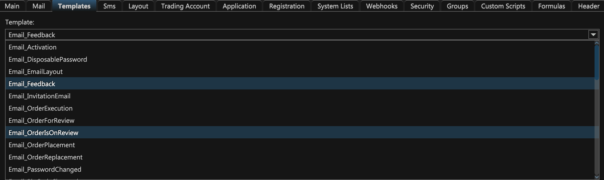
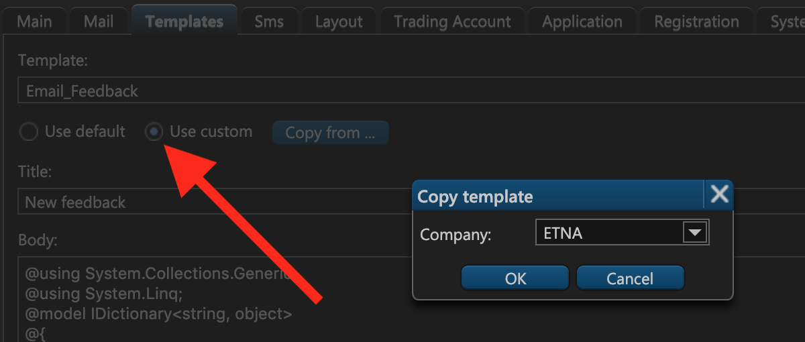

# 3. Templates

The third tab of the company creation window deals with email templates. If you've configured an email server on the previous [tab](2.-email.md), now you can proceed to create email templates for different events like account activation, order execution, price alerts, and so forth.

ETNA Trader provides default values for these templates, but you can also configure them yourself by modifying the **Title** and the **Body**.

To switch templates, expand the uppermost drop-down menu and select the required email template.

To import email templates from a different company, click Use custom and then select the target company. Once you click **OK**, all email templates from the selected company will be copied to the newly created company.

