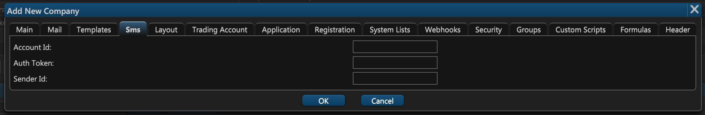

# 4. SMS

ETNA Trader supports SMS notifications for various events like order execution and price alerts via a service called Twilio. [Twilio](https://www.twilio.com/) is a global SMS platform that enables companies to automate the process of sending and receiving SMS messages through Twilio's API.

If you're interested in configuring SMS notifications for your users, first familiarize yourself with Twilio's [documentation](https://www.twilio.com/docs/sms). Once you've configured your Twilio account, return to ETNA Trader and open up the fourth tab of the company creation window:

Here you should specify the following settings from your Twilio account:

1. **Account ID**. This your Twilio account ID \(think of it as your login\).
2. **Auth Token**. This is the authentication token of your Twilio account \(think of it as your password\).
3. **Sender ID**. This is the alphanumeric Sender ID that allows you to set your company name or brand as the Sender ID when sending one-way SMS messages.

