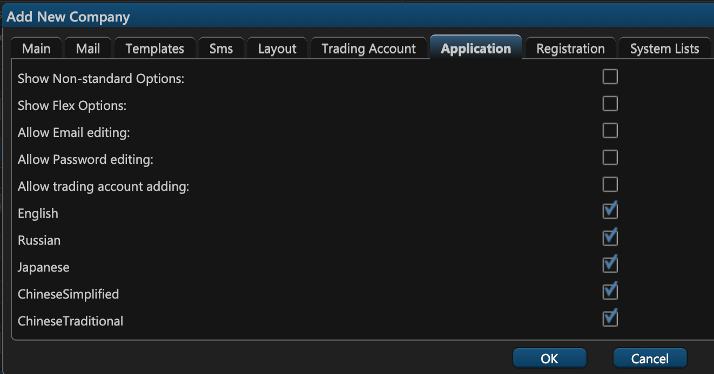

# 7. Application

On the seventh tab of the company creation window — Application — you can find a multitude of various settings, including:

* **Show Non-standard Options**. Select this checkbox to display non-standard options to the user. 
* **Show Flex Options**. Select this checkbox to display flexible exchange options to the user.
* **Allow Email editing**. Select this checkbox to permit users to change their email address.
* **Allow Password editing**. Select this checkbox to permit users to change their password.
* **Allow trading account adding**. Select this checkbox to permit users to add trading accounts.
* **English**. Select this checkbox to permit users to change the interface language to English.
* **Russian**. Select this checkbox to permit users to change the interface language to Russian.
* **Japanese**. Select this checkbox to permit users to change the interface language to Japanese.
* **Chinese Simplified**. Select this checkbox to permit users to change the interface language to the simplified Chinese.
* **Chinese Traditional**. Select this checkbox to permit users to change the interface language to the traditional Chinese.

