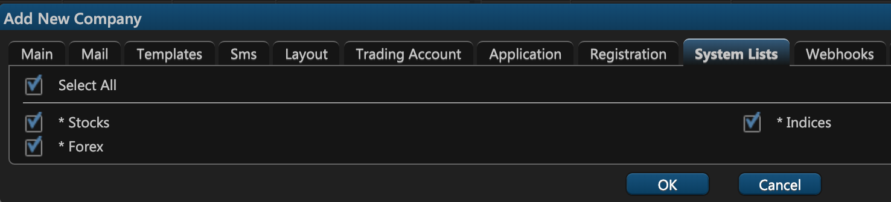

# 9. System Lists

On the ninth tab of the company creation window — **System Lists** — you can indicate the types of financial instruments that should be available to the users of this company. There are three options to choose from:

1. **Stocks**
2. **Forex**
3. **Indices**

