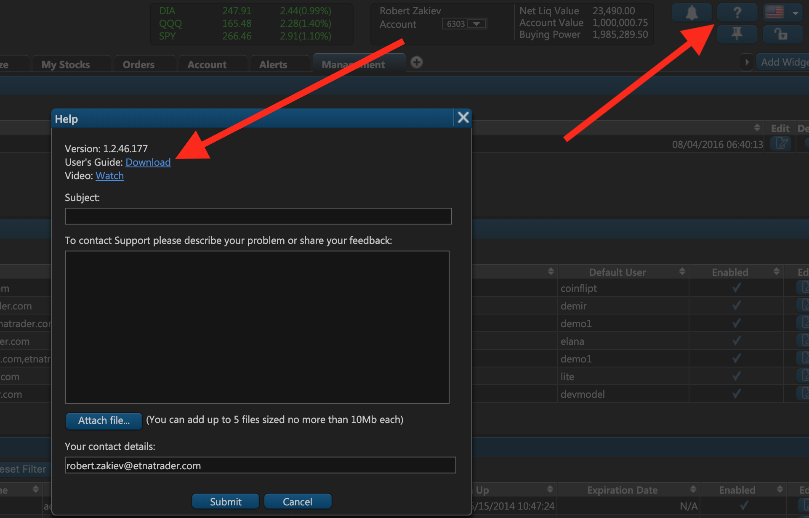
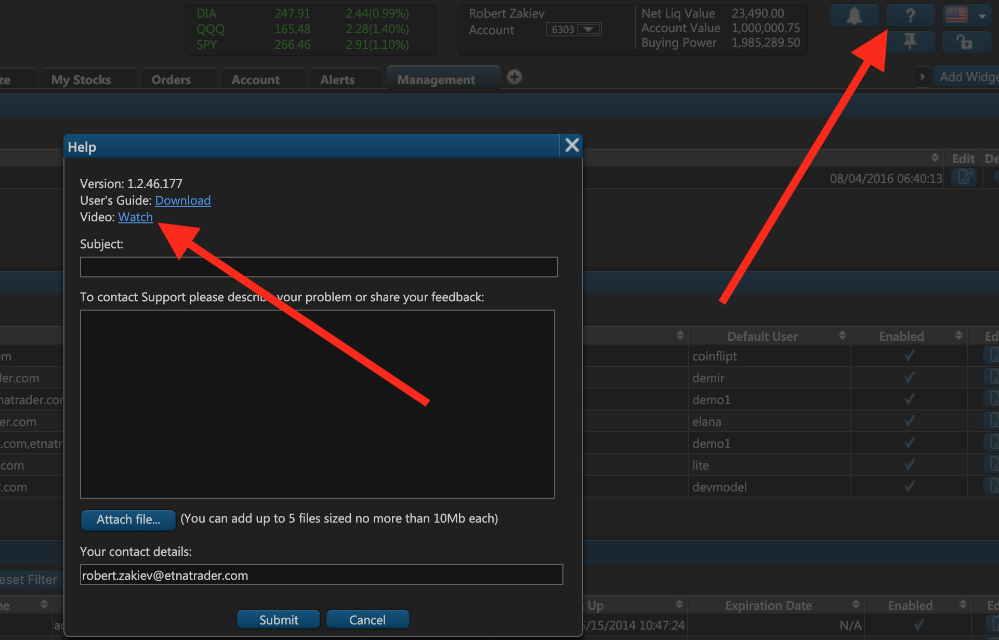

# 1. Main Tab

The first tab you face when creating a new company — **Main** — prompts you to indicate the basic information about the new company:

* **Company ID** \(non-configurable\). This is the company's ID within your environment.
* **Name**. This is the name of the new company.
* **Project Name**. This is the project name that your users will see in emails. Normally it shouldn't differ from the company name. The project name also serves as the tab title in the browser \(&lt;head&gt; &lt;title&gt;\).
* **Hostname**. This is the domain name that hosts your private-labeled instance of the ETNA Trader web terminal. To learn more about configuring a custom domain, feel free to read our dedicated article on the subject.
* **Default Group**. This is the group that will automatically incorporate all newly created users of this company. You must select an existing default group.
* **Default User**. This is the user whose default layout settings will be applied to all newly created users. For example, if your default user is John, and you create a new user called Bob, Bob's layout will be copied from the John's layout. Please note that if you change the default user's settings, these new settings will not automatically be applied to the existing users — their settings will have to be updated individually. However, every new user will always copy the default user's latest settings.
* **User Guide** \(optional\). This is the online location that hosts your user documentation. When your users click on the little question mark button in the upper right-hand corner, they will immediately be redirected to this address.  
* **Video** \(optional\). This is the video guide that demonstrates how to use your private-labeled instance of ETNA Trader. We recommend you make a short video demonstrating the core functionality like placing orders and adding ticker symbols to get your users started.

  

* **Logo**. This is the custom logo your users will see in the upper left-hand corner of the web terminal. Please examine our [white-label guidelines](../../getting-started/private-labeling/white-labelling.md) to learn more about the resolution requirements.
* **Icon**. This is the favicon displayed in the browser's address bar next to the address. Please examine our [white-label guidelines](../../getting-started/private-labeling/white-labelling.md) to learn more about the favicon's resolution requirements. 

The next tab of the company creation window handles email server configuration settings.

