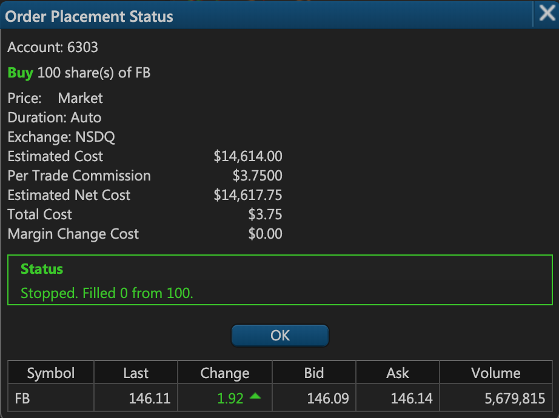
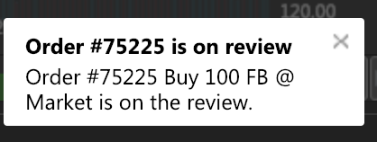
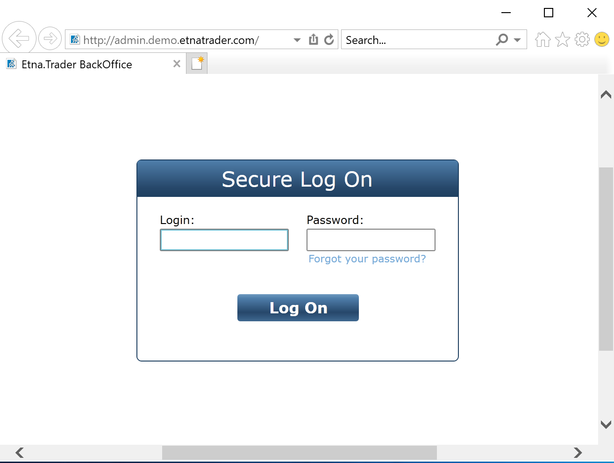
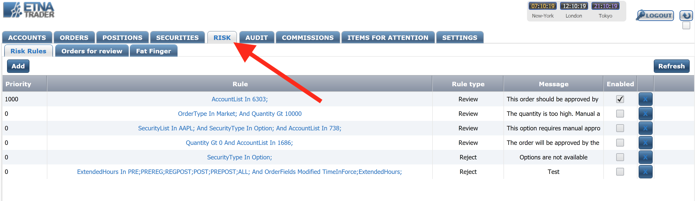
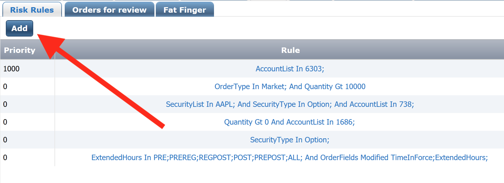
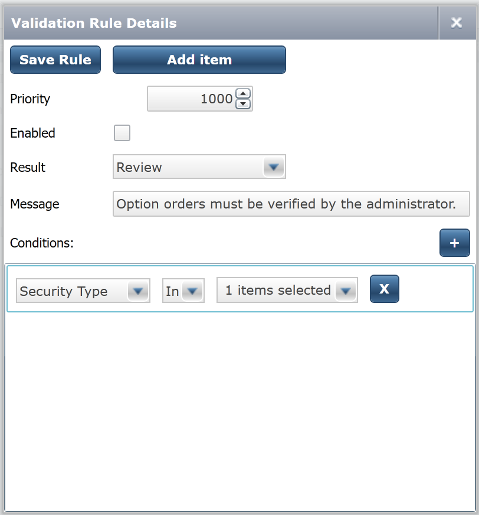
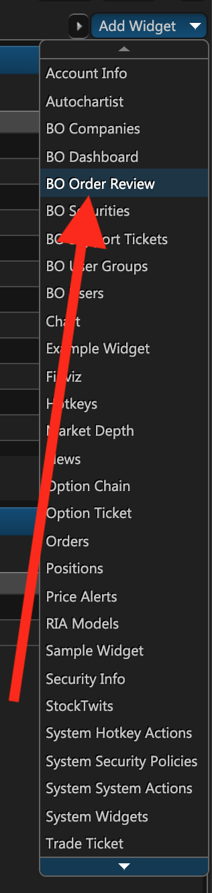
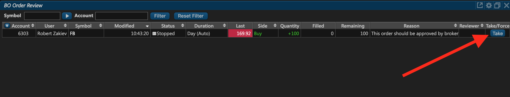
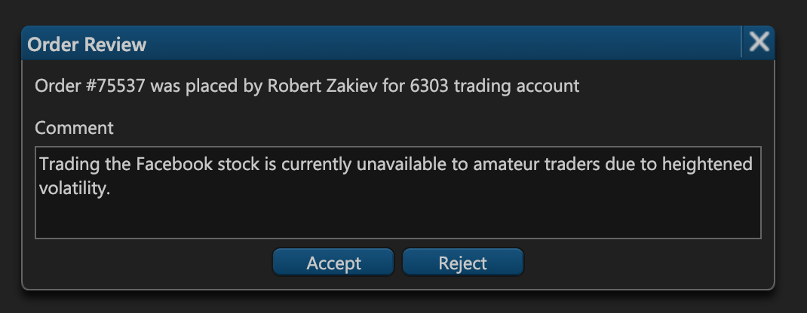

# Order Reviews

### Introduction

By default, all placed orders in ETNA Trader are automatically executed without prior approval from the user's administrator. Consequently, users can place market, limit, and stop-loss orders without any limitations which might lead to unintended consequences like amateur traders selling options or trading on margin. For this reason ETNA traders offers comprehensive order review functionality that enables administrators to configure meticulous rules for each user.

### Understanding Order Review

There are two components to order reviews:

1. Risk rule designer in the ETNA Trader's administrator portal.
2. Order Review Panel in the ETNA Trader's web terminal.

The risk rule designer is located at **admin.yourWebTerminal.com**, and it allows you to create order review rules for all of your users. For example, you can create a rule that will force all orders places on the London Stock Exchange to first be reviewed by administrators. Also, you can automatically reject all orders placed during pre- or post-market hours — the range of possible conditions is quite extensive.

Once the rules are set in place, the administrators in your company will have to review all orders whose characteristics satisfy the conditions in one of those rules. Until a suspended order is reviewed, users will see the following message after placing the order: 

The notifications for such orders will contain the following text:

### Configuring Risk Rules

The first step in configuring the order review is to go to the ETNA Trader's administrator portal \(**admin.yourWebTerminal.com**\) and sign in using your administrator credentials \(regular credentials are invalid for the administrator portal\).


ETNA Trader's administrator portal requires your computer to have [Microsoft Silverlight](https://www.microsoft.com/silverlight/) installed, and it can only be accessed through Internet Explorer.


Once you've logged in to the administrator portal, navigate to the **Risk** tab. This is the tab where all rules are configured.

On this tab you can see all of the existing rules, examine their type and description as well as enable, disable, or remove them altogether. To add a new rule, click **Add**.

The rule creation window will pop-up, prompting you to configure a new rule.

Here you should specify the following parameters:

1. **Priority**. This is the priority of the newly created rule. All rules are prioritized based on the value specified in this text field.
2. **Enabled**. This checkbox indicates if the rules is enabled. If you leave this option disabled, all orders whose characteristics satisfy this rule will be automatically executed.
3. **Result**. Here you can either choose **Review** or **Reject**. With **Review**, all orders whose characteristics satisfy this rule will be sent for review to the company's administrators. With **Reject**, all such orders will automatically be rejected and therefore will not be executed. 
4. **Message**. This is the message that users will see whenever they place an order whose characteristics satisfy this rule. 
5. **Conditions**. These are the conditions of this rule. It is by far the most important aspect of the rules, since these conditions determine which orders are automatically sent for review and which are to be executed without prior approval. The complete list of all conditions is available in a [dedicated article](types-of-conditions.md).

Once you've configured and, importantly, enabled all of the required rules, you can exit the administrator portal. From now on all trading accounts and all orders with characteristics that satisfy the conditions of these rules will automatically be suspended until they're reviewed by an administrator.

### Reviewing Orders

All suspended orders have to be reviewed by administrators who should in turn either approve or reject these orders. The order review process transpires in the **BO Order Review** widget that you can add from the widget list in the web terminal.

Once you've added this widget, notice that it lists all orders that have been suspended due to some active rule. In this case we put in place a rule that would suspend all trade orders that dealt with the Facebook stock. When the user placed this order, they were immediately notified that their order is on review. 

To review an order, click **Take**.

When reviewing an order, specify the reason why you chose to accept or reject the order. Then click **Accept** or **Reject**.

If you clicked **Accept**, the order was executed. Conversely, if you clicked **Reject**, the order was rejected.

