# Types of Conditions

### Conditions

In ETNA Trader, each risk rule can have multiple conditions, and an order must simultaneously satisfy all conditions of an active rule before it is detected by the system and then sent for review. There are a total of 29 different conditions that can be specified in each rule.

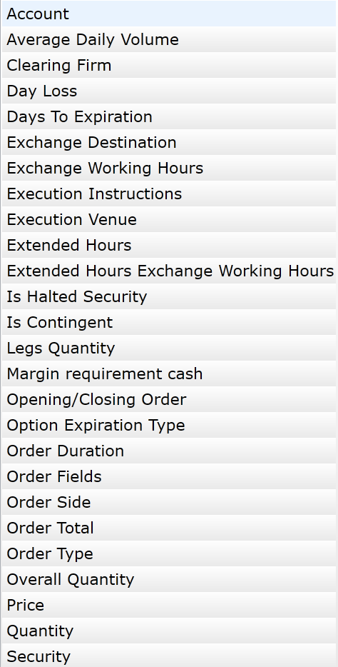

#### **1. Account**

Use this condition to apply the order review mechanism only to specific trading accounts. You can specify multiple accounts, and this rule will be applied to all of them. Alternatively, you can specify to which accounts this rule should not be applied by selecting the **NotIn** option.

#### **2. Average Daily Volume**

Use this condition to apply the order review mechanism only to to those trading accounts whose average daily volume exceeds or is less than the specified amount. Gt refers to "greater" while Lt refers to "less than".

#### 3. Clearing Firm

Use this condition to apply the order review mechanism only to those trading accounts who belong to a particular clearing firm that is indicated in the the text field. Alternatively, you can enforce this rule for all accounts except for the specified by selecting **NotIn** in the drop-down menu.

#### 4. Day Loss

Use this condition to apply the order review mechanism only to those trading accounts whose current day loss is greater than or equal to the specified amount.

#### 5. **Days to Expiration**

Use this condition to apply the order review mechanism to the options whose expiration date is exactly the specified number of days from now.

#### 6. Exchange Destination

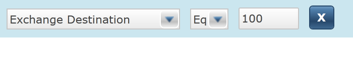

#### 7. Exchange Working Hours

Use this condition to apply the order review mechanism to all orders placed during specific trading hours. For example, you can use this rule to review all orders placed during the pre- and post-market hours.

#### 8. Execution Instructions

Use this condition to apply the order review mechanism to all orders 

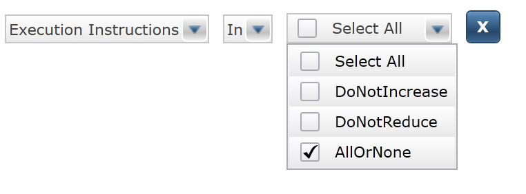

#### 9. Execution Venue

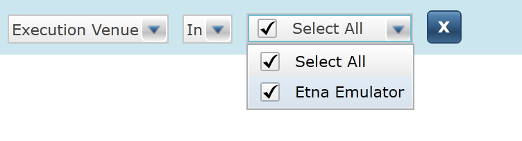

#### 10. Extended Hours

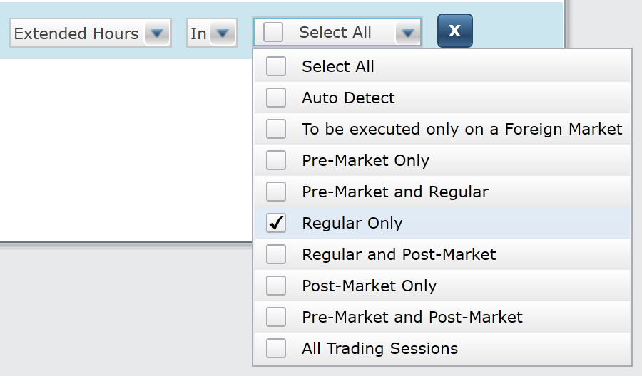

#### 11. Extended Hours Exchange Working Hours

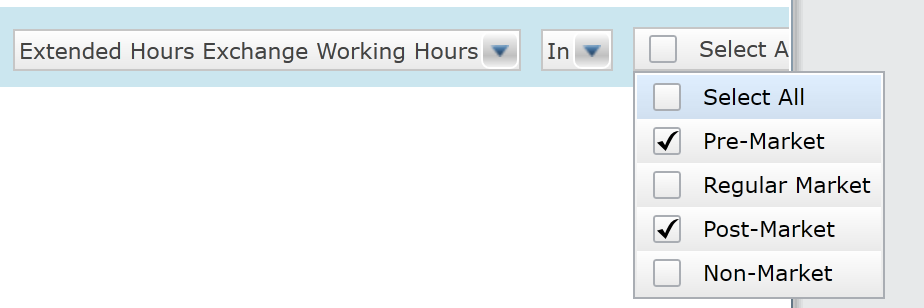

#### 12. Is Halted Security

#### 13. Is contingent

#### 14. Legs Quantity

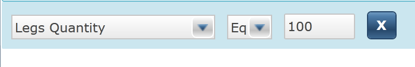

#### 15. Margin Requirement Cash

#### 16. Opening/Closing Order

#### 17. Option Expiration Type

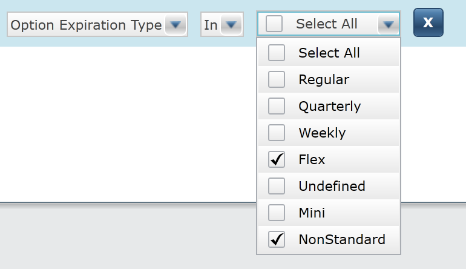

#### 18. Order Duration

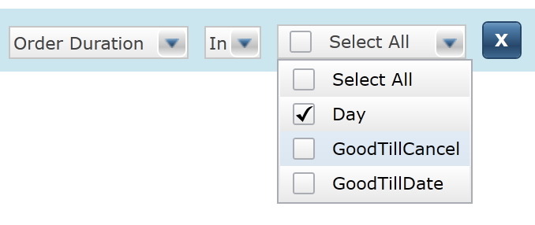

#### 19. Order Fields

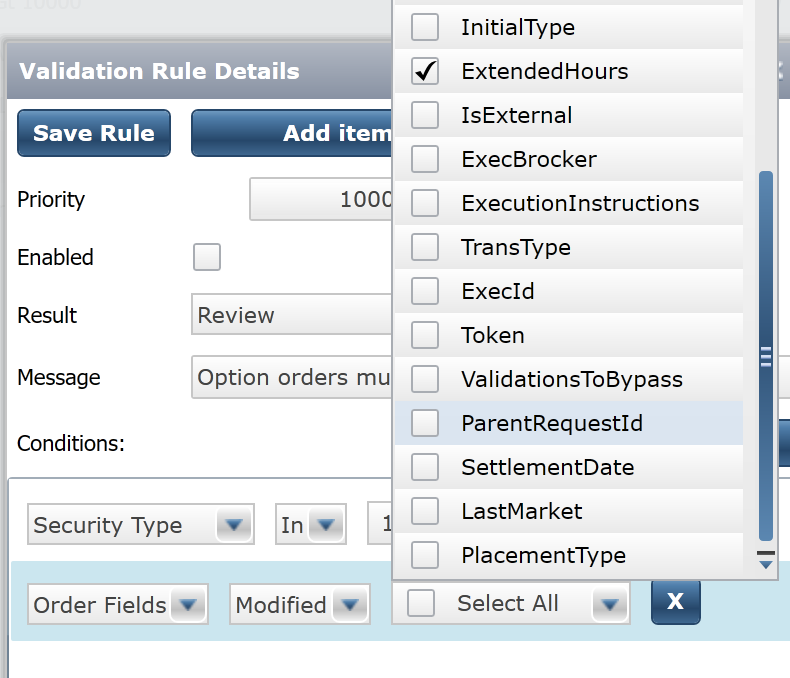

#### 20. Order Side

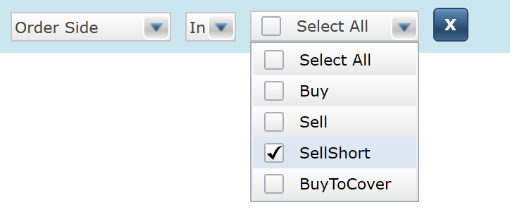

#### 21. Order Total

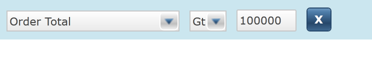

#### 22. Order Type

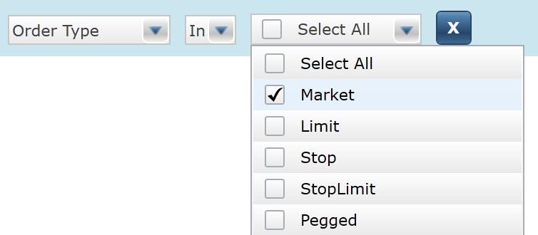

#### 23. Overall Quantity

#### 24. Price

#### 25. Quantity

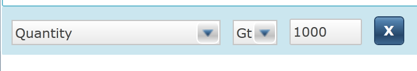

#### 26. Security

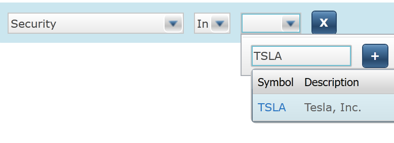

#### 27. Security Exchange

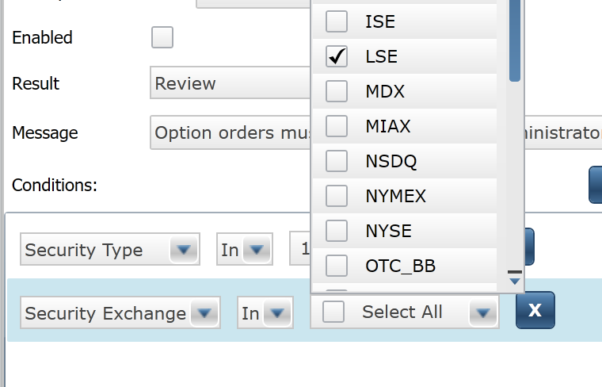

#### 28. Security Exchange Working Hours

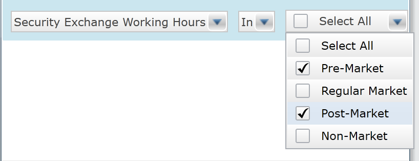

#### 29. Security Type

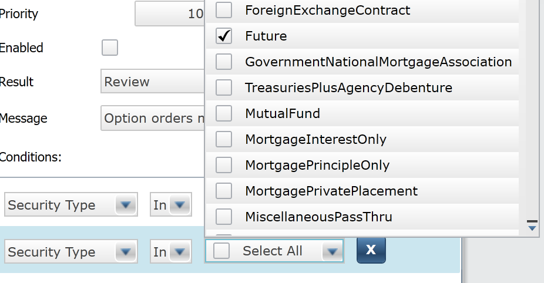

