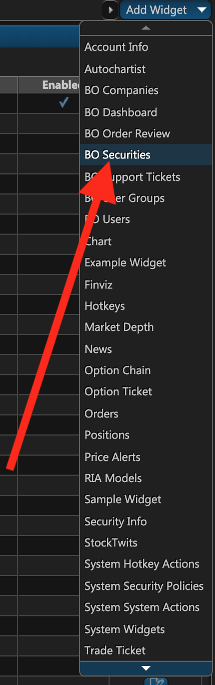
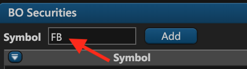
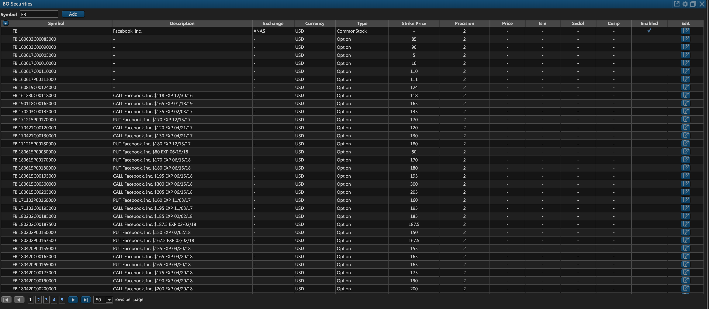
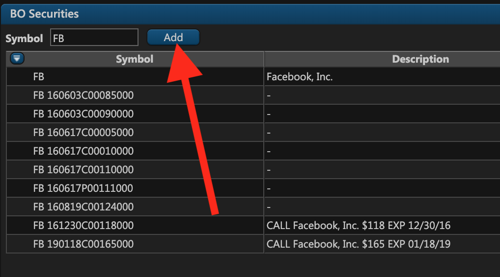
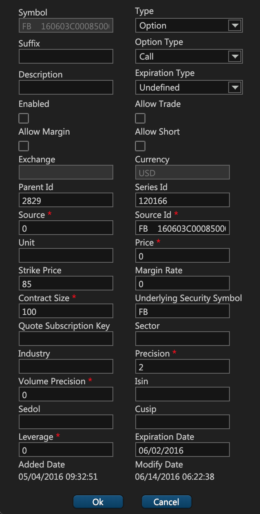

# Tracking Securities

### Introduction

In ETNA Trader, administrators frequently need to look up all financial instruments for a particular security and examine their parameters like options' strike price, stocks' decimal precision, and so forth. For this purpose, we have implemented a fairly simple widget called **BO Securities** which list all of the available instruments for a particular ticker symbol along with all of the pertinent information.

Apart from providing ample information on all securities, **BO Securities** also enables you to add custom securities in case they're not present in the system. Such unavailability may be the result of a market data supplier failure, or it could happen due to absence of quotes for certain securities like mutual funds or ETFs. In that case you may need to add such securities manually and specify all of the required information.

### Looking Up Securities 

As mentioned above, the list of all financial instruments related to a particular security may is available in the **BO securities** widget. You can find it in the widget list:

Once you've added the widget to your ETNA Trader dashboard, it will appear empty. Use the symbol text field to specify the required security and then press **Enter** \(there won't be any pop-ups\). 

The list of all financial instruments related to this security will shortly be displayed in the widget. As you can notice, we've determined to list all financial instruments related to Facebook, and consequently the widget listed the company's common stock as well as the options. 

There are a total of 13 columns in this table that represent various information about a financial instrument:

1. **Symbol**. This is the symbol under which the security is listed on a stock exchange. Usually, it's the company's ticker symbol for the stock, and the ticker + some number sequence for options.
2. **Description**. This is the description of the security. Sometimes it's omitted, but usually it displays some ancillary information like the underlying company's name or the option's strike price or expiration date.
3. **Exchange**. This is the exchange on which the financial instrument is listed.
4. **Currency**. This is the currency in which the financial instrument is denominated.
5. **Type**. This is the type of the financial instrument that is related to the specified ticker symbol.
6. **Strike Price**. This is the strike price of the option.
7. **Precision**. This represents the number of decimal places that is be displayed in the financial instrument's price.
8. **Price**. This is the price of the financial instrument.
9. **ISIN**. This abbreviation stands for International Securities Identification Number and it serves as a security's unique identifier.
10. **SEDOL**. This abbreviation stands for Stock Exchange Daily Official List and it's primarily used by the London Stock Exchange and various other smaller stock exchanges.in the United Kingdom 
11. **Cusip**. This abbreviation stands for Committee on Uniform Security Identification Procedures and it serves as an alternative identifier for stocks and bonds circulating in the United States and Canada.
12. **Enabled**. This field indicates if the financially instrument is enabled or disabled \(unavailable for trading\).
13. **Edit**. Use this column to edit information about a particular security \(this might be useful if you spotted a mistake in a particular\).

### Adding New Securities

Every once in while a certain security is missing from the list of available instruments, forcing administrators to add custom securities to the web terminal. If you'd like to add a new security, click **Add**.

The security addition window will appear, prompting you to specify the following parameters:

1. wer

