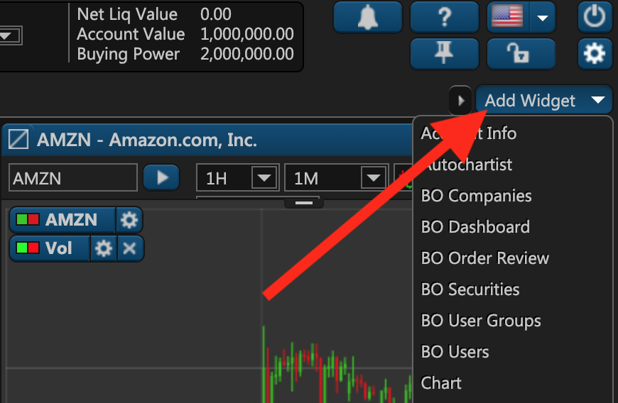
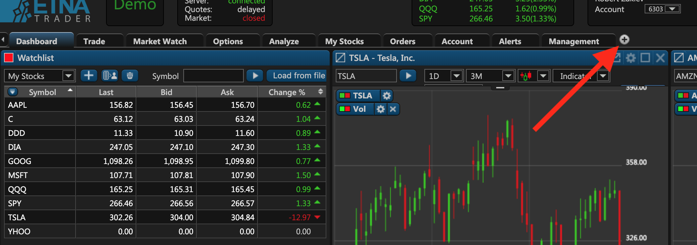

# Dashboard Overview

## Administrator's Dashboard in ETNA Trader

Once you've logged in to the ETNA Trader Web Terminal as an administrator, you'll be presented with the first tab — **Dashboard** — that incorporates the most frequently used widgets like Watchlist and Positions as well as a few widgets with your top stocks.

A **widget** is a self-contained window that has a particular purpose. For example, the _Watchlist_ widget displays a pre-defined list of your frequently-tracked securities. Other widgets can display your current positions, show the chart for a particular security, or server another purpose depending on the widget's objective. To add a new widget, simply click **Add Widget** and then select any widget you'd like to see in your dashboard.

The navigation in ETNA Trader is performed with tabs, each representing a separate set of widgets. You can create as many tabs as you want and fill each tab with the required widgets. To create a new tab, simply click on the little plus icon next to the last tab:

As an administrator, you have far more rights and, by extension, far more widgets to choose from. In the following pages of this section we'll be covering all of the administrator widgets and also how you can use them to manage your users.

