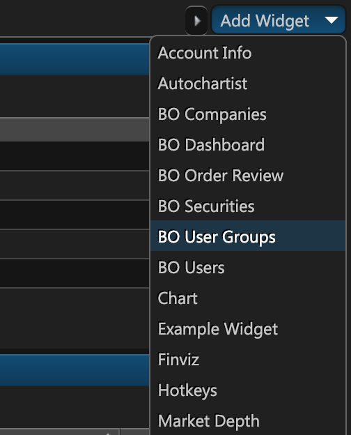
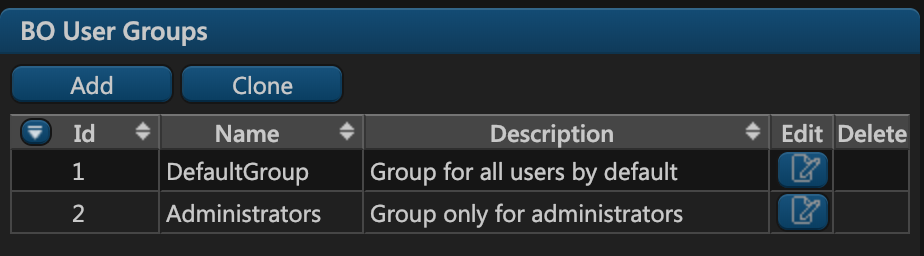
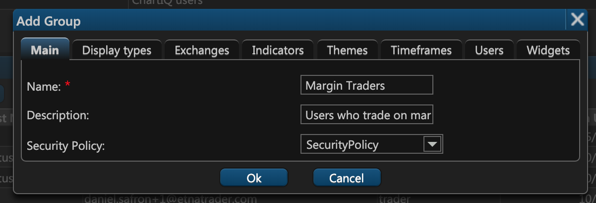
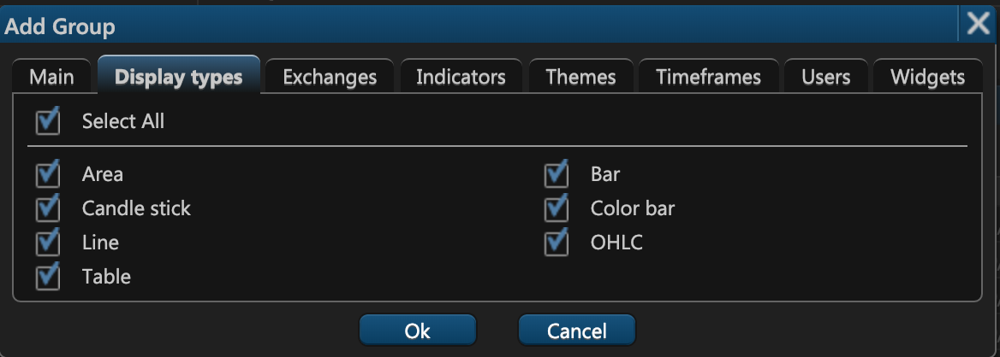
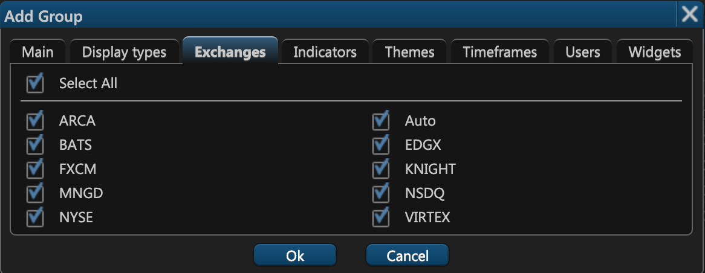
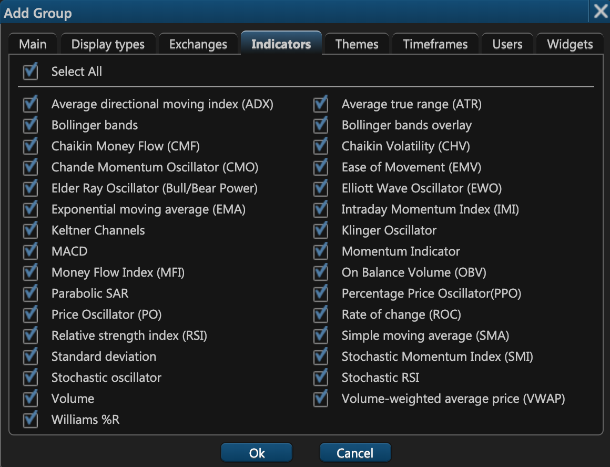
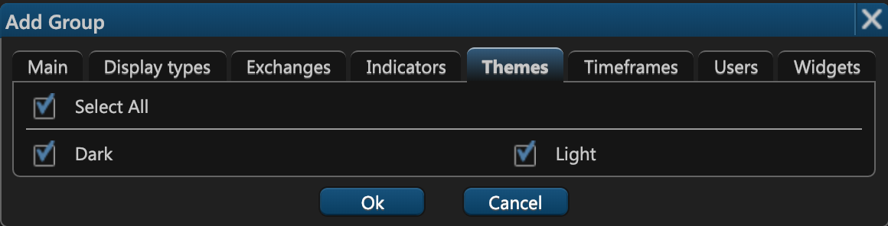
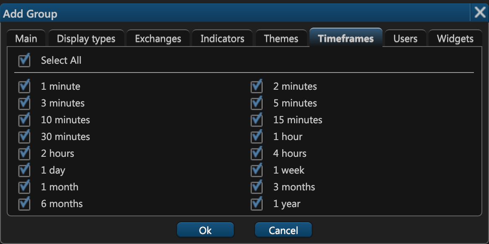
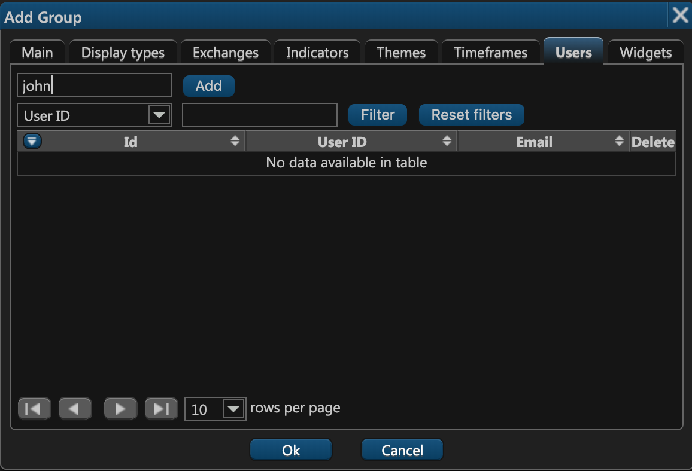
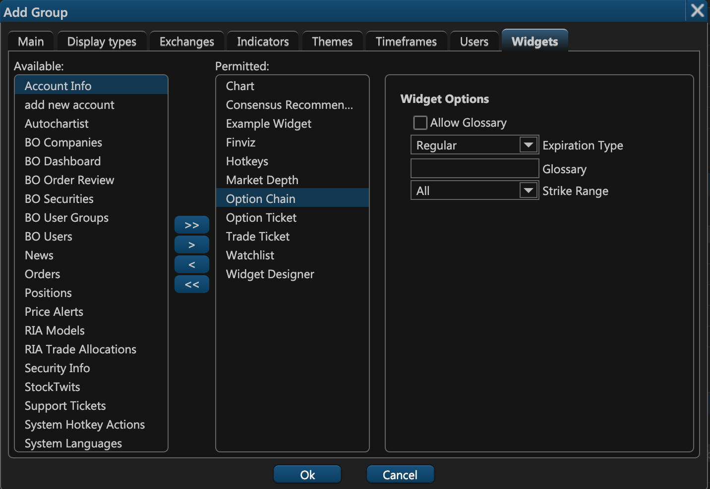

# Managing User Groups

## Introduction

In ETNA Trader, a user group represents a set of users with common permissions. For example, each company might have one group for administrators and another for regular users. User groups are independent of other entities and they can can be created via the **BO User groups** widget.

One user can belong to multiple groups and similarly, one company can have more than one group.


User groups are distinct from companies and vice versa.


## Creating a New Group

To create a new user group, click Add Widget and then click **BO User Groups**.

The **BO User Groups** widget will appear, listing all of the existing users groups \(there are initially two groups — the default one and the one for administrators\).

To add a new user group, click **Add**. The user group creation window will appear where you should specify the new group's settings.

## Main

The first tab of the user group creation window is **Main**. Here you can specify the following settings:

1. **Name**.This is the name of the newly created user group.
2. **Description**. This is the description of the new user group.
3. **Security Policy**. This is the [security policy](system-security-policies.md) of this new user group.

## Display Types

On the second tab of the user group creation window — **Display types** — you can configure the chart modes that will be available to the members of this user group. Note that if a user belongs to multiple groups an each group has a different chart mode selection, the user will have access to a union of chart modes from all the groups.

## Exchanges

On the third tab of the user group creation window — **Exchanges** — you can indicate which stock exchanges must be available to the members of this user group. Note that if a user belongs to multiple groups an each group has a different exchange selection, the user will have access to a union of exchanges from all the groups.

## Indicators

On the fourth tab of the user group creation window — **Indicators** — you can specify which indicators must be available to the members of this user group. Note that if a user belongs to multiple groups an each group has a different indicator selection, the user will have access to a union of indicators from all the groups.

## Themes

On the fifth tab of the user group creation window — **Themes** — you can specify which themes \(Light and Dark\) should be available to the members of this user group. Note that if a user belongs to multiple groups an each group has a different theme selection, the user will have access to a union of themes from all the groups \(likely both themes\).

## Timeframes

On the sixth tab of the user group creation window — **Timeframes** — you can determine which timeframes should be available to the members of this user group. Note that if a user belongs to multiple groups an each group has a different timeframe selection, the user will have access to a union of timeframes from all the groups.

## Users

On the seventh tab of the user group creation window — **Users** — you can add initial users to this newly created group. If you already know the user ID of the requires users, simply type them into the uppermost textfield and then click **Add**. To search for a particular user, use the text field to the left of the button **Filter**.


You can add users who already belong to another group, as one user can belong to multiple groups.


## Widgets

On the eighth tab of the user group creation window — **Users** — you can specify which widgets should be accessible to the members of this group. In the leftmost column \(**Available**\) you have all of the available widgets. Next to it there's a column called **Permitted** which lists all of the widgets available to this user. You can add or remove widgets by clicking on the right or left arrow icons. When a particular widget is selected in the **Permitted** column, there appears another column on the right that displays the options that should be available to the user in this widget.

Note that if a user belongs to multiple groups an each group has a different widget selection, the user will have access to a union of widgets from all the groups.

