# Managing Users

## Introduction

The main entity in ETNA Trader is **user**. As an administrator, you're in charge of creating and managing all of your users. Users are grouped into [user groups](../managing-user-groups.md) and are also assigned to [companies](../bo-companies/). In the following paragraphs we cover all of the settings that can be configured for each user.


Users are distinct from trading accounts and vice versa.


## Creating New Users in ETNA Trader

To create a new user, you first need to add the **BO Users** widget that handles user creation. Click **Add Widget** and then click **BO Users**.

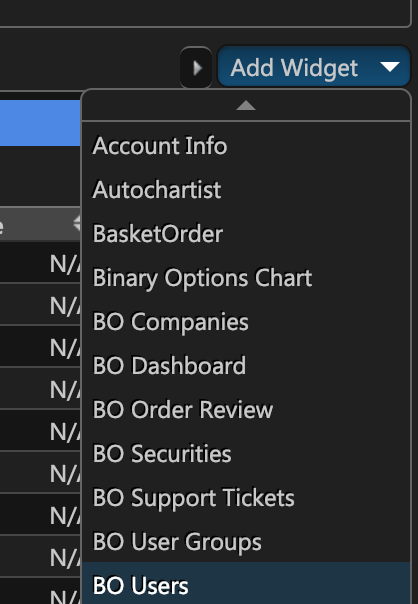

The widget should be added and, as you can see, it lists all of the existing users. The table consists of 10 columns:

1. **ID**. This is the user's internal ID. It''s generally not used except for REST API requests.
2. **First Name**. This is the user's first name.
3. **Middle Name**. This is the user's middle name.
4. **Last Name**. This is the user's last name.
5. **Email**. This is the user's email address.
6. **User ID**. This property is distinct from ID and serves as the user's login.
7. **Sign Up**. This indicates the first date on which the user logged in to the web terminal.
8. **Expiration Date**. If you have trial users, this column will indicate when their account will be expired.
9. **Enabled**. This indicates if the user is active \(whether or not they can place orders\).

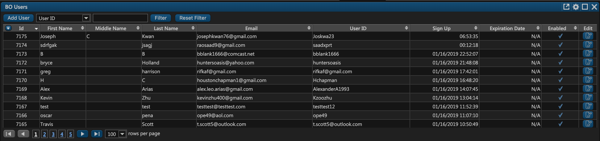

Now you can proceed to create a new user. Click **Add User**.

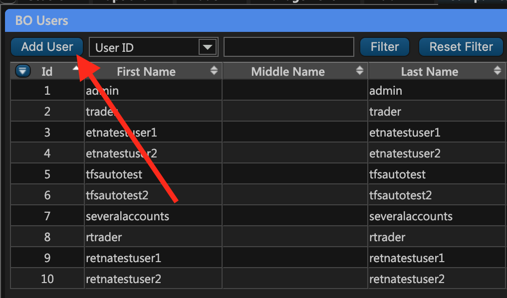

You'll be presented with a pop-up window where you should specify the new user's information. To edit an existing user, click on the **Edit** icon \(the fifth column\).

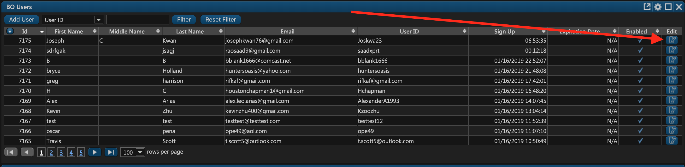

You'll be presented with the user modification window where you can examine a multitude of tabs with various information about this user. Let's examine each of them in detail.

## Main

On the first tab of the user modification window, you should enter the following information:

* **User ID**. This is the user's login.
* **First Name** \(optional\). The first name of the user.
* **Middle Name** \(optional\). The middle name of the user.
* **Last Name** \(optional\). The last name of the user.
* **Email**. The user's email address. If you've configured email notifications, we'll send an email to this address in response to significant events like successful order execution and sign-up confirmation.
* **Entitlements phone number**. The user's phone number that you can use to contact the user.
* **Enabled**. This property indicates if the user is active \(whether or not they can make trades, etc.\)
* **Send Welcome Email**. Click this button to send a welcome email to the user \(configurable when creating [companies](../bo-companies/)\).
* **Reset Password**. Click this button to reset the user's password.
* **Reset to Default**. Click this button to reset the user's settings with the [default user's](https://robert-zakiev.gitbook.io/etna-trader-api/administrators-widgets/bo-companies/main-tab) settings. 
* **Get Access Link**. Click this button to generate a link with which you can log in as this user \(useful for troubleshooting\). Bear in mind that **such links must be opened in the incognito mode** \(so as to not mingle user's cookies with your cookies\).
* **Expiration Date**. Select the required company and that company's trial period will be applied to this user.

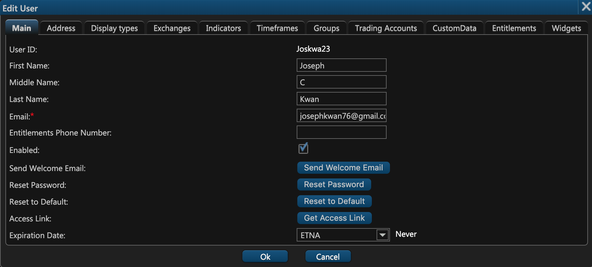


In order for us to send any sort of email to the user, the company to which they're assigned should have a configured email server.


## Address

On the second tab of the user creation window you can specify the user's residential address.

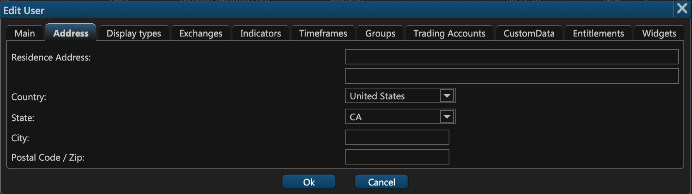

## Display type

On the third tab of the user creation window you can examine the chart modes available to the user \(they're inherited from the user's default group\). Note that this is a read-only tab.

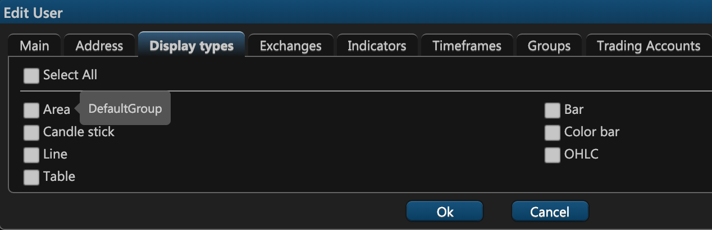

## **Exchanges**

On the fourth tab of the user creation window — **Exchanges** — you can indicate which security exchanges should be available to the user. Some of these exchanges are inherited from the default group of this user while others can be selected manually.

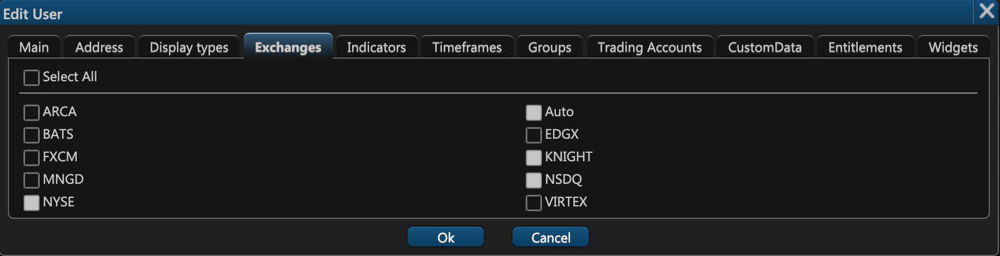

## Indicators

On the fifth tab you can determine which trading indicators should be available to the user. Some of these indicators are inherited from the default group of this user while others can be selected manually.

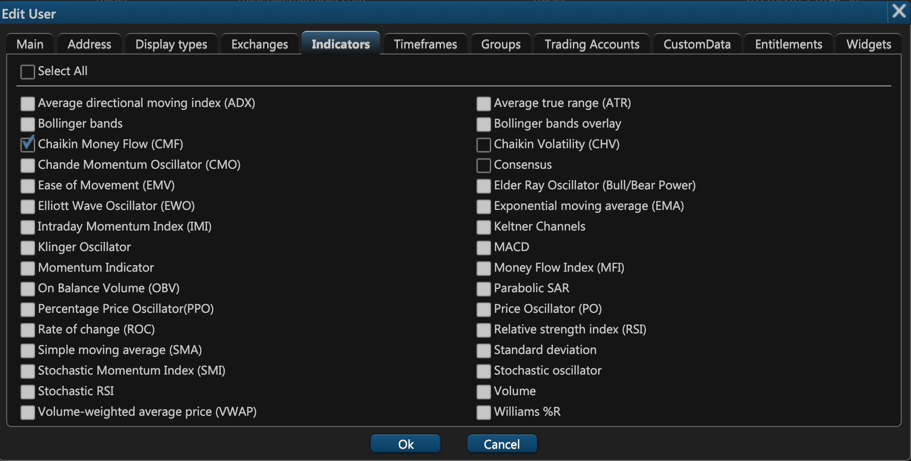

## Timeframes

On the sixth tab you can determine which timeframes should be available to the user. As with exchanges and indicators, some of these timeframes are inherited from the default group of the user, but you can also add extra timeframes manually.

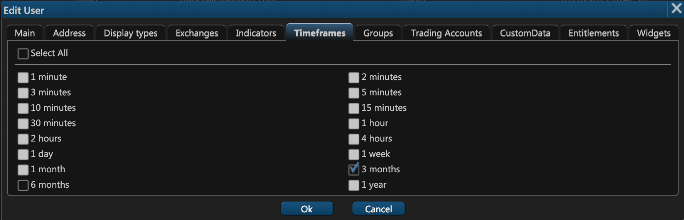

## Groups

On the seventh tab you can examine the [groups](../managing-user-groups.md) to which the user belongs. Normally each user belongs to at least the default group. It's also possible to remove the user from a particular group by clicking on the little X icon in the fourth column.

Note that any user might be part of multiple groups; for example, you may have a user that belongs simultaneously to the default group and also to a group called **Aggressive Traders**.

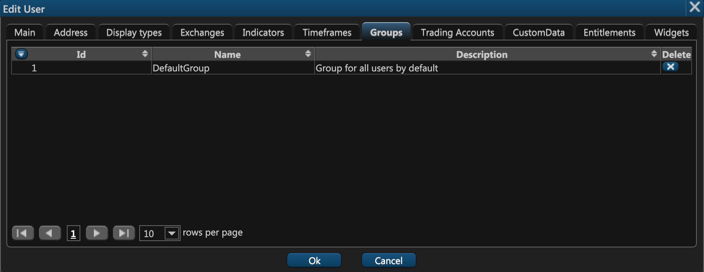

## Trading Accounts

In ETNA Trader, users are distinct from trading accounts, as each user might have multiple trading accounts. For example, a user might have separate trading accounts for stock trading, options trading, and Forex trading. Similarly, one trading account might have multiple associated users. For example, all members of a family are using the same account to place orders.

User's trading accounts can be examined on the eight tab of the user modification window.

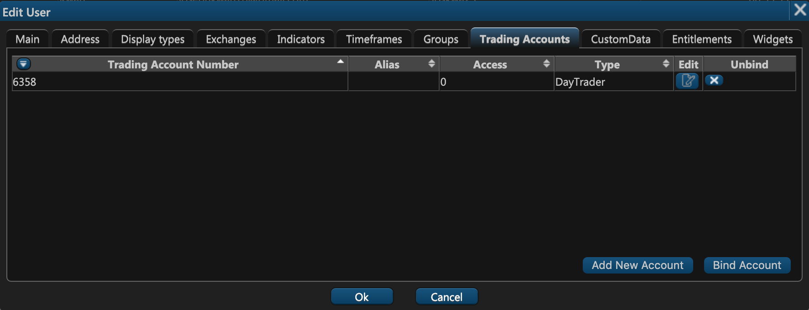

They're listed in a table with 6 columns:

1. **Trading Account Number**. This is the account number you can locate in the web terminal's header. 

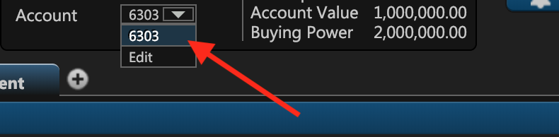

1. **Alias**. If you don't want to identify your accounts using numbers, you can give them a name using aliases. That way you'll see the account alias instead of digits in the header \(see the previous screenshot\). To specify the required alias, click on the edit icon in the 5th column.
2. **Access**. This column indicates the access level of this account.

| Access Value | Permissions |
| :--- | :--- |
| 0 | Full. All operations are allowed |
| 1 | Read Only. The user can only examine the existing orders and positions \(without having the ability to place new orders\). |
| 2 | Close Positions Only. The user can only close the positions without the ability to open new ones. |

1. **Type**. This column displays the trading account type. In ETNA Trader, there are three main types of trading accounts that are completely FINRA compliant.

| Account Type | Description |
| :--- | :--- |
| Cash | This type of account only permits trading operations with the trader's funds  without the ability to trade on margin. Cash accounts are not allowed to open short positions and write call and put options \(except for covered calls\). |
| Margin | In addition to personal funds, margin accounts permit trading with borrowed money. As per FINRA's requirements, the owner of a margin account can trade on margin only if their equity is no less than $2'000. If the owner's equity falls below the $2'000 mark due to market fluctuations, the account is automatically converted to _Cash_. If at that point the account has any short or margin positions, the owner will get a required maintenance call. |
| Day Trader | This type of margin account is aimed at day traders and allows them to buy and sell the same security on the same trade date. To qualify for the day trader account, the owner of the account should have at least $25'000 of equity. If the equity falls below the $25'000 mark due to market fluctuations, the owner of the account will get an equity maintenance call the next business day. |

1. **Edit**. Click this button to set an alias for the account.
2. **Unbind**. Click this button to unbind the account from this user.

### Creating a New Trading Account

To create a new trading account, click **Add New Account**. In the appeared pop-up window, specify the following information:

* **Account Cash**. This indicates the initial amount of funds available to the user.
* **Access**. This property indicates the access level of this account \(see item 3\).
* **Account Type**.  This property indicates the trading account type \(see the previous table\).

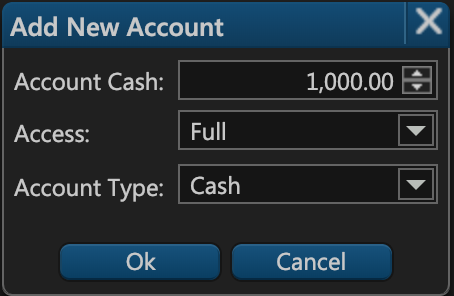

Click **OK** and the account will be successfully created.

Alternatively, if you'd like to bind an existing account to the user, click **Bind Account**. Specify the account's number, the require access level and click **OK**.

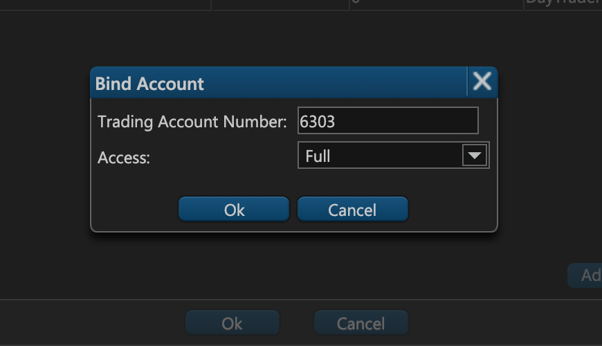

## Entitlements

The penultimate tab of the user modification windows — **Entitlements** — is a read-only tab that enables you to view which exchanges are available to the user, whether they get real-time or delayed quotes, and their agreement state. The agreement state could be either signed, unsigned, or N/A \(not applicable\).

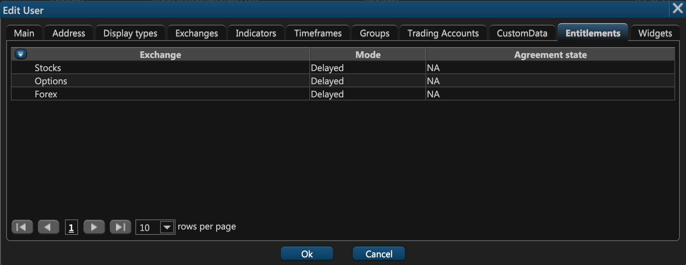

## Widgets


By default, widget settings are inherited from the user's [user groups](../managing-user-groups.md#widgets).


The last tab of the user modification windows — **Widgets** — enables you to determine which widgets should accessible to this user. In the leftmost column \(**Available**\) you have all of the available widgets. Next to it there's a column called **Permitted** which lists all of the widgets accessible to this user. You can add or remove widgets by clicking on the right or left arrow icons.


It's critical that you don't accidentally provide the user with administrator widgets. Ensure that the user only has access to the widgets they in fact need.


When a particular widget is selected in the **Permitted** column, there appears another column on the right that displays the options that should be available to the user in this widget. Some of these options are inherited from the default user group while others can be selected manually.

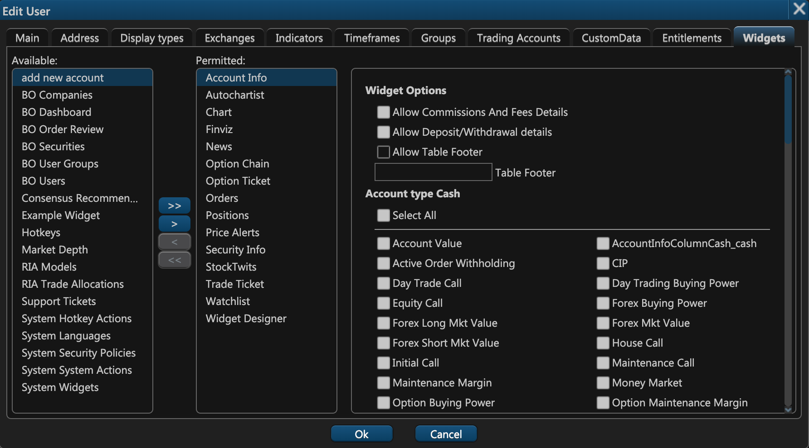

When you've finished modifying the user, click **OK**.

