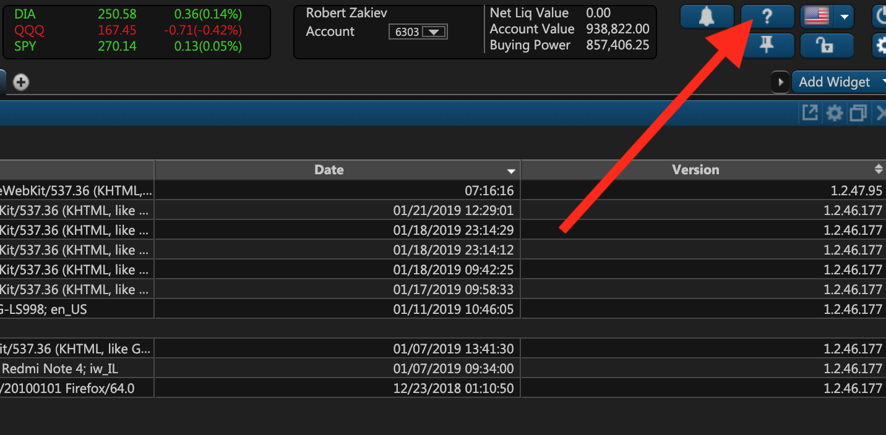
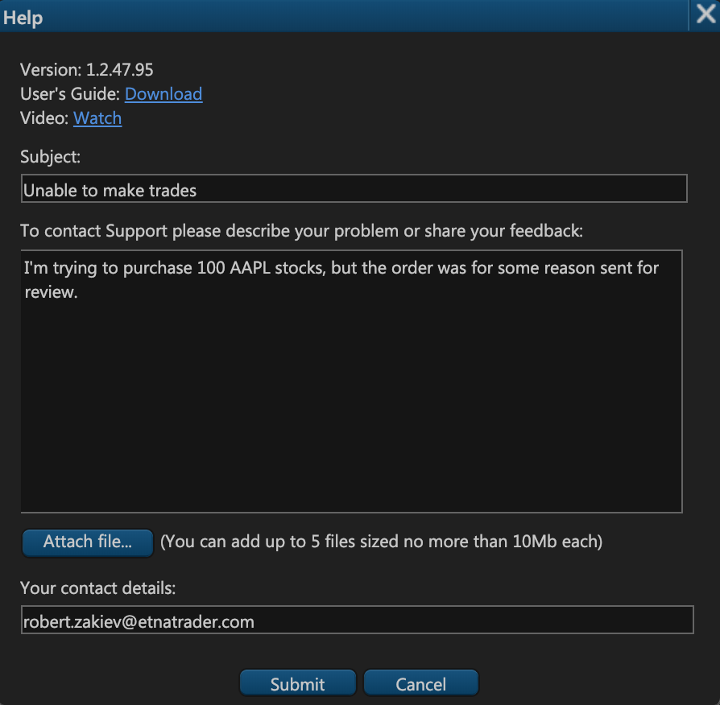
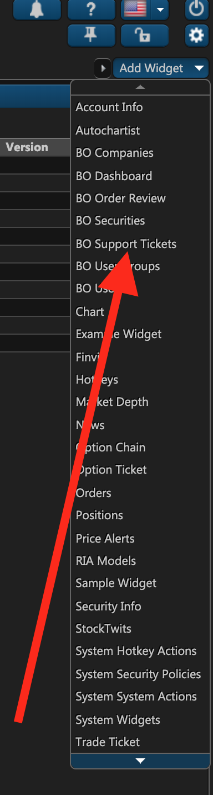
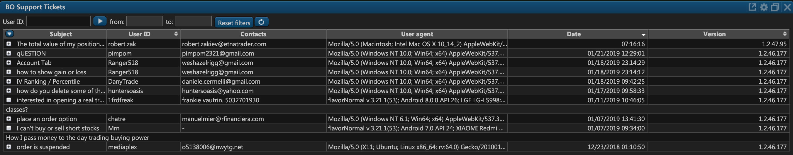

# Support Tickets

### Introduction

ETNA Trader provides powerful and versatile user feedback functionality that enables companies to receive, track, and respond to messages from their users. Whenever a user experiences some technical issue or wants to enquire about some widget, they can submit a troubleshooting ticket within the web terminal. This ticket is then registered in our system and you get notified about it via email or the **BO Support Tickets** widget.

Apart from email notifications and the support ticket widget, you can also integrate your own ticket management system like Zendesk or Freshdesk into ETNA Trader. That way our system will automatically send all user feedback to your ticket management system, where you can proceed to handle customer issues. 


To integrate a custom ticket management system into ETNA Trader, please contact our support team at support@etnatrader.com.


### Submitting User Feedback

Whenever a user needs technical assistance, they should file a troubleshooting report in ETNA Trader by clicking on the little question mark icon in the upper right-hand corner.

In the appeared pop-up window, they should describe the experienced issue and then click **Submit**. They could also optionally attach up to five files, each sized no more than 10 megabytes.

At the top there are two links: one for the user guide and the other for the video that your users can watch. Both of these links can be configured in the **BO companies** widget, on the [**Main** tab](bo-companies/main-tab.md) of the company modification window.

When the report is submitted, it is automatically sent to the **BO Support Tickets** widget.

### Exploring the BO Support Tickets Widget

The default way of tracking and examining user feedback in ETNA Trader is to use a widget entitled **BO Support Tickets**. This widget is used to track, filter, and examine all of the existing user reports. To add the widget, click **Add Widget** and then click **BO Support Tickets**.

The widget will be added to your current tab, listing all of the existing support tickets in a table. This table contains six columns:

1. **Subject**. This is the subject line of the support ticket.
2. **User ID**. This is the ID of the user who filed the ticket.
3. **Contacts**. This is the contact information of the user \(usually their email address\).
4. **User agent**. This is the user agent \(Google Chrome masquerades as Mozilla/5.0\).
5. **Date**. This is the date on which the report was filed.
6. **Version**. This is the version of ETNA Trader in which the user was experiencing issues.

You can filter the support ticket by the following criteria:

1. **User ID**. Use it to list all tickets from a particular user.
2. **Date range**. Use it to list all tickets that were filed during the specified timeframe.

To reset filters, click **Reset filters**.

### 

