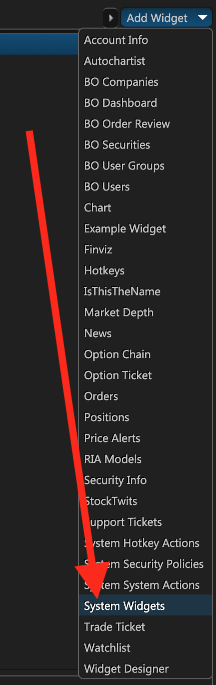
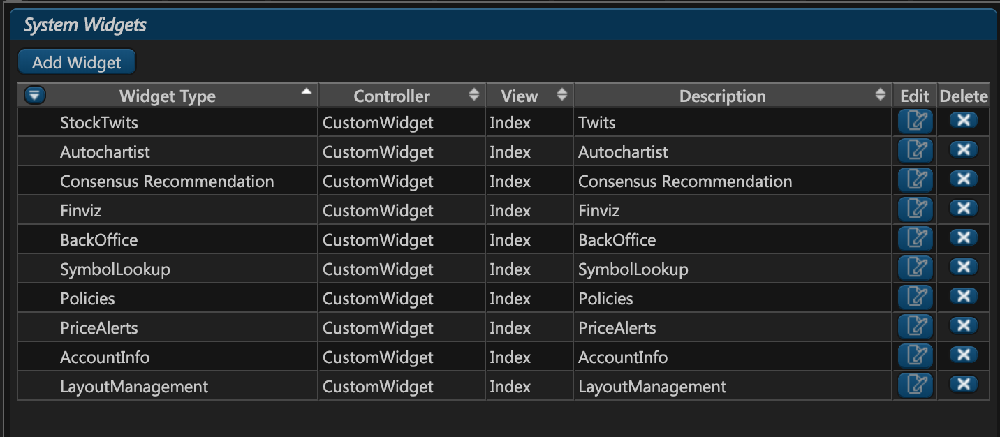
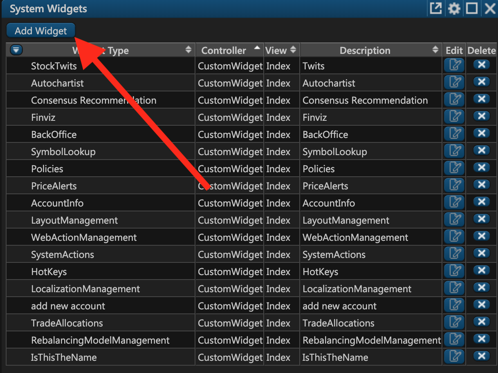
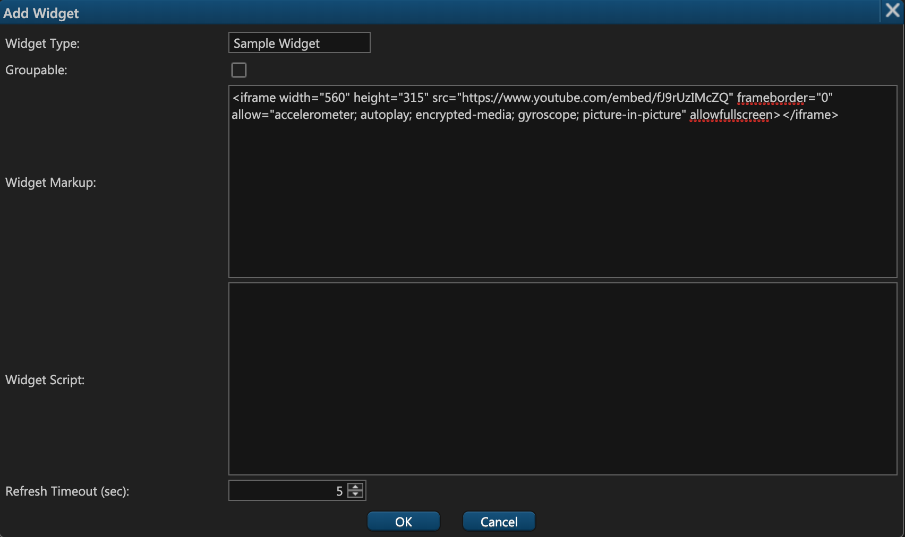
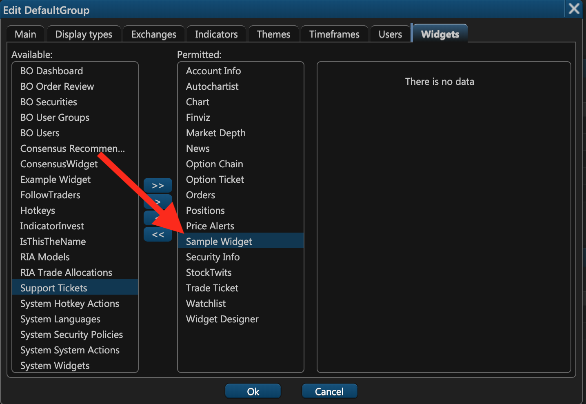
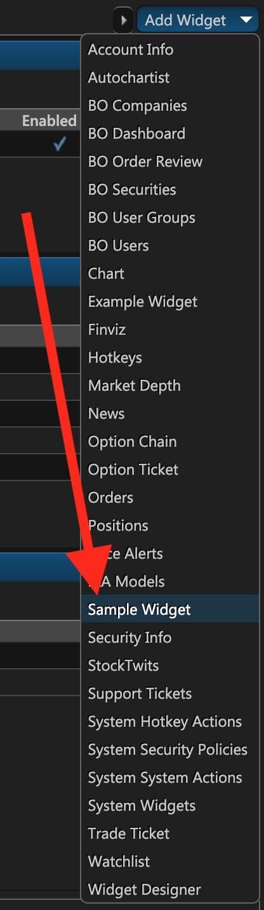
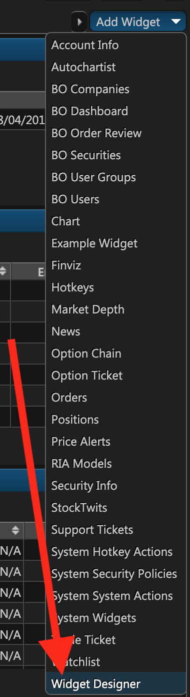
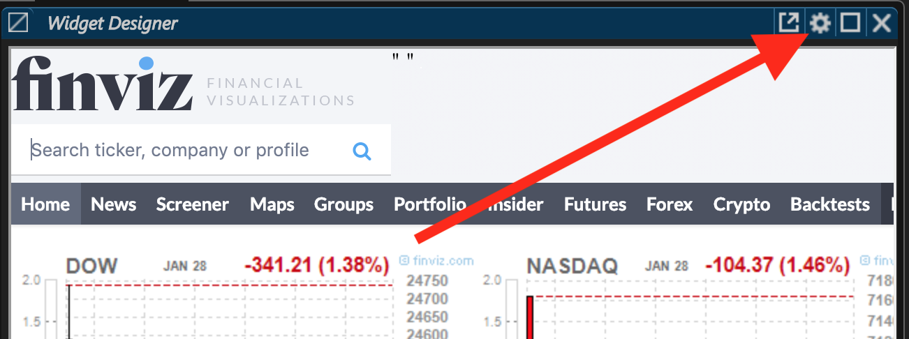
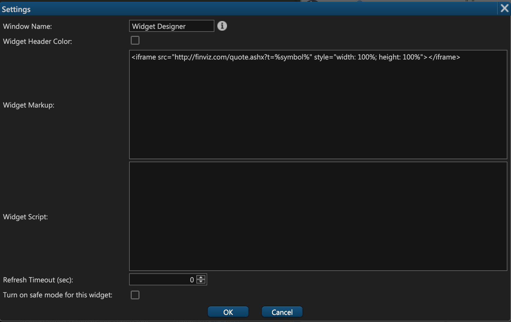

# System Widgets

## Introduction

ETNA Trader comes with a multitude of different trading widgets out of the box. These built-in widgets are more than enough for trading-related purposes; however, many companies prefer to extend the existing functionality with their own custom widgets. Suppose you need to embed a news feed from a particular website via iframe or perhaps you'd like to develop your own custom widget using JavaScript — ETNA Trader enables you to embed such widgets effortlessly. This functionality is provided via the **System Widgets** widget, and it enables developers to embed two types of custom widgets:

1. Externally referenced content via HTML \(e.g. iframe\).
2. Custom JavaScript widgets.

## Adding the _System Widgets_ Widget

To add the _**System Widgets**_ widget, click **Add Widget** and the click **System Widgets**.




If the **System Widgets** widget is unavailable, it's likely that you're logged in as a user, and not as an administrator \(this widget is available only for administrators\).


The widget will appear, listing all of the current configurable widgets \(some of them are native\). The table contains the following columns:

1. **WidgetType**. This is the name and the description of the widget.
2. **Controller**. In MVC terminology, this is the controller that mediates between the model of the widget and the view. 
3. **View**. In MVC terminology, this is the view that displays the content of the widget.
4. **Description**. This is the description of the widget \(it's copied from the WidgetType column\).



You can inspect the existing widgets by clicking **Edit**. To delete a widget, click **X**.

## Adding a New Widget

To add a new widget, click **Add**.



The widget creation window will appear, prompting you to configure the new widget.



### Widget Type

As explained earlier, this is the name of the widget that circulates throughout the platform. Users will see the widget listed under this name in the widget list.

### Groupable

In ETNA Trader, groupable widgets collectively subscribe to all events that happen to any member of the group. Such widgets are linked by color — for example, you can have three widgets linked by the green color. In such scenario, if you perform some action in one of these widget, this event will be extrapolated to the other widgets from this group.

For example, suppose you have two widgets in one group — **Trade Ticket** and **Market Depth**. Specifying **TSLA** in the **Trade Ticket** will automatically display the market depth for the Tesla stock in the **Market Depth** widget. What this means is that you should only group certain widgets in case they have common properties \(ticker symbol, for instance\).

### Widget Markup

Widget Markup is the HTML part of the widget. If you want to embed an iframe or some other HTML text into the widget — this is the place to do it. Alternatively, you can use this text field to store some ancillary HTML elements for your JavaScript in the next text field.

Here's an example of the widget markup from the **Stock Twits** widget:



```markup
<div id="stocktwits-widget-news" width: '100%', height: '100%> </div>
<a href='http://stocktwits.com' style='font-size: 0px; ''>StockTwits</a>
```



### Widget Script

Widget Script is the main text field where you specify the JavaScript code that will be interpreted at the time the widget is displayed. In the following example you can see the JavaScript code of the **Stock Twits** widget. Notice that the script references the HTML elements from the **Widget Markup** text field. 



```javascript
function loadScript( url, callback ) {

  var script = document.createElement( "script" )
  script.type = "text/javascript";
  if(script.readyState) {  //IE
    script.onreadystatechange = function() {
      if ( script.readyState === "loaded" || script.readyState === "complete" ) {
        script.onreadystatechange = null;
        callback();
      }
    };
  } else {  //Others
    script.onload = function() {
      callback();
    };
  }

  script.src = url;
  document.getElementsByTagName( "head" )[0].appendChild( script );
}


// call the function...
loadScript("https://stocktwits.com/addon/widget/2/widget-loader.min.js", function() {
var myWidget = $("#stocktwits-widget-news");
var WidgetDesigner = myWidget.parent();
var width= WidgetDesigner.width();
var height= WidgetDesigner.height();
STWT.Widget({container: 'stocktwits-widget-news', symbol: '%symbol%', width: width, height: height,  limit: '150', scrollbars: 'true', streaming: 'true', title: '%symbol%', style: {link_color: '4871a8', link_hover_color: '4871a8', header_text_color: '000000', border_color: 'cecece', divider_color: 'cecece', divider_color: 'cecece', divider_type: 'solid', box_color: 'f5f5f5', stream_color: 'ffffff', text_color: '000000', time_color: '999999'}});

});
```



Also, it's worth mentioning that you could leverage our [external API](https://etnatraderapi.atlassian.net/wiki) to fetch market quotes, users' positions, etc.

#### Refresh Timeout

By default, the content in the widget is never refreshed after it's initially loaded. This is because the **Refresh Timeout** option is set to 0 \(seconds\). If you want your content to be refreshed with a certain frequency, specify the required refresh delay in seconds, and the content in the widget will be updated accordingly.

Once you're done configuring the script, click **OK**.

### Adding Custom Widgets to Users

By default, ETNA Trader does not automatically add new widgets to all new or existing users. If you want to add the newly created widget to certain users, it has to be done through the [user groups widget](managing-user-groups.md#widgets). Move the widget from the **Available** column to the **Permitted** column, and then click **OK**.



From now on the users belonging to this user group will be able to add this widget to their web terminal.



### User-Created Widgets

The previously discussed **System Widgets** widget is available exclusively to administrators. In other words, regular users are unable to create such widgets. What users can do, however, is create their own personal widgets that are available only for them. They can do that via the **Widget Designer** widget.



This widget's functionality is identical to that of **System Widgets**. A user should simply click on the little gear icon and proceed to configure their own custom widget using HTML and JavaScript.





Once the user is finished configuring the widget, they should click **OK**. And the widget will immediately display the required content. As stated previously, user-created widgets are available only to them personally; other users or administrators will not have access to that widget.


If you need a more sophisticated widget with rich functionality and deep integration with ETNA Trader, feel free to contact our [support team](https://www.etnasoft.com/contact-support/).


