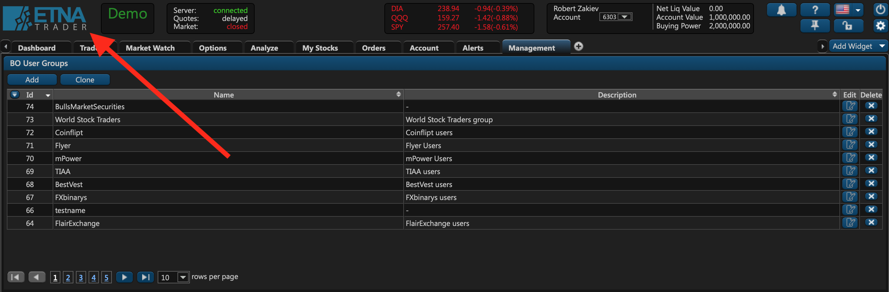
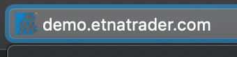
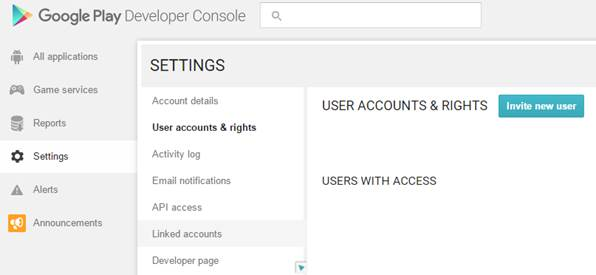

# Rebranding


To private-label ETNA Trader, contact us at support@etnasoft.com


## Introduction

ETNA Trader is a white label trading suite — meaning you can provide your own custom logos and texts to ensure that each aspect of the software is marked by your branding. Both the web terminal and the mobile apps can be completely rebranded, and in this article we will outline the requirements for image assets and texts.

## General Text Rebranding

There are three cross-platform texts that can be rebranded in ETNA Trader:

| Text | Description | Example |
| :--- | :--- | :--- |
| Company Name | The name of your company. | Good Trade Inc. |
| Support email | The troubleshooting email your users can use to contact you. | support@goodtrade.com |
| Mail Server Credentials | The credentials of the email server that we'll use to send emails to your users. | — |

## Web Terminal Rebranding

ETNA Trader's web terminal enables you to rebrand image assets as well as text materials.

### Rebranding Images in the Web Terminal

When it comes to images, you can replace the **company logo** in the upper left-hand corner and the **favicon**.

| Asset | Requirements |
| :--- | :--- |

<table>
  <thead>
    <tr>
      <th style="text-align:left">Company Logo</th>
      <th style="text-align:left">
        
The image resolution should preferably be 420 x 180 px. If not, the image
          should at least have the aspect ratio identical to 420 x 180 (2.33).

        

          
        

      </th>
    </tr>
  </thead>
  <tbody></tbody>
</table><table>
  <thead>
    <tr>
      <th style="text-align:left">Favicon</th>
      <th style="text-align:left">
        
The favicon resolution should be 16 x 16 px.

        

          
        

      </th>
    </tr>
  </thead>
  <tbody></tbody>
</table>When it comes to text materials in the web terminal, you can provide your own domain name. For example, if your company is called _Good Trade_, you can host our trading platform at terminal.goodtrade.com.

## iOS App Rebranding

ETNA Trader for iOS and Android offer by far the highest degree of private-labelling. Specifically, the iOS app enables you to rebrand the app name, privacy policy text, app icon, launch image, as well as App Store description.

Before we can rebrand the app with your logos and texts, you should first create an [Apple ID account](https://appleid.apple.com/account#!&page=create). Once done, proceed to create an Apple Developer account [here](https://developer.apple.com/membercenter/index.action). Please note that Apple charges $99/year for hosting apps, so you must have an active membership before anything can be published. Once you have a developer account with an active membership, you can give us access to this account and we'll publish the rebranded app on your behalf.


We recommend that you create a developer account on behalf of your organization \(not in your own name\).


The following table describes the resources that you should provide us so as that we can incorporate them into your soon-to-be rebranded app.

| Resource | Description | Example |
| :--- | :--- | :--- |
| Application name | The app's name. The length of the name must not exceed 12 characters. | Good Trade |
| Privacy policy text | Since Apple requires developers to provide a URL that outlines the developer's privacy policy, you should provide your own URL that users can visit to learn how you handle their data. | goodtrade.com/privacy-policy |
| App Description | The description of the app that is displayed in the App Store. | Good Trade for iOS is a trading app that enables you to trade stocks, bonds, and currencies right from the palm of your hand. |
| Icon logo | The app's icon logo that users tap on to open the app. Please take a look at [Apple's documentation](https://developer.apple.com/design/human-interface-guidelines/ios/icons-and-images/app-icon/) that comprehensively outlines the resolutions of all required icons. | [Archive](https://wiki.etnasoft.com/download/attachments/15668511/App%20icons.zip?version=1&modificationDate=1475673975254&api=v2) |
| Splash screen | The splash screen that is displayed whenever the app is opened. Make sure to familiarize yourself with [Apple devices resolution](https://developer.apple.com/design/human-interface-guidelines/ios/icons-and-images/launch-screen/) first. | [Archive](https://wiki.etnasoft.com/download/attachments/15668511/Launch%20Files.zip?version=1&modificationDate=1475673975300&api=v2) |


The Apple Watch app will automatically pick up the provided icons and the app name.


## Android App Rebranding

Similar to the iOS app, you rebrand ETNA Trader for Android with custom images and text materials.

Before we can rebrand the app with your logos and texts, you should first create a [Google Developer account](https://play.google.com/apps/publish/signup/). Once done, proceed to the Google Play Developer Console. Navigate to **Linked accounts**, under **Settings**. Click **Invite new user** and then send an invitation to [eugeny.elesin@etnatrader.com](mailto:eugeny.elesin@etnatrader.com) \(our Android developer\). Once we have access to your Google Play Console, we'll be able to publish your rebranded app.

The following table describes the resources that you should provide us so that we can incorporate them into your soon-to-be rebranded app.

| Resource | Description | Example |
| :--- | :--- | :--- |
| Application name | The app's name. The length of the name must not exceed 12 characters. | Good Trade |
| Privacy policy text | Since Google requires developers to provide a URL that outlines the developer's privacy policy, you should provide your own URL that users can visit to learn how you handle their data. | goodtrade.com/privacy-policy |
| App Description | The description of the app that is displayed in the Google Play Store. | Good Trade for Android is a trading app that enables you to trade stocks, bonds, and currencies right from the palm of your hand. |
| Icon logo | The app's icon logo that users tap on to open the app. Please take a look at [Google's documentation](https://support.google.com/googleplay/android-developer/answer/1078870?hl=en) that comprehensively outlines the resolutions of all required icons. | — |
| Splash screen | The splash screen that is displayed whenever the app is opened. Make sure to familiarize yourself with [Google devices resolution](https://developer.android.com/training/multiscreen/screensizes) first. | — |

