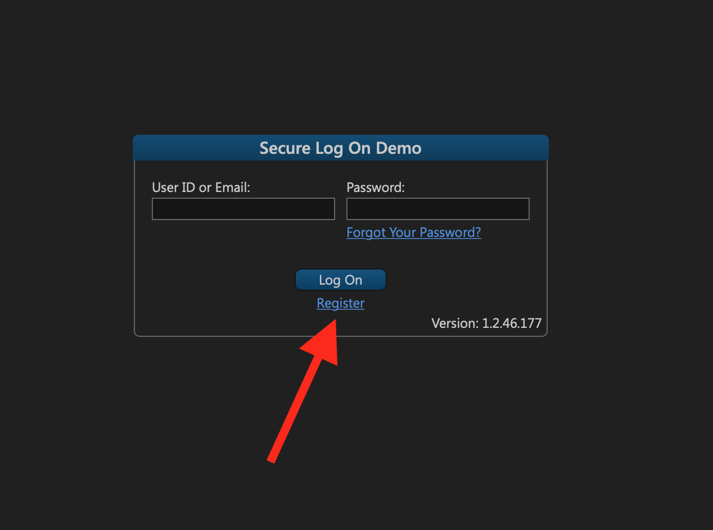
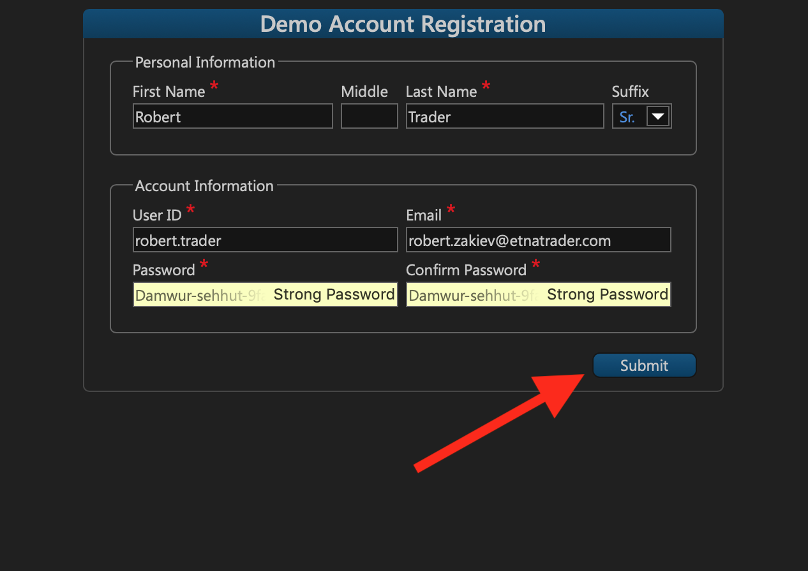
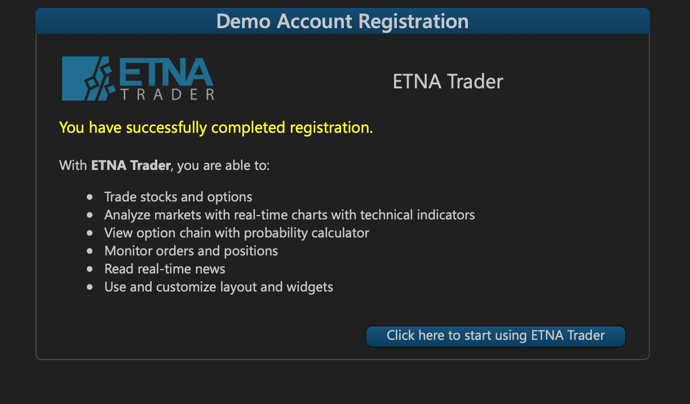
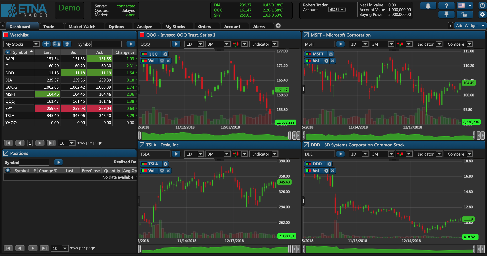

# Signing Up

## Introduction

ETNA Trader provides two basic account types: **user** and **administrator**. Users have regular rights that authorize them to perform basic procedures like placing orders and analyzing markets; on top of that, administrators' rights include administrative privileges that enable them to create and manage users and companies, and so on.

To sign up for ETNA Trader as an administrator, you should first sign up as a regular user and then request administrator rights from the service provider. Once the rights are granted, you may proceed to create companies, create users, manage support tickets, and so on.


Administrator rights include all of the user rights.


## Signing Up for ETNA Trader

To sign up for ETNA Trader, go to your newly configure trading environment \(something like terminal.yourcompanyname.com\). Click **Register**.

Fill out the sign-up form by specifying the following information:

* **First Name**
* **Middle Name** \(optional\)
* **Last Name**
* **Suffix** \(optional\)
* **User ID**
* **Email** \(you can use it to log in\)
* **Password**

Once done, click **Submit**.

The sign-up process is now complete. Hit **Click here to start using ETNA Trader**.

You will immediately be redirected to the ETNA Trader web terminal.

