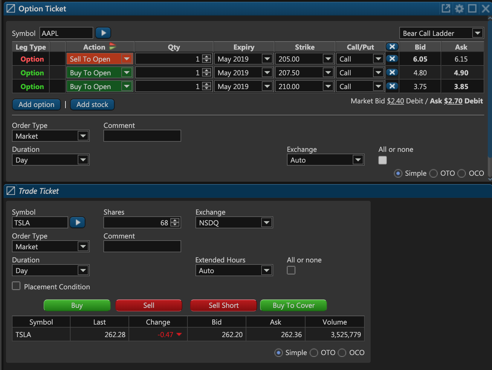
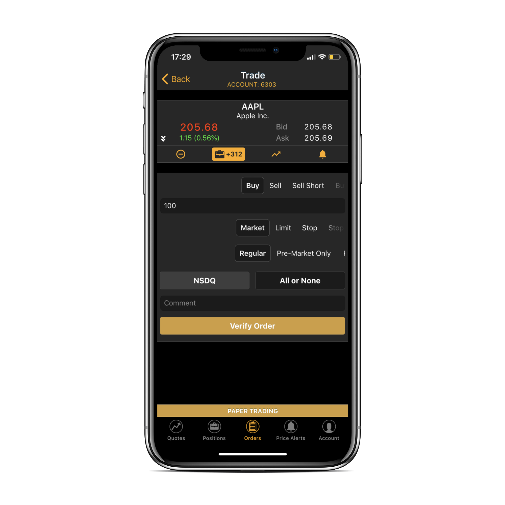
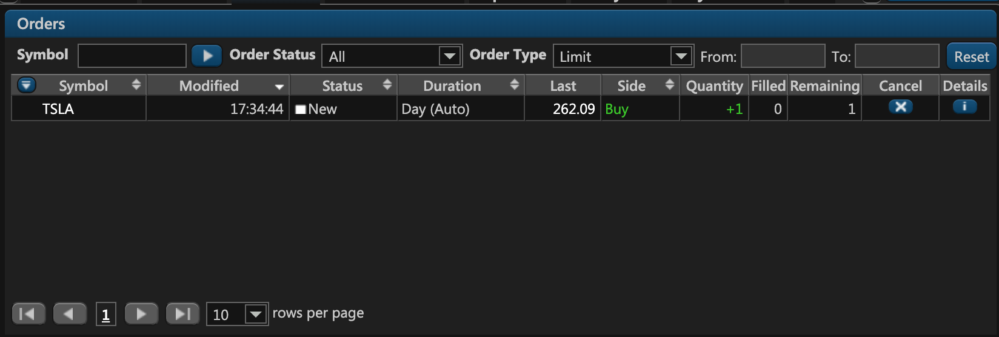

# Orders

### Introduction

In ETNA Trader, any transaction that involves a purchase or sale of a specific security is called an order. Orders can be placed to buy, sell, sell short, or buy to cover some security, thereby opening a new position. Once the price hits the trader's target, the position can be closed with a second order.

Orders can be placed in the web terminal via the **Trade Ticket** or **Option Ticket** widgets:



They can also be placed via ETNA Trader for iOS and Android:



Brief **information** about all outstanding orders can be examined on the Orders widget:



If you're using API to place and view traders' orders, there are significantly more parameters that must be specified and analyzed.

### Order Parameters in ETNA Trader

Orders in ETNA Trader contain a multitude of different parameters, some of which are displayed in the web terminal and mobile apps, while others are strictly internal parameters that are useful only to developers and administrators.

The following table outlines all of the parameters of an order in ETNA Trader:

<table>
  <thead>
    <tr>
      <th style="text-align:left">Parameter</th>
      <th style="text-align:left">Description</th>
    </tr>
  </thead>
  <tbody>
    <tr>
      <td style="text-align:left">Id</td>
      <td style="text-align:left">This is the internal ID of the order.</td>
    </tr>
    <tr>
      <td style="text-align:left">SecurityId</td>
      <td style="text-align:left">This is the internal ID of the underlying security of the order.</td>
    </tr>
    <tr>
      <td style="text-align:left">Quantity</td>
      <td style="text-align:left">This is the number of shares in the order.</td>
    </tr>
    <tr>
      <td style="text-align:left">StopPrice</td>
      <td style="text-align:left">This is the stop price of the order (if there&apos;s no stop price &#x2014;
        the value of this parameter will be 0).</td>
    </tr>
    <tr>
      <td style="text-align:left">ClientId</td>
      <td style="text-align:left">This is the order ID on the client&apos;s side.</td>
    </tr>
    <tr>
      <td style="text-align:left">ExecutedQuantity</td>
      <td style="text-align:left">This is the number of shares that have been purchased or sold.</td>
    </tr>
    <tr>
      <td style="text-align:left">LastPrice</td>
      <td style="text-align:left">This is the price of the last executed order for the underlying security.</td>
    </tr>
    <tr>
      <td style="text-align:left">LastQuantity</td>
      <td style="text-align:left">This is the number of shares that were traded in the last transaction.</td>
    </tr>
    <tr>
      <td style="text-align:left">LeavesQuantity</td>
      <td style="text-align:left">This is the number of shares in the order that are yet to be purchased.</td>
    </tr>
    <tr>
      <td style="text-align:left">AveragePrice</td>
      <td style="text-align:left">This is the average price at which the order was executed.</td>
    </tr>
    <tr>
      <td style="text-align:left">Side</td>
      <td style="text-align:left">This is the type of order (could be &quot;Buy&quot;, &quot;Sell&quot;,
        &quot;SellShort&quot;, or &quot;BuyToCover&quot;).</td>
    </tr>
    <tr>
      <td style="text-align:left">Date</td>
      <td style="text-align:left">This is the date on which the order was placed by the user.</td>
    </tr>
    <tr>
      <td style="text-align:left">TransactionDate</td>
      <td style="text-align:left">This is the date on which the transaction took place.</td>
    </tr>
    <tr>
      <td style="text-align:left">Status</td>
      <td style="text-align:left">
        <p>This is the current status of the order. Possible values:</p>
        <p>0 - New</p>
        <p>1 - Partially Filled</p>
        <p>2 - Filled</p>
        <p>3 - Done For Day</p>
        <p>4 - Canceled</p>
        <p>5 - Replaced</p>
        <p>6 - Pending Cancel</p>
        <p>7 - Stopped</p>
        <p>8 - Rejected</p>
        <p>9 - Suspended</p>
        <p>10 - Pending New</p>
        <p>11 - Calculated</p>
        <p>12 - Expired</p>
        <p>13 - Accepted For Bidding</p>
        <p>14 - Pending Replace</p>
        <p>15 - Error</p>
      </td>
    </tr>
    <tr>
      <td style="text-align:left">ExecutionStatus</td>
      <td style="text-align:left">This is the execution status of the order. It&apos;s usually identical
        to Status with the exception of emergency situations. For example, if an
        order modification request was rejected by the exchange because the order
        has already been filled, the status will be <b>Filled</b> and the execution
        status will be <b>Rejected</b>.</td>
    </tr>
    <tr>
      <td style="text-align:left">Type</td>
      <td style="text-align:left">This is the type of the order. The range of possible values includes: <b>Market</b>, <b>Limit</b>, <b>Stop</b>, <b>Stop Limit</b>.</td>
    </tr>
    <tr>
      <td style="text-align:left">RequestStatus</td>
      <td style="text-align:left">This is the status of the order modification request.</td>
    </tr>
    <tr>
      <td style="text-align:left">Target</td>
      <td style="text-align:left">This is the target operation of the order. Possible values: <b>new</b>, <b>cancel</b>, <b>modify</b>.</td>
    </tr>
    <tr>
      <td style="text-align:left">TimeInForce</td>
      <td style="text-align:left">
        <p>Indicates the time frame in which the order will be active. Possible Values:</p>
        <ol>
          <li><b>Day</b>. The order automatically expires at the end of the regular
            trading session if it weren&apos;t executed.</li>
          <li><b>GTC </b>(Good-till-Canceled). The order persists indefinitely until
            it is executed or manually cancelled.</li>
          <li><b>AtTheOpening</b>. The order should be filled at the opening of the
            marketplace or cancelled.</li>
          <li><b>ImmediateOrCancel</b>. The order should be completely or partially
            filled immediately. If partially filled, the remaining part of the order
            should be cancelled.</li>
          <li><b>FillOrKill</b>. The order should be filled immediately and entirely
            or cancelled right away.</li>
          <li><b>GoodTillCrossing</b>. The order will be active until the market enters
            the auction phase.</li>
          <li><b>GoodTillDate</b>. The order will be active until the date specified
            in the ExpireDate attribute (unless it is executed or cancelled).</li>
          <li><b>GoodTillTime</b>. The order will be active until a certain time point.</li>
        </ol>
      </td>
    </tr>
    <tr>
      <td style="text-align:left">ExecInst</td>
      <td style="text-align:left">Indicates if the order should be filled either entirely in one transaction
        or not at all. Possible values: <b>&apos;DoNotIncrease&apos;</b>, <b>&apos;DoNotReduce&apos;</b>, <b>&apos;AllOrNone&apos;</b>.</td>
    </tr>
    <tr>
      <td style="text-align:left">ExpireDate</td>
      <td style="text-align:left">This is the expiration of the order. If the order isn&apos;t executed
        until the specified date, it&apos;ll automatically be cancelled.</td>
    </tr>
    <tr>
      <td style="text-align:left">CounterPartyOrderId</td>
      <td style="text-align:left">This is the order of the order counterparty on the execution venue (set
        by the executor).</td>
    </tr>
    <tr>
      <td style="text-align:left">AccountId</td>
      <td style="text-align:left">This is the identifier of the trading account.</td>
    </tr>
    <tr>
      <td style="text-align:left">UserId</td>
      <td style="text-align:left">This is the ID of the user on whose trading account the order was executed.</td>
    </tr>
    <tr>
      <td style="text-align:left">RequestId</td>
      <td style="text-align:left">This is the identifier of the request modification.</td>
    </tr>
    <tr>
      <td style="text-align:left">StateId</td>
      <td style="text-align:left">The is the identifier of the order&apos;s state in ETNA Trader.</td>
    </tr>
    <tr>
      <td style="text-align:left">ParentId</td>
      <td style="text-align:left">This is the ID of the parent security in a multi-leg order.</td>
    </tr>
    <tr>
      <td style="text-align:left">Legs</td>
      <td style="text-align:left">These are the legs of a multi-leg order.</td>
    </tr>
    <tr>
      <td style="text-align:left">Exchange</td>
      <td style="text-align:left">This is the exchange on which the order should be executed.</td>
    </tr>
    <tr>
      <td style="text-align:left">ExecutionVenue</td>
      <td style="text-align:left">This is the execution venue of the order (the list of options may vary
        depending on which exchanges are available to your company).</td>
    </tr>
    <tr>
      <td style="text-align:left">TrailingStopAmountType</td>
      <td style="text-align:left">This is the type of the trailing stop (<b>Absolute</b> or <b>Persentage</b>).</td>
    </tr>
    <tr>
      <td style="text-align:left">TrailingStopAmount</td>
      <td style="text-align:left">This is the trailing amount of the trailing stop (in percentage terms
        or in the currency units).</td>
    </tr>
    <tr>
      <td style="text-align:left">TrailingLimitAmountType</td>
      <td style="text-align:left">This is the type of the trailing limit (<b>Absolute</b> or <b>Persentage</b>).</td>
    </tr>
    <tr>
      <td style="text-align:left">TrailingLimitAmount</td>
      <td style="text-align:left">This is the trailing amount (in percentage terms or in the currency units).</td>
    </tr>
    <tr>
      <td style="text-align:left">CreateDate</td>
      <td style="text-align:left">This is the date on which the order was created.</td>
    </tr>
    <tr>
      <td style="text-align:left">InitialType</td>
      <td style="text-align:left">This is the initial type of the order.</td>
    </tr>
    <tr>
      <td style="text-align:left">IsExternal</td>
      <td style="text-align:left">This field indicates if the order was placed externally. For example,
        a user can place an order manually by calling their broker without using
        ETNA Trader.</td>
    </tr>
    <tr>
      <td style="text-align:left">ExecBrocker</td>
      <td style="text-align:left">This is the final executor of the order.</td>
    </tr>
    <tr>
      <td style="text-align:left">ExecutionInstructions</td>
      <td style="text-align:left">These are instructions specified as part of the order.</td>
    </tr>
    <tr>
      <td style="text-align:left">TransType</td>
      <td style="text-align:left">This is the type of the execution transaction. Possible values: <b>New</b>, <b>Correct</b>, <b>Cancel</b>, <b>Status</b>.</td>
    </tr>
    <tr>
      <td style="text-align:left">ExecId</td>
      <td style="text-align:left">This is the identifier of the execution on the execution venue.</td>
    </tr>
    <tr>
      <td style="text-align:left">ValidationsToBypass</td>
      <td style="text-align:left">Indicates the validation rules that must be skipped.</td>
    </tr>
    <tr>
      <td style="text-align:left">ParentRequestId</td>
      <td style="text-align:left">This is an internal ETNA Trader field that should not be used.</td>
    </tr>
    <tr>
      <td style="text-align:left">SettlementDate</td>
      <td style="text-align:left">This is the date on which the order was settled.</td>
    </tr>
    <tr>
      <td style="text-align:left">Description</td>
      <td style="text-align:left">This is the description of the order. It&apos;s generated automatically
        according to this formula: <code>Side + Quantity + Symbol + &quot;@&quot; + Stop/Limit Price +Type (Buy 101 AAPL @ $120.00 Stop)</code>
      </td>
    </tr>
  </tbody>
</table>When requesting order information via ETNA Trader's API, all of the aforementioned parameters will be returned in the JSON format. For example:

```javascript
{
    "Id": 73552,
    "SecurityId": 4, //Apple stock
    "Quantity": 150,
    "Price": 0,
    "StopPrice": 0,
    "ClientId": "1045239786",
    "ExecutedQuantity": 150,
    "LastPrice": 156.57,
    "LastQuantity": 150,
    "LeavesQuantity": 0,
    "AveragePrice": 156.57,
    "Side": "Buy",
    "Date": "2019-01-22T13:00:26.575811Z",
    "TransactionDate": "2019-01-22T14:30:03.7168916Z",
    "SettDate": "0001-01-01T00:00:00Z",
    "Status": "Filled",
    "ExecutionStatus": "Filled",
    "Type": "Market",
    "RequestStatus": "Complete",
    "Target": "Modify",
    "TimeInForce": "Day",
    "ExecInst": "AllOrNone",
    "ExpireDate": "2019-01-22T21:00:00Z",
    "CounterPartyOrderId": "1045239786",
    "AccountId": 6303,
    "UserId": 7125,
    "RequestId": 96193,
    "StateId": 168831,
    "ParentId": -1,
    "Legs": [],
    "Exchange": "Auto",
    "ExecutionVenue": "Etna Emulator",
    "TrailingStopAmountType": "Absolute",
    "TrailingStopAmount": 0,
    "TrailingLimitAmountType": "Absolute",
    "TrailingLimitAmount": 0,
    "CreateDate": "2019-01-21T15:07:45.8158882Z",
    "InitialType": "Market",
    "IsExternal": false,
    "ExecBrocker": "Auto",
    "ExecutionInstructions": {},
    "TransType": "New",
    "ExecId": "173657808",
    "ValidationsToBypass": 0,
    "ParentRequestId": 0,
    "SettlementDate": "0001-01-01T00:00:00Z"
}
```

