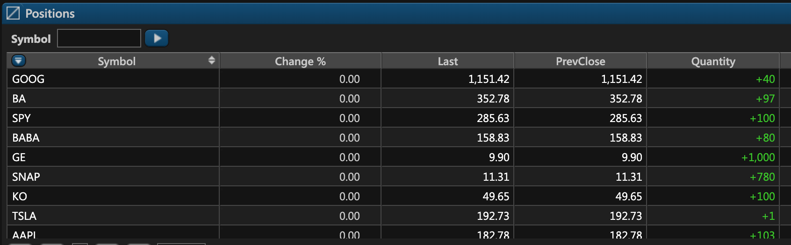

# Positions

### Introduction

In ETNA Trader, the process of purchasing or selling securities leads to opening a new long or short position. A position is strictly linked to a specific trading account and they can be examined from the _Positions_ widget of the web terminal:

Additionally, positions of a specific trading account can be listed via the following API endpoint:



### Position Parameters

The following table outlines all parameters of a positions:

<table>
  <thead>
    <tr>
      <th style="text-align:left">Parameter</th>
      <th style="text-align:left">Description</th>
      <th style="text-align:left">Example</th>
    </tr>
  </thead>
  <tbody>
    <tr>
      <td style="text-align:left">Symbol</td>
      <td style="text-align:left">The ticker symbol of the position&apos;s underlying security under which
        it is listed on the exchange.</td>
      <td style="text-align:left">
        <ul>
          <li>AAPL</li>
          <li>TSLA</li>
          <li>GE</li>
        </ul>
      </td>
    </tr>
    <tr>
      <td style="text-align:left">Description</td>
      <td style="text-align:left">Typically, this field represents the name of the company.</td>
      <td style="text-align:left">Apple Inc.</td>
    </tr>
    <tr>
      <td style="text-align:left">Change</td>
      <td style="text-align:left">
        
This is the difference between the closing price from the previous trading
          session and the price of the last trade.

        
<code>Change = Last - PrevClose</code>
        

      </td>
      <td style="text-align:left"><code>Change</code> = <code>Last</code> - <code>PrevClose</code> = 106 - 90
        = 16</td>
    </tr>
    <tr>
      <td style="text-align:left">Change %</td>
      <td style="text-align:left">
        
Identical to <code>Change</code> but expressed in percentage terms.

        
<code>Change % = (Last - PrevClose) / PrevClose * 100</code>
        

      </td>
      <td style="text-align:left">Change % = (106-90)/ 90 * 100 = 17.77%</td>
    </tr>
    <tr>
      <td style="text-align:left">Bid</td>
      <td style="text-align:left">This is the bid price &#x2014; the highest price at which buyers (i.e.
        bidders) are willing to purchase the security.</td>
      <td style="text-align:left">100.00</td>
    </tr>
    <tr>
      <td style="text-align:left">Ask</td>
      <td style="text-align:left">This is the ask price &#x2014; the lowest price at which sellers are willing
        to sell the security.</td>
      <td style="text-align:left">110.00</td>
    </tr>
    <tr>
      <td style="text-align:left">Last</td>
      <td style="text-align:left">This is the price of the last trade that was made during the regular trading
        hours of the previous trading session.</td>
      <td style="text-align:left">106.00</td>
    </tr>
    <tr>
      <td style="text-align:left">PrevClose</td>
      <td style="text-align:left">This is the closing price from the previous trading session.</td>
      <td style="text-align:left">90.00</td>
    </tr>
    <tr>
      <td style="text-align:left">Ext H Price</td>
      <td style="text-align:left">This is the price of the last trade made during the extended hours. It
        is displayed at &quot;-&quot; during the regular trading session.</td>
      <td
      style="text-align:left">&#x2014;</td>
    </tr>
    <tr>
      <td style="text-align:left">Mark</td>
      <td style="text-align:left">This is the mark price of the underlying security. Refer to our dedicated
        article that explains the formula for calculating the <a href="understanding-the-mark-price.md">mark price</a> in
        detail</td>
      <td style="text-align:left">12.55</td>
    </tr>
    <tr>
      <td style="text-align:left">Quantity</td>
      <td style="text-align:left">The number of securities that were purchased or sold short.</td>
      <td style="text-align:left">100</td>
    </tr>
    <tr>
      <td style="text-align:left">Contract Size</td>
      <td style="text-align:left">This is the deliverable quantity of the underlying financial instrument.</td>
      <td
      style="text-align:left">
        <ul>
          <li>For stocks &#x2014; 1</li>
          <li>For options &#x2014; 100</li>
        </ul>
        </td>
    </tr>
    <tr>
      <td style="text-align:left">Avg Open Price</td>
      <td style="text-align:left">
        
The average opening price of the position.

        
Calculated as: <code>&#x3A3;(Quantity * Fill Price) / Quantity</code>
        

      </td>
      <td style="text-align:left">47.84</td>
    </tr>
    <tr>
      <td style="text-align:left">Daily Cost Basis</td>
      <td style="text-align:left">The aggregate value of all order transactions. This value is calculated
        daily and after the current trading session it resets to <code>PrevCloseMktValue</code>.</td>
      <td
      style="text-align:left">28&apos;384.19</td>
    </tr>
    <tr>
      <td style="text-align:left">Cost Basis</td>
      <td style="text-align:left">
        
The aggregate value of all order transactions.

        
Calculated as: <code>&#x3A3;Quantity * Fill Price * ContractSize</code>
        

      </td>
      <td style="text-align:left">
        <ol>
          <li>Purchased to shares at $10. Cost Basis = 100</li>
          <li>Purchased another 10 shares at $15. Cost Basis = 100 + 150 = 250</li>
          <li>Sold 5 shares at $15. Cost Basis = 100 + 150 - 75 = 175</li>
        </ol>
      </td>
    </tr>
    <tr>
      <td style="text-align:left">Market Value</td>
      <td style="text-align:left">
        
This is the current market value of the position. Calculated as:

        
Market Value = <code>Mark * Quantity * Contract Size</code>
        

      </td>
      <td style="text-align:left">1812.24</td>
    </tr>
    <tr>
      <td style="text-align:left">RP/L Day</td>
      <td style="text-align:left">
        
This is the realized profit or loss on the trading account for the ongoing
          trading session. Calculated as:

        
<code>&#x3A3;(Fill Price - AverageOpenPrice) * Quantity * Contract Size</code>
        

      </td>
      <td style="text-align:left">245.31</td>
    </tr>
    <tr>
      <td style="text-align:left">P/L Day</td>
      <td style="text-align:left">
        
This is the total profit or loss on the trading account as compared to
          the securities&apos; closing price of the previous trading session. Calculated
          as:

        <ul>
          <li>If there are no deals made today:
            <ul>
              <li><code>P/L Day - MarketValue - PrevCloseMrktValue + RP/L Day</code>
              </li>
            </ul>
          </li>
          <li>If deals have been made today:
            <ul>
              <li>P/L Day = DayQty * Mark * Contract Size - Daily Cost Basis + (Qty - DayQty)
                * (Mark - PrevClosePrice) * Contract Size + RPL Day</li>
            </ul>
          </li>
        </ul>
      </td>
      <td style="text-align:left">387.1</td>
    </tr>
    <tr>
      <td style="text-align:left">PrevCloseMarketValue</td>
      <td style="text-align:left">
        
This is the market value of the position at the closing of the previous
          trading session. Calculated as:

        
<code>&#x3A3;ClosePrice * Quantity * ContractSize</code>
        

      </td>
      <td style="text-align:left">9656.19</td>
    </tr>
    <tr>
      <td style="text-align:left">P/L Open</td>
      <td style="text-align:left">
        
This is the unrealized profit and loss in the position. The profit or
          loss becomes realized once the position is liquidated. Calculated as:

        
<code>P/L Open = Market Value - Average Open Price * Quantity * Contract Size</code>
        

      </td>
      <td style="text-align:left">929</td>
    </tr>
    <tr>
      <td style="text-align:left">P/L %</td>
      <td style="text-align:left">
        
Identical to <code>P/L Open</code> but expressed in percentage terms. Calculated
          as:

        
<code>P/L % = P/L Open / CostBasis * 100</code>
        

      </td>
      <td style="text-align:left">15.2</td>
    </tr>
    <tr>
      <td style="text-align:left">Created</td>
      <td style="text-align:left">The date on which the position as opened. Expressed in Unix timestamps.</td>
      <td
      style="text-align:left">17659421</td>
    </tr>
    <tr>
      <td style="text-align:left">Modified</td>
      <td style="text-align:left">The date on which the position was last modified. Expressed in Unix timestamps.</td>
      <td
      style="text-align:left">84748201</td>
    </tr>
    <tr>
      <td style="text-align:left">Security Type</td>
      <td style="text-align:left">This is the type of the underlying security in the position.</td>
      <td style="text-align:left">
        <ul>
          <li>Option</li>
          <li>Common Stock</li>
        </ul>
      </td>
    </tr>
  </tbody>
</table>