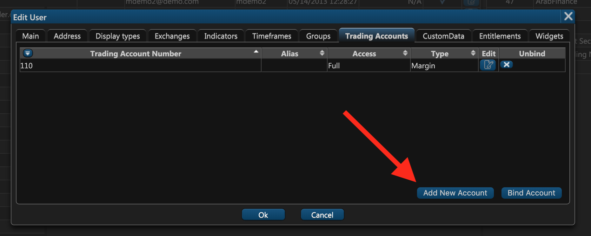
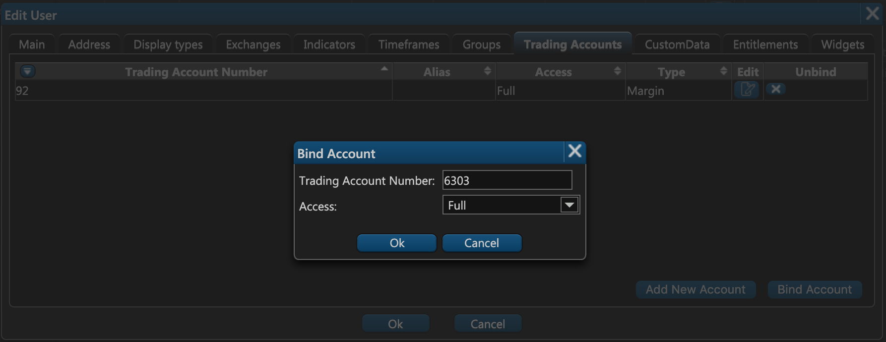

# Trading Accounts

### Introduction

In ETNA Trader, a trading account is a separate entity used for performing trades. Whenever you need to purchase or sell some security, you must have an active trading account that was approved by a clearing firm that handles the confirmation, settlement, and delivery of transactions. The clearing firm can also reject trades if, for example, the account's equity falls below a certain level.

Trading accounts are distinct from users, as one user might have multiple trading accounts and vice versa. For example, a user might have separate trading accounts for stock trading, options trading, and Forex trading. Similarly, one trading account might have multiple associated users. For example, all members of a family are using the same account to place orders.

Trading accounts can be created in one of the two following ways:

1. Through ETNA Trader's [web terminal](../administrators-widgets/managing-users/#trading-accounts);

   2. Through our[ extended REST API](../../rest-api/broker-api/internal-accounts/create-a-new-trading-account/).

As an administrator, you need to review each newly created trading account before ETNA Trader sends it for review to the clearing firm. After the account is approved by the clearing firm, it becomes active and can be used to perform trades.

### Account Types

All trading accounts fall into one of the four FINRA-defined types: _Cash_, _Margin_, _MarginIRA_, and _Day Trader_. 

| Account  Type | Description |
| :--- | :--- |
| Cash | This type of account only permits trading operations with the trader's funds  without the ability to trade on margin. Cash accounts are not allowed to open short positions and write call and put options \(except for covered calls\). |
| Margin | In addition to personal funds, margin accounts permit trading with borrowed money. As per FINRA's requirements, the owner of a margin account can trade on margin only if their equity is no less than $2'000. If the owner's equity falls below the $2'000 mark due to market fluctuations, the account is automatically converted to _Cash_. If at that point the account has any short or margin positions, the owner will get a required maintenance call. |
| MarginIRA | This is the Margin Individual Retirement Account. |
| Day Trader | This type of margin account is aimed at day traders and allows them to buy and sell the same security on the same trade date. To qualify for the day trader account, the owner of the account should have at least $25'000 of equity. If the equity falls below the $25'000 mark due to market fluctuations, the owner of the account will get an equity maintenance call the next business day. |

Each of these types has its own requirements; if they are not met, the account becomes inactive and the user can no longer perform trades.

### Account Access Level

If you've created a new trading account, it's not automatically available to any of your company's users — it has to be bound to each user individually. Binding trading accounts to users can be done through:

* **BO Users** widget;

* ETNA Trader's [private REST API](../../rest-api/broker-api/internal-accounts/bind-an-account-to-a-user/).

During the binding process, you have to specify the access level that the user must have when operating this trading account.

| Access Level Value | Permissions |
| :--- | :--- |
| Full | **Full**. All operations are allowed. |
| ReadOnly | **Read Only**. The user can only examine the existing orders and positions \(without having the ability to place new orders or modify the existing ones\). |
| ClosePositionsOnly | **Close Positions Only**. The user can only close the positions without the ability to open new ones. |


Access Level Value must be specified only when an account is bound to a user via ETNA Trader's [REST API](../../rest-api/broker-api/internal-accounts/bind-an-account-to-a-user/).


### Trading Account Parameters

Each trading account consists of an array of different parameters, some of which are retrieved from the clearing firm — **base parameters** — while others are dynamically calculated based on the aforementioned base parameters.

Some of these parameters can be examined in the **Account Info** widget.

The chart on the right displays the trading account's value for a certain period. Specify the starting date, the end date, and the account value for the period will be graphed. To export the chart data in the Excel \(.xlsx\) format, click **Export**.

Let's examine each of the trading account's parameters in detail.

### Cash

Cash indicates the amount of funds that the account's user has deposited themselves or borrowed from the broker. You can think of it as the net balance of the account: if equity exceeds liabilities —  Cash is positive; if equity is lower than liabilities — Cash is negative.

For example, if you crate a new trading account, it's Cash parameter is initially equal to $0. After every deposit, Cash increases by the deposited amount — if you deposit $100, it'll increase from $0 to $100.

Now let's investigate how opening new positions affects Cash. Suppose your Cash is equal to $200 and you want to purchase $800 worth of Apple stock \($200 is your own money and the remaining $600 are margin debt\). The applicable commission for this transaction is $3.75 and it has to be included in the order cost — so you'll only be able to purchase $796.25 worth of stocks while the remaining $3.75 will be charged for the commission. In total, your Cash will be decreased by $800 and will be equal to —$600. In addition to negative Cash, your account will also have $796.25 worth of Apple stock.


Cash is a base parameter that is retrieved daily from the clearing firm. Throughout the trading session it is dynamically re-calculated whenever a new transaction is made. 


### Margin Rate

Margin rate is the fraction of funds that the user must contribute if they're using margin debt to finance a new position. If the margin rate is set to 0.6, the user has to provide 60% of the cost of the new position, and the broker will provide the remaining 40%.

### Order Initial Margin Requirements

Order's initial margin requirements is the fraction of the funds that the user must provide when opening leveraged positions.

### Maintenance Margin

Maintenance margin represents the minimum amount of equity that should be maintained in a margin account to comply with FINRA's regulations. 

### Active Order Withholding \(Pending Cash\)

Active Order Withholding indicates the amount of funds reserved to carry out current transactions. This reserve is withheld from the Cash parameter and is calculated as the sum of the transaction commission and the cost of the securities purchased during the transaction.

* For stocks,

$$
Active Order Withholding = Σ Commissions + 
ΣOrderInitialMarginRequirements
$$

* For options,

$$
Active Order Withholding = Σ Commissions + ΣOrderCost + ΣOrderInitialMarginRequirements
$$

### Account Value

Account value represents the sum of the available Cash and the aggregate market value of all long and short positions.

$$
AccountValue = Cash + Market Value
$$

### Pending Order Count

Pending Order Count indicates the number of current outstanding orders \(the ones that are yet to be executed\).

### Excess Issued

Excess Issued represents the available funds that can be used to open new positions. 


Excess Issued is a base parameter that is retrieved daily from the clearing firm. Throughout the trading session it is dynamically re-calculated whenever a new transaction is made. 


### Excess

Excess represents currently available funds that can be used to open new positions adjusted for Pending Cash. This is a base parameter that is retrieved daily from the clearing firm. Throughout the trading session, this parameter is calculated differently depending on the configuration of your environment:

* **Default**

$$
Excess = Excess Issued - Pending Cash
$$

* **Real-time Excess**

$$
Excess=Cash+MarketValue−MaintenanceMargin−PendingCash
$$

* **Excess with Unsettled Cash**

$$
Excess = ExcessIssued - UnsettledCash
$$

### Stock Buying Power

This is the gross number of stocks that can be purchased on this trading account, adjusted for the available margin debt. 

$$
StockBuyingPower = Excess / MarginRate
$$

### Option Buying Power

This is the gross number of options that can be purchased on this trading account. 

$$
OptionBuyingPower = Excess
$$

### Day Trading Buying Power

Day trading buying power is a critical indicator that represents the amount of funds that the user can spend to open new positions. At the beginning of every trading session, this value is retrieved from the clearing firm. Throughout the trading session, Day Trading Buying Power fluctuates based on the performed trades — it decreases with each new long position and it increases with each position closing.

It's calculated differently for stocks and options. For stocks, when you open a new long position, Day Trading Buying Power decreases according to the following formula:

$$
DayTradingBuyingPower -=  OrderCost * 4 * MarginRate + Commission * 4
$$

where:

| Parameter | Description |
| :--- | :--- |
| OrderCost | This is the cost of the order calculated as the order price multiplied by the number of purchased securities. |
| 4 | Because brokers let their users borrow up to three times as much money to finance positions, the buying power of the entire account has to be decreased by the position cost multiplied by four \(1 is the user's funds and 3 is the margin debt\). |
| MarginRate | This is the fraction of funds that the user must contribute if they're using margin debt. |
| Commission | This is the commission that was applied to this order.  |


Please note that the cost of the margin debt provided by the broker is not taken into account when calculating Day Trading Buying Power.


### Option Maintenance Margin

This is the minimum amount of equity that must be maintained on the trading account in order to cover the existing option positions.

### Market Value

Market Value represents the sum of four other trading account parameters:

1. stockLongMarketValue — the aggregate market value of all long positions in stocks.
2. stockShortMarketValue — the aggregate market value of all short positions in stocks.
3. optionLongMarketValue — the aggregate market value of all long positions in options.
4. optionShortMarketValue — the aggregate market value of all short positions in options.

$$
MarketValue = stockLongMarketValue + stockShortMarketValue +
$$

$$
+ optionLongMarketValue + optionShortMarketValue
$$

### Equity

Equity represents the sum of Cash and the net market value of all positions in stocks:

$$
Equity = Cash + StockMarketValue
$$

### Stock Market Value

Stock market value is calculated as the net market value of all positions is stocks. The aggregate market value of all long stock positions is added to the aggregate market value of all short stock positions.

$$
StockMarketValue = StockLongMarketValue + StockShortMarketValue
$$

### Day Trades

Day trades is the number of day trades that have been executed on this trading account during the last five trading sessions \(including the current one\). According to FINRA, a day trade is the purchase and sale \(or sale and purchase\) of the same security during the same trading session in a margin account.

### Net Liquidity

Net liquidity is identical to Market Value.

### OpenPL

OpenPL stands for **Open Profit/Loss** and it represents the amount of unrealized profit or loss of the trading account at the opening of the current trading session.

### ClosePL

ClosePL stands for **Close Profit/Loss** and it represents the amount of unrealized profit or loss of the trading account at the closing of the current trading session.

### P/L Day

P/L Day stands for **Profit/Loss Day** and it represents the sum of realized and unrealized profit of this trading account. It is calculated according to this formula:

* If the number of securities traded during this trading session is 0, **P/L** **Day** is calculated as the sum or unrealized and realized profit or loss for the day:

$$
P/L Day = ΣMarketValue - PreviousCloseMarketValue  + RP/L Day
$$

* If the number of securities traded during the current trading session is greater than 0, **P/L Day** is calculated as: 

$$
P/L Day =Σ DayQuantity * MarkPrice * ContractSize - DailyCostBasis +
$$

$$
+ (TotalQuantity - Day Quantity) * (Mark - PreviousClosePrice) * ContractSize +
$$

$$
+ RP/L Day
$$

where: 

| Parameter | Description |
| :--- | :--- |
| RP/L Day | Realized profit or loss for the day. |
| DayQuantity | This is the number of contracts traded during the current trading session \(essentially indicates if any trades have been made today\). |
| MarkPrice | This is the mark price \(learn more about it [here](understanding-the-mark-price.md)\). |
| ContractSize | This is the number of securities in each contract. |
| DailyCostBasis | This is the total amount of commissions charged during the current trading session. |
| PreviousClosePrice | This is the last closing price of the security. |

The logic here is that if a trader only has positions from the previous trading sessions, P/L should be calculated based on the previous closing price of every position. Conversely, if the trader has positions from both the previous and from the current trading sessions, P/L should be calculated separately for the previous session, for this session, and then added together.

### Status

This is the current status of the trading account. The range of possible account statuses is as follows:

* **New** — the trading account has been created;
* **SentToClearing** — the trading account has been sent to the clearing firm;
* **Approved** — the trading account has been approved by the clearing firm;
* **Rejected** — the trading account has been rejected by the clearing firm.

### MarginInterestRate

Margin interest rate is the interest rate applied to the funds borrowed to finance margin positions.

### OwnerType

This is the type of the trading account's owner. The range of possible account statuses is as follows:

* **IndividualCustomer** = 0
* **InstitutionalCustomer** = 1, 
* **Combined** = 2, 
* **EmployeeAccount** = 3, 
* **MarketMaking** = 4,
* **OtherProprietary** = 5, 
* **Unknown** = 6, 
* **ErrorAccount** = 7.

### Maintenance Call

This field indicates the amount of funds that need to be deposited into the account in order to prevent a maintenance call.

### Equity Call

This field indicates the amount of funds that need to be deposited into the account in order to prevent a minimum equity call.

### Initial Call

This field indicates the amount of funds that need to be deposited into the account in order to prevent an initial call.

### Day Trade Call

This field indicates the amount of funds that need to be deposited into the account in order to prevent a day trade call.

### Trade Day Balance

Trade Day Balance represents the amount of funds this trading account owes to the broker.

### Cip

Cip is the Carriage and Insurance Paid To \(CIP\). This value is retrieved daily from the clearing firm.

### SmaBalance

SmaBalance is the amount of funds in a special memorandum account. This value is retrieved daily from the clearing firm.

### Option Level

Option level indicates the extent of option strategies permitted on this trading account. Level one has the smallest selection of strategies while level four has no limitations \(even naked options are allowed\). In other words, as you move up from level one to level four, the number of available option strategies increases. 


Each option level incorporates the strategies available in all previous levels.


#### **Level 1**

On level 1, the user of the trading account is allowed to open only short positions in options that are covered by a long position in the option's underlying security.

Available strategies:

* Covered Short Call.

#### **Level 2**

On level 2, in addition to strategies from level 1, the user of the trading account is also allowed to open long positions in Call and Put options.

Available strategies:

* Long Call;
* Long Put.

#### **Level 3**

On level 3, in addition to strategies from level 1 and 2, the user of the trading account also has access to a broader range of option strategies which includes multi-leg strategies with a capped risk.

Available strategies:

* Long Iron Butterfly;
* Long Iron Condor;
* Butterfly;
* Skip Strike Butterfly;
* Double Diagonal Spread;
* Long Spread;
* Short Spread;
* Long Diagonal Spread;
* Short Diagonal Spread;
* Protective Put.

#### **Level 4**

In addition to all strategies from the previous levels, level 4 also adds strategies that carry unlimited risk.

* Short Strangle;
* Short Call;
* Short Put.


Option level 4 enables traders to open positions in naked options. As a broker, you may want to require such options to be covered by a fixed amount of user's funds \(contact our support\). 


### ChangeAbsolute

ChangeAbsolute indicates the difference between the current market value of all positions less their market value at the closing of the previous trading session. 

### ChangePercent

ChangeAbsolute indicates the difference between the current market value of all positions less their market value at the closing of the previous trading session expressed in percentage terms.

### NetCash

NetCash represents the amount of available funds adjusted for the option maintenance margin. It is calculated according to the following formula:

$$
NetCash = Cash - OptionMaintenanceMargin
$$

