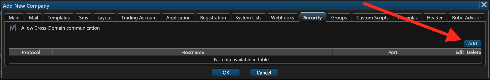
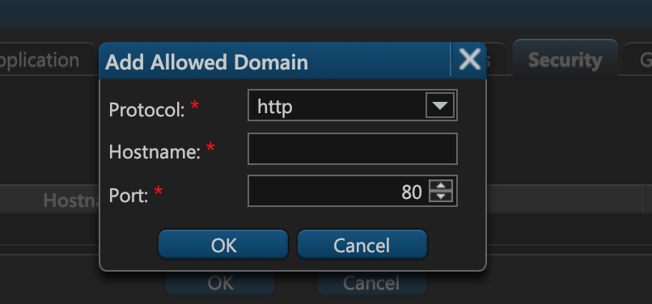

# 11. Security

On the eleventh tab of the company creation window — **Security** — you can enable and configure cross-domain communications.

By default, ETNA Trader forbids API calls to our back-end from hostnames that are not listed on this tab. To add a hostname, click **Add**. 

Specify the protocol, the hostname, and the port. When done, click **OK**.

From now on you can make API calls to our back-end from the specified hostname.

