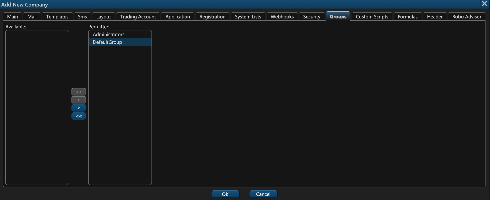

# 12. Groups

On the twelfth tab of the company group creation window — **Groups** — you can determine  which groups' users can log in to this company's web terminal. In the leftmost column \(**Available**\) you have all of the available groups. Next to it there's a column called **Permitted** which lists all of the groups whose users should be allowed to log in to this company's web terminal. You can add or remove these groups by clicking on the right or left arrow icons. 


Multiple groups can be shared among multiple companies. 


