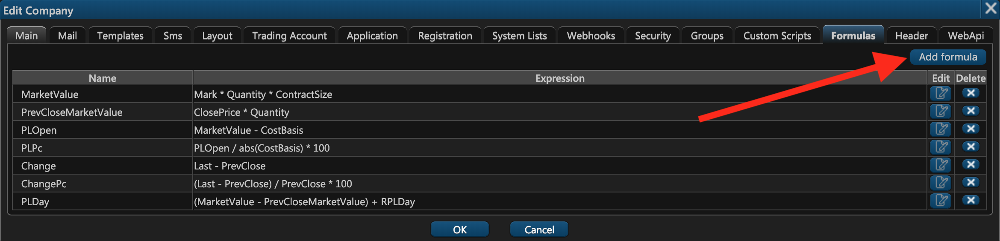
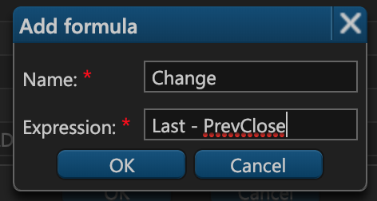

# 14. Formulas

### Custom Formulas

On the fourteenth step of the company creation window — **Formulas** — you can configure custom formulas for calculating various figures.

Experience tells us that different companies have different formulas for the most common trading figures like **profit, loss**, **percentage change**, etc. If you're dissatisfied with the way ETNA Trader calculates certain figures, you may define your own formulas that meet your requirements. To add a new formula, click **Add formula**.



In the appeared pop-up window, specify the following parameters:

1. **Name**. This is the figure you want to re-define \(must be selected from the list\).
2. **Expression**. This is the formula for the re-defined figure.



When done click **OK**, and from now on the specified figure will be calculated according to the new formula.

### Formula Syntax

Custom formulas in ETNA Trader are parsed and evaluated by the [Javascript Expression Evaluator](https://www.npmjs.com/package/expr-eval). This library can interpret basic Javascript expressions, but it's a little more math-oriented. For example, if you want to re-define the formula for price change, you should enter the required mathematical expression. For example:

```text
Last - PrevClose
```

where Last and PrevClose are ETNA Trader's variables. Some of these variables are fetched from the market data suppliers while others are computed with the help of the fetched variables.

#### Fetched Variables 

<table>
  <thead>
    <tr>
      <th style="text-align:left">Variable</th>
      <th style="text-align:left">Description</th>
    </tr>
  </thead>
  <tbody>
    <tr>
      <td style="text-align:left">Last</td>
      <td style="text-align:left">This is the price at which the last trade was executed before the closing
        time</td>
    </tr>
    <tr>
      <td style="text-align:left">PrevClose</td>
      <td style="text-align:left">This is a security's closing price on the preceding day</td>
    </tr>
    <tr>
      <td style="text-align:left">Mark</td>
      <td style="text-align:left">
        <p><em>1.Trading hours:</em>
        </p>
        <p><b>    Last</b>, if Bid
          < LastPrice < Ask;</p>
            <p><b>    Ask,</b> if Last >= Ask ;</p>
            <p><b>    Bid</b>, if Last =
              < Bid;</p>
                <p><em>2. After-market</em>: <b>Close</b>
                </p>
                <p><em>3. Pre-market</em>: <b>Close</b>
                </p>
                <p><em>4. Non-trading hours: </em><b>Close</b>
                </p>
      </td>
    </tr>
    <tr>
      <td style="text-align:left">ClosePrice</td>
      <td style="text-align:left">This is the price at which the last trade of the day was executed</td>
    </tr>
    <tr>
      <td style="text-align:left">Quantity</td>
      <td style="text-align:left">This is the number of shares in a position</td>
    </tr>
    <tr>
      <td style="text-align:left">RPLDay</td>
      <td style="text-align:left">Realized profit or loss for the day for all positions</td>
    </tr>
    <tr>
      <td style="text-align:left">CostBasis</td>
      <td style="text-align:left">The net cost of all positions</td>
    </tr>
    <tr>
      <td style="text-align:left">RealizedPL</td>
      <td style="text-align:left">Realized profit or loss</td>
    </tr>
    <tr>
      <td style="text-align:left">ContractSize</td>
      <td style="text-align:left">Deliverable quantity of commodities or financial instruments in an underlying
        contract</td>
    </tr>
  </tbody>
</table>#### Calculated Variables

| Variable | Description |
| :--- | :--- |
| MarketValue | This is the current market value of a position |
| PrevCloseMarketValue | This is the market value of a position  |
| PLOpen | The profit or loss for an open position |
| PLPc |  Unrealized profit or loss for the day for all open positions \(in percentage terms\) |
| PLDay |  Profit or loss for the day for all open positions \(on the absolute basis\) + RPLDay |
| Change | The difference between the security's closing price from the previous day and the current market price \(on the absolute basis\) |
| ChangePc | The difference between the security's closing price from the previous day and the current market price \(in percentage terms\) |

### 

