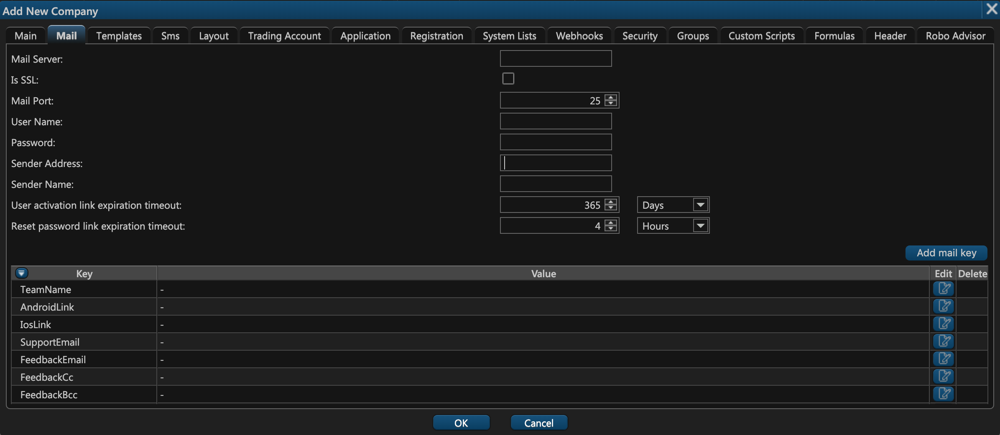

# 2. Mail

The second tab of the company creation window concerns the settings of the email server that will be used to send various emails to your users like sign-up confirmation and password reset.

Here you can configure the following settings:

1. **Mail Server**. This is the address of the server that will be used to send emails.
2. **Is SSL**. Select this checkbox if your SMTP server is using SSL for communication.
3. **Mail Port**. This is the email port through which we will connect to email server.
4. **User Name**. The username that we can user to authorize on the server.
5. **Password**. The password that we can user to authorize on the server.
6. **Sender Address**. This is the email address your users will see as the sender of all emails \(e.g. admin@goodtrade.com\).
7. **Sender Name**. This is the name of the sender of the email.
8. **User activation link expiration timeout**. This indicates the time period after which a generated user activation link must expire.
9. **Reset password link expiration timeout**. This indicates the time period after which a generated password reset link must expire.

Below these settings is a list of key-value pairs that appear in all sent emails. For example, you can define a pair with a key **TeamName** and a corresponding value of **Good Trade**. You can later insert these keys in email templates and our service will automatically replace them with their corresponding values at the time of email dispatch.

