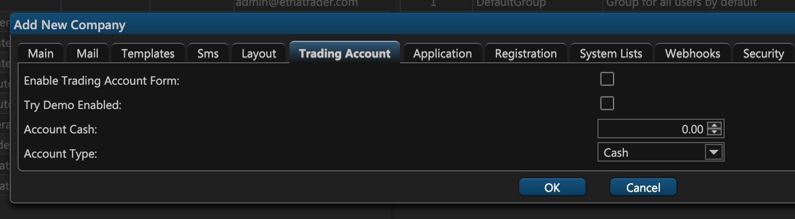

# 6. Trading Account

On the sixth tab of the company creation window — **Trading Account** — you can configure a demo trading account for the users of this company.

If you selected the **Try Demo Enabled** checkbox, proceed to specify which type of demo account demo users will initially get \(**Account Type**\) and also how much funds should be available on such accounts \(**Account Cash**\). 

Feel free to read our article on user's [trading accounts](../managing-users/#trading-accounts) that delves deeper into the subject.

