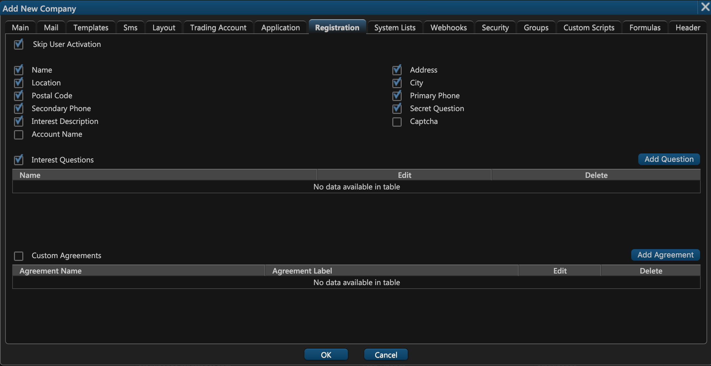
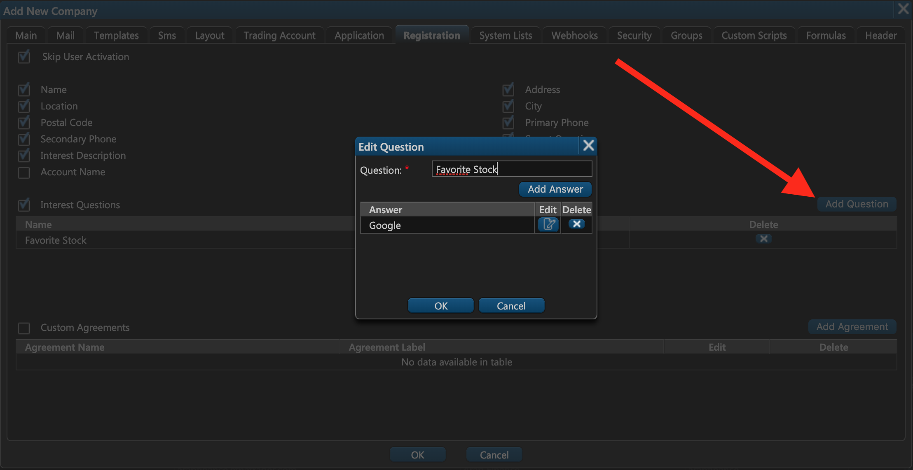
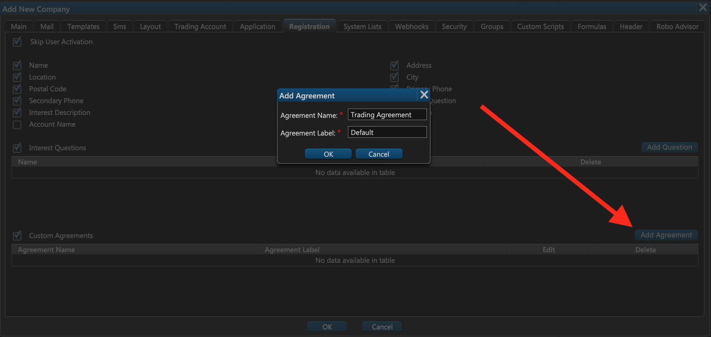

# 8. Registration

### Configuring the Sign-Up Page

On the 8th tab of the company creation window — **Registration** — you can configure the layout of the user sign-up page. 

If you want to exempt your users from the obligatory activation, you can disable it by selecting the **Skip User Activation** checkbox. That way the user can immediately log in to the web terminal after registration without having to activate their account by email.

Next, select the text fields that the user should fill out in order to complete the sign-up process.

### Interest Questions

You can also optionally configure some interest questions to learn more about the user. For example, you can ask them, "What are you favorite tech stocks?", and then provide a list of pre-defined options like Apple, Google, Tesla, Amazon, Netflix, and so on. You can also find out which industries the user prefers, or whether or not they might be interested in robo-advisors.

### Custom Agreements

Lastly, you can optionally configure custom agreement checkboxes that you expect the user to check when they sign up.

