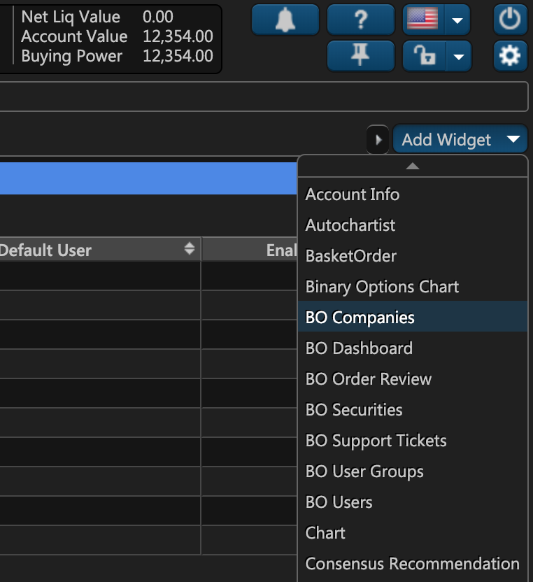
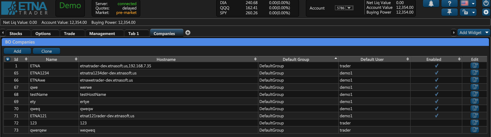

# Managing Companies

### Introduction

In ETNA Trader, each user must belong to a certain company through user groups. In other words, before you attempt to create a new user, first ensure that you have at least one company and one user group. As an administrator, you can create and manage different companies and their corresponding user groups and users. 

To create a new company, you need to add a widget entitled **BO Companies** to your terminal \(we recommend you create a separate tab for it so as to not overfill the existing tabs\). This widget is used for creating and managing all your companies in ETNA Trader.

### Adding the BO Companies Widget 

Click **Add Widget** and then click **BO Companies**.


If you don't see the **BO companies** widget, it's likely that you've logged in as a **user** \(and not as an **administrator**\).


The widget will automatically be added and, as you can see, it displays a table with all of the existing companies \(it's empty by default\). 

The rows represent the companies while columns display various information about the company, including:

* **ID**. This is the company's ID within your environment.
* **Name**. This is the company's name.
* **Hostname**. This is the hostname of the company.
* **Default Group**. This is the default group for all newly created users.
* **Default User**. This is the default user for this new company.
* **Enabled**. This property indicates if the company is active and if its users can make trades.
* **Edit**. Clicking on this icon enables you to edit the company's properties.

To add a new company, click **Add**. You can also clone an existing company by clicking **Clone** in case you want to create a company that's quite similar to the cloned one.  

You'll be presented with the company creation window, where you can specify all of the required properties for the new company. There are a total of 16 tabs that you need to go through in order to create a company. Most of them are optional; however, we recommend that you configure them as meticulously as you can so as to avoid any issues in the future.

In the following articles we'll take a more detailed look at each of these tabs.

