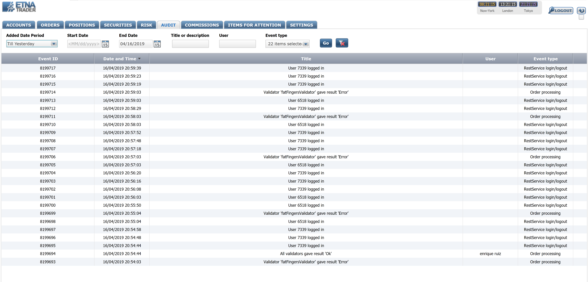
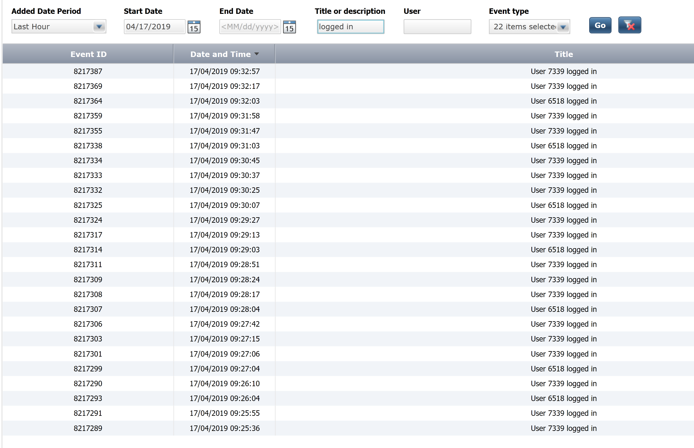
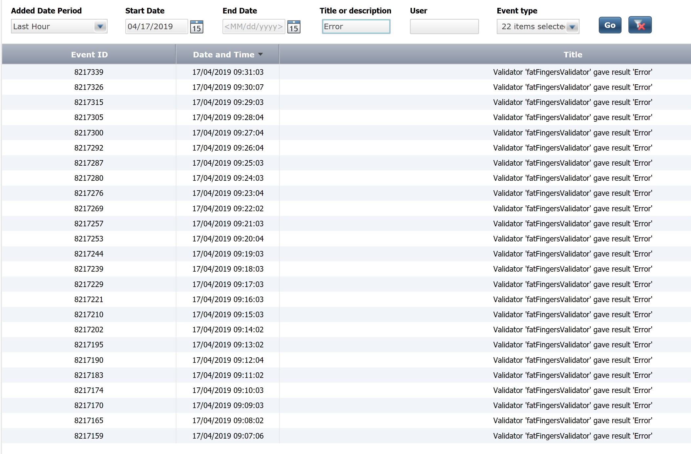
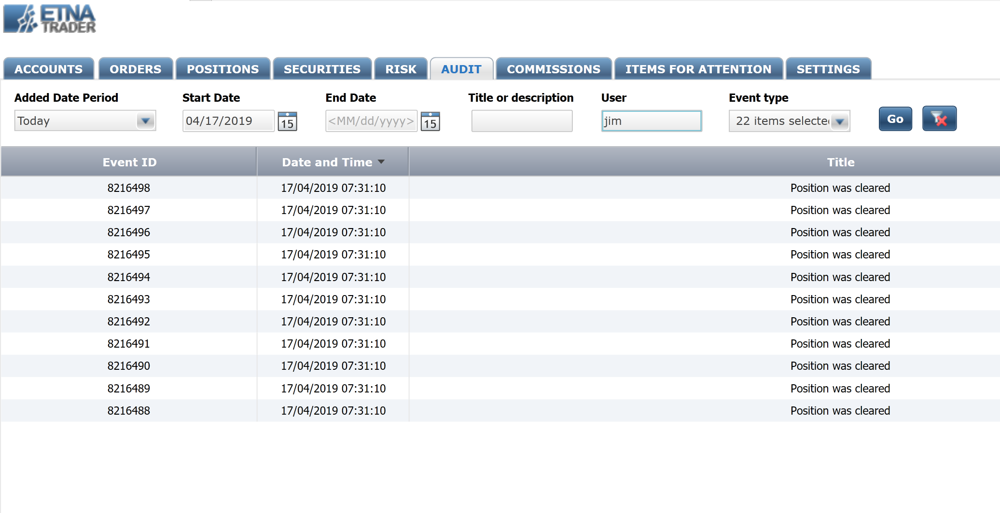
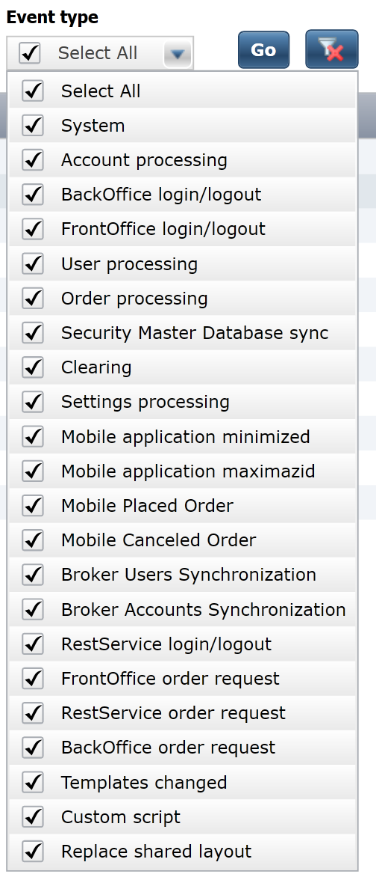

# Auditing Operations

### Introduction

In ETNA Trader, almost all operations conducted by traders are logged and can be examined by the company's administrators. If you spot a strange order or simply need to review some activity over a specific time period, you can do that in ETNA Trader's Back Office. This might help resolve any dispute with traders when, for example, they claim that they didn't place a specific order.

### Audit in ETNA Trader

Auditing operations in ETNA Trader can be done on the **Audit** tab of the Back Office.



On this page you can sort the existing audit operations by the following parameters:

#### **Added Date Period** 

This is the time frame for which the logged operations should be displayed. Possible values: **All**, **Last Hour**, **Today**, **Till Yesterday**, **Last Week**, **Current Month**, **Specify Data Range**.

**Start Date**

If **Added Date Period** is set to **Specify Data Range**, this is the starting date of the time frame.

#### **End Date**

If **Added Date Period** is set to **Specify Data Range**, this is the end date of the time frame.

#### **Title or Description**

This is a string that will be queried in the title and description of all operations. Those operations that contain the queried string will be displayed. 

For example, to list all logins performed by traders, enter the following text:

```text
logged in
```



To list operations that resulted in error, enter the following text:

```text
Error
```



#### User

This filter can be used to display operations that involved a specific user. For example, if you have a user with username **jim** and you'd like to list all operations that where **jim** was involved, simply enter **jim** in the **User** text field and click **Go**.



#### Even Type

_Event Type_ is by far the most customizable filter on the **Audit** tab. It enables you to determine which types of logged operations should be listed in the table. Select the checkboxes next to the required operations and then click **Go**.




