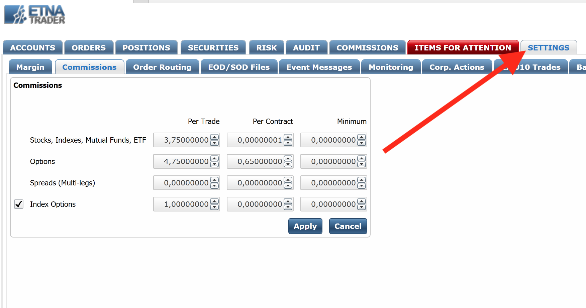
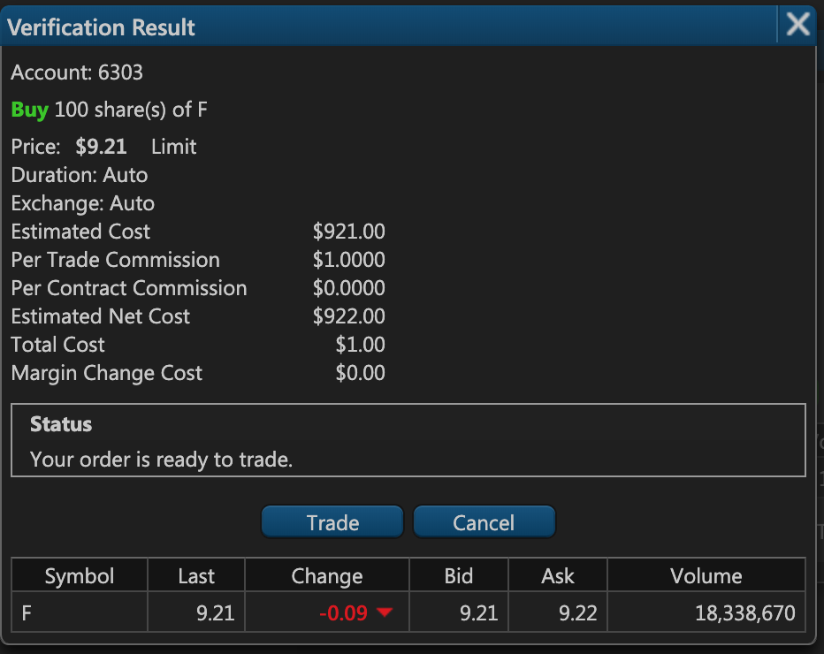
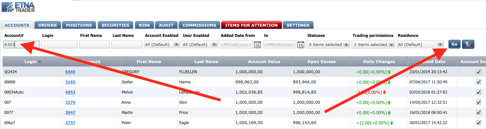

# Configuring Commissions

### Introduction

Whenever a user makes a trade, in addition to the cost of the order, the user also has to pay the broker's commission applicable to this order. Such commissions are configured individually for different types of securities like stocks, options, ETFs, etc. ETNA Trader initially sets default values for all commissions; however, they can always be modified in the Back Office located at [admin.yourDomain.com](http://admin.demo.etnatrader.com).

In addition to the broker's commission, there are also other non-broker commissions like the  exchange & SEC commissions. These commissions can be manually configured in your environment by our support team at your request. Each of these commissions will be displayed separately during order placement; for example, the user will see the following commissions when they place a new order:

* SEC commission: $0.01;
* Exchange commission: $5;
* Per Trade commission: $4.

Alternatively, you can incorporate the exchange, SEC, and all other applicable commissions into the Per Trade commission which will be less confusing for the user. For example, if you want to charge your users $3 per trade, the exchange charges $1 per trade, and the SEC charges $0.5 per trade, you can combine all these commissions into a single Per Trade commission of $4.5. That way, if the user purchases 1000 shares of the Apple stock priced at $200, they will see the following charge statement:

* Cost: $200'000;
* Per Trade commission: $4.5;
* Total cost: $200'004.5;

Now let's delve deeper into how you can configure per trade commissions in ETNA Trader's Back office.

### Configuring Commissions

To configure a custom commission for all new orders, navigate to the Back Office of your environment \(usually located at [admin.yourDomain.com](http://admin.demo.etnatrader.com)\).

Navigate to the **Settings** tab, and then open the **Commissions** tab. 

Here you can configure an individual commission for different types of securities:

* Stocks, Indices, Mutual Funds, ETFs;
* Options;
* Spreads \(multi-leg options\);
* Index Options.

For each of these security types, you can configure three different types of commissions:

* **Per Trade**. This is a fixed commission applied to every trade regardless of the volume. For example, if a trader purchases 1000 shares of the Apple stock priced at $200 and the per trade commission is set to $5, the user will end up paying $200'005 for the trade \(in addition to SEC, exchange, and other similar commissions\).
* **Per Contract**. This is a fixed commission applied to every security in the trade. For example, if the per contract commission is set to $0.001 and a trader purchases 1000 stocks of any security, they will pay $1 in addition to the per trade commission and other commissions like the SEC and exchange commissions.
* **Minimum**. This is the minimum commission for every trade. For example, you can set this commission to be $7, and if the _**per trade**_ ****and _**per**_ **contract** commissions do not add up to $7 \(maybe they're in total $5.25\), the user will still be charged $7 for the trade. That way you can ensure that traders are still charged per trade or per contract, but no less than a fixed sum.

Once you're finished configuring the commissions, click **Apply** and from then on the commissions will be applied to every trade.











### Account-Specific Commissions

Aside from configuring global commissions that are applied to all accounts, you can also configure individual commissions for a specific trading account. To do that, navigate to the **Accounts** tab, enter the number of the required account, and click **Go**.

Under the **Commissions & Fees** tab, select the **Apply specific commissions** checkbox. Specify the required commissions for this trading account and then click **Save**.

To reset the commissions, click **Restore previous values**.


Account-specific commissions take precedence over the global commissions.


