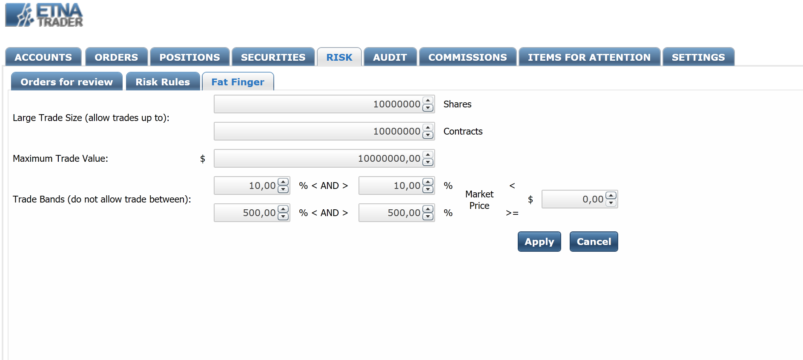
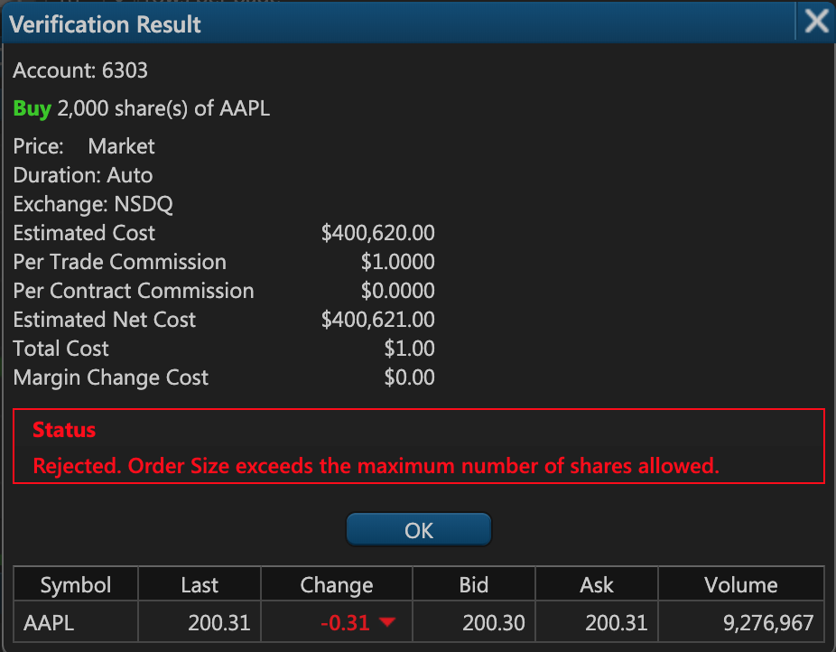
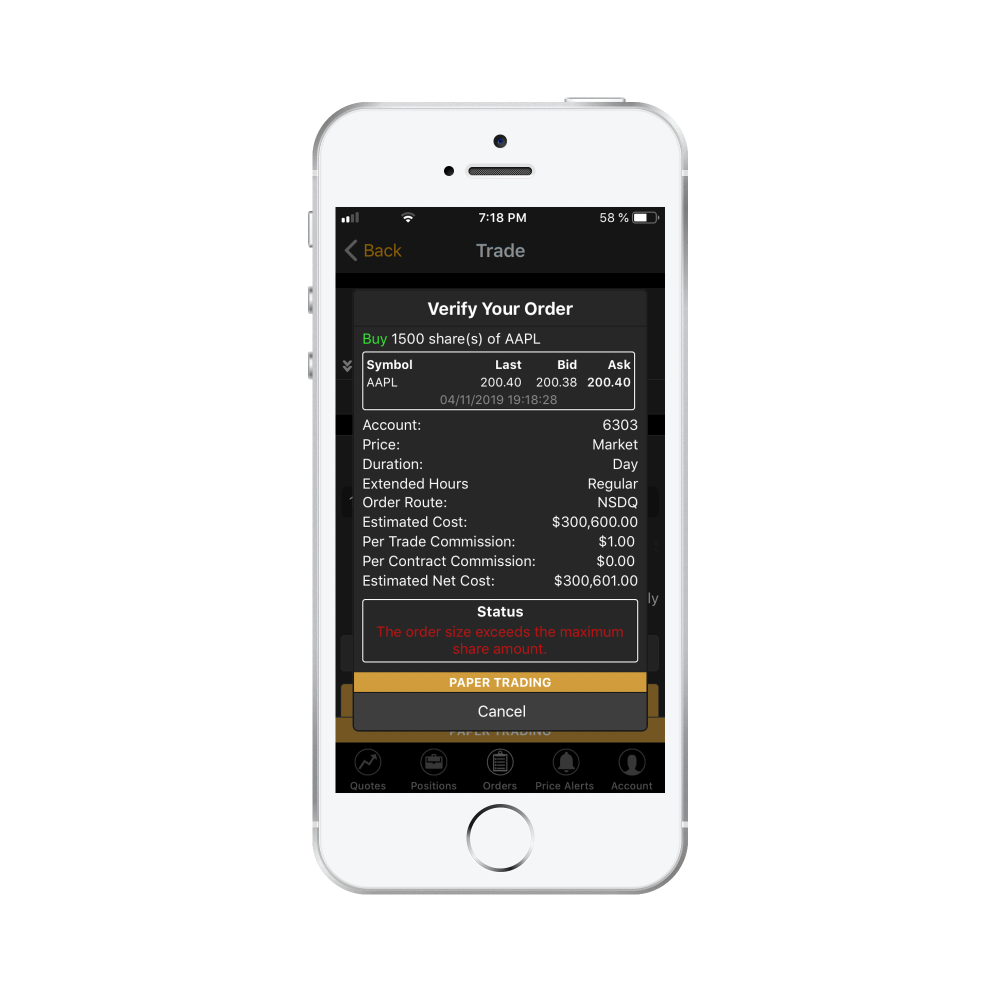
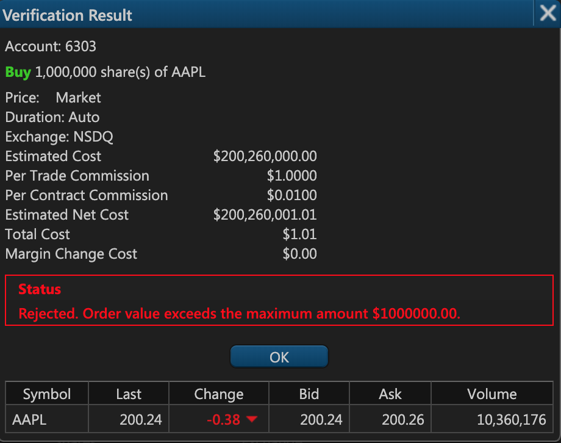
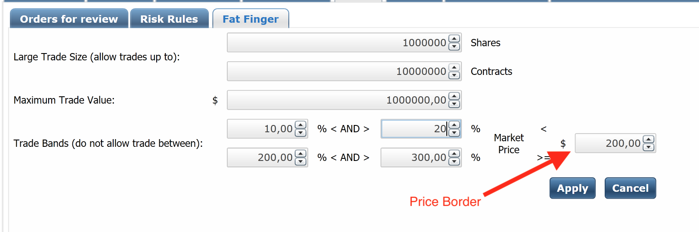
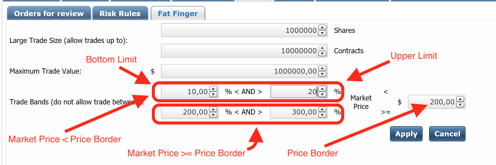
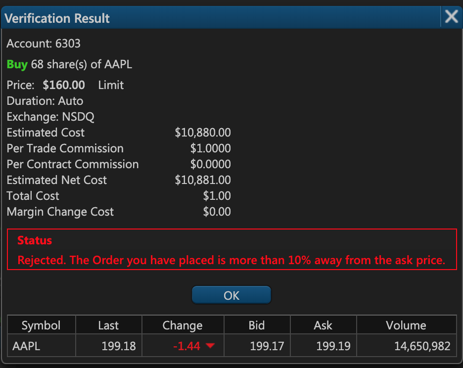
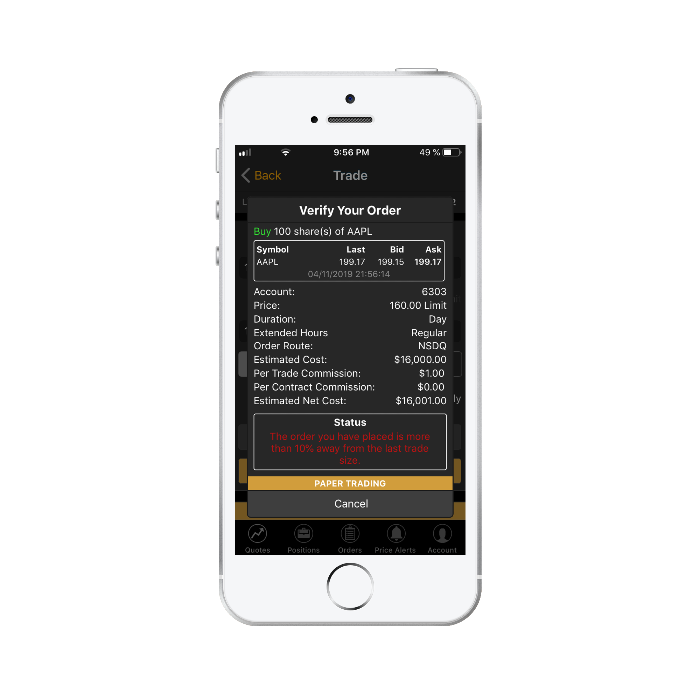

# Configuring Fat Finger Rules

### Introduction

Occasionally, some trader accidentally purchases one million shares of some security, causing their buying power to crash in value to extremely low levels. Sometimes the trader might even go bankrupt, and it might take a while for the broker to recover the funds. Some financial companies are known to have lost billions of dollars as a result of an improperly configured order. The main way to avoid such conflicts is to utilize fat finger rules that automatically prevent placement of strange orders.

ETNA Trader's Back Office provides comprehensive fat finger rule functionality, enabling brokers to thoroughly configure limitations for order placement in terms of:

* Total order value;
* Number of securities in the new position;
* Difference between the mark price and the order price.



Now let's delve deeper into the configuration of fat finger rules in ETNA Trader.

### Fat Finger Rules Configuration in ETNA Trader

Fat finger rules in ETNA Trader can be configured in the Back Office. Navigate to the **Risks** tab, and then click **Fat Finger**.

On this page you can configure three types of fat finger rules:

1. **Large Trade Size**;
2. **Maximum Trade Value**;
3. **Trade Bands**.

### Large Trade Size

The first type of fat finger rules is **Large Trade Size** and it enables you to place a limit on the number of securities and option contracts a trader can buy or sell in a single order.

For example, if you set this rule to 1'000, all of your traders will be unable to place orders in which the number of transacted securities exceeds 1'000.

* Web Terminal:

* Mobile:

For multi-leg orders, the same logic is applied to each leg individually. For example, if you have a three-legged order, each leg must not have more than 1'000 securities \(but collectively they may have more than 1'000 securities\).

### Maximum Trade Value

The second type of fat finger rules is **maximum trade value**. This rule enables you to place a limit on the the total value of an order. For example, if this rule is set to $100'000, all traders in your company will be prohibited from placing orders with value in excess of $100'000.

* Web Terminal

* Mobile:

For multi-leg orders, the value of the order is calculated as follows:

* For market orders \(single-leg /multi-leg\): **mark price**.
* For limit orders \(single-leg/multi-leg\): **limit price**.

### Trade Bands

The last type of fat finger rules is **Trade Band**, and it allows you to determine the upper and bottom limits for the price difference between the mark price and the limit price. 

For example, if the bottom limit is set to 10%, traders will be unable to set limit prices lower than 10% below the current mark price. Similarly, if the upper limit is set to 20%, the limit price for sell orders will be restricted by market value + 20%.


Trade bands are applied to all types of orders.


The rightmost text field is the **price border** against which the trade bands are calculated. If the mark price exceeds the price border, the limits located at the top are applied; conversely, if the mark price is lower than the price border, the limits at the bottom are applied.

For example, suppose you've configured the following price deviation limits:

| Comparison Mode | Bottom Limit | Upper Limit |
| :--- | :--- | :--- |
| Mark price &gt; Price border | 10% | 20% |
| Price border &gt; Mark price | 200% | 300% |

The price border in this example will be set to $200.

Now suppose that a trader wants to place a limit order for purchasing 100 shares of the Apple stock with the price limit set to $160. The current price of Apple is $198, meaning that the bottom limit is 10% and the upper limit is 20%. The difference between $160 and $198 is greater than 10% and therefore the order will be invalid:

* Web terminal:

* Mobile:

### Fat Finger Rules and Margin Rates

In ETNA Trader, both fat finger rules and margin rates can operate concurrently without any conflicts. Both types of validators are applied to every order; however, usually fat fingers rules get triggered first. If the order satisfies fat finger rules bot does not satisfy the initial margin rates, the order will be rejected because one validation process was failed.

