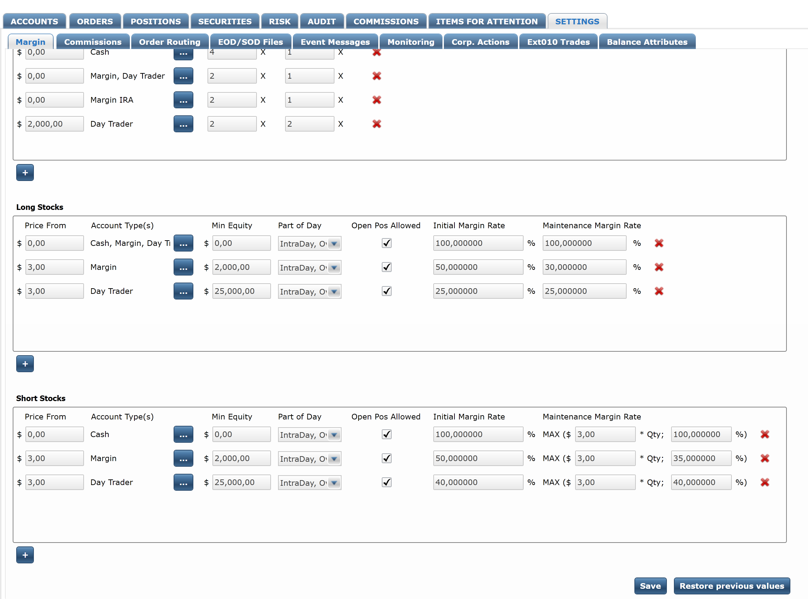
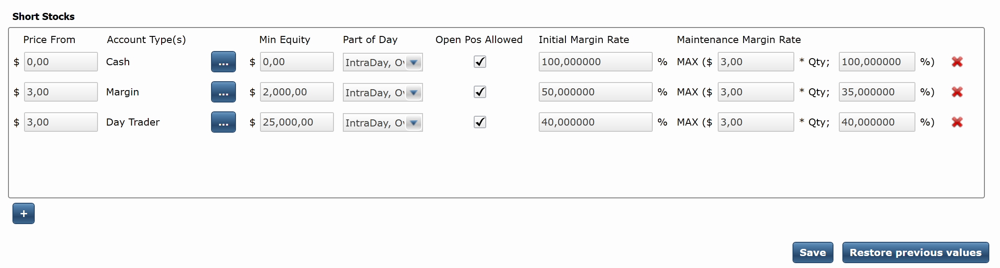
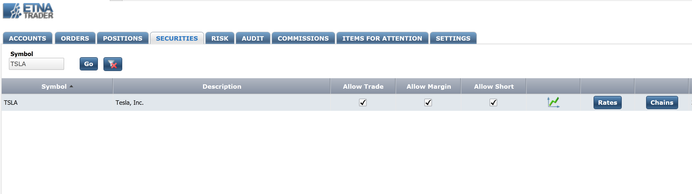
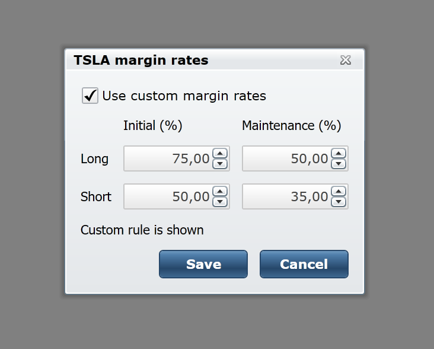
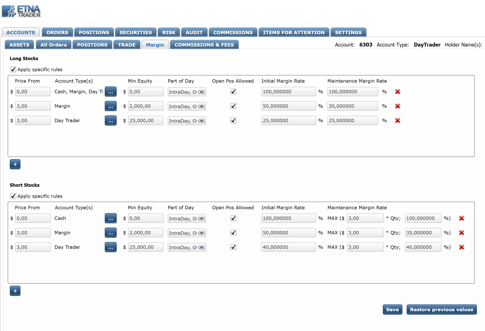

# Configuring Margin Rates

### Introduction

ETNA Trader enables brokers to increase traders' buying power using leverage. The amount of leverage available to traders \(the initial margin rate\) and the maintenance margin rate can both be specified in ETNA Trader's Back Office. Both rates can vary depending on the type of the trading account \(Cash, Margin, etc.\), the amount of equity in the account, and the type of the position \(intraday or overnight\).


ETNA Trader does not handle interest rate charges for margin debt; the broker must do it themselves and then adjust their traders' cash positions accordingly.


### Understanding the Initial and Maintenance Margin Rates

#### Initial Margin Rate

Suppose a trader called Bob opens a new trading account and deposits $5'000 into it. His **initial margin rate** is set to 25%. Therefore, his initial buying power is calculated as:

$$
5000/0.25 = 20000
$$

In other words, Bob can purchase $20'000 worth of securities, of which $5'000 are his own funds and the remaining $15'000 are the margin debt provided by the broker. With every position he opens, he should provide at least 25% of his own funds and the broker will contribute the remaining 75%.

#### Maintenance Margin Rate

Every trading account might also be subject to the **maintenance margin rate**. This rate indicates the minimum amount of equity that must be maintained in the account. If this rate is set to 20%, the trader's equity should at all times be no less than 20% of the aggregate market value of all positions. If the ratio of equity to market value of all positions falls below 20%, the owner of the account receives a margin call.


ETNA Trader currently prioritizes margin rates defined by the clearing firm over the  margin rates defined by ETNA Trader.


### Configuring Global Margin Rates

To configure the initial and maintenance margin rates, head over to ETNA Trader's Back Office located at admin.yourDomain.com \([admin.demo.etnatrader.com](https://admin.demo.etnatrader.com)\). Navigate to the **Settings** tab, and click **Margin**. 

On this page you can configure the initial and maintenance margin rates individually for **Long** and **Short** positions.

#### Long Position Rates

The initial and maintenance margin rates for long positions can be configured in the second section of the **Margin** page. Here you have the default rates for different account types: Cash, Margin, and Day Trader. To add a new set of rates, click on the **+** button at the bottom.

There are seven different parameters that can be configured in each rule:

1. **Price From**. This parameter indicates the threshold of security prices at which the rates will apply.
2. **Account Type**. This is the list of account types to which these rates must be applied \(Cash, Margin, Margin IRA, Day Trader\).
3. **Min Equity**. This is the equity threshold at which these rates must be applied. For example, if this parameter is set to $10'000, these rates will only applied to those traders whose equity is equal to or exceeds $10'000.
4. **Part of Day**. This is an obsolete parameter that does not affect the rule in any way \(skip it\).
5. **Open Pos Allowed**. This checkbox indicates if opening positions should be permitted on accounts. For example, if you add a new rule with the **Price From** parameter set to $10'000 and disable this checkbox, all traders will be prohibited from purchasing securities whose price exceeds or is equal to $10'000.
6. **Initial Margin Rate**. This is the initial margin rate for new positions. For example, if this rate is set to 75%, all traders who want to open a leveraged position will have to contribute 75% of the position's price, and the broker will contribute the remaining 25%.
7. **Maintenance Margin Rate**. This is the maintenance margin rate applicable to all positions held overnight. Please note that this value will be overridden by the clearing firm.

Notice that you can have different rules with varying values depending on your requirements.

#### Short Position Rates

The initial and maintenance margin rates for short positions can be configured in the third section of the **Margin** page. The process is almost identical to the configuration of rates for long positions except for the maintenance margin rate formula.

There are seven different parameters that can be configured in each rule:

1. **Price From**. This parameter indicates the threshold of security prices at which the rates will apply. For example, you can use it to prohibit traders from shorting stocks cheaper than $3.
2. **Account Type**. This is the list of account types to which these rates must be applied \(Cash, Margin, Margin IRA, Day Trader\).
3. **Min Equity**. This is the equity threshold at which these rates must be applied. For example, if this parameter is set to $10'000, these rates will only applied to those traders whose equity is equal to or exceeds $10'000.
4. **Part of Day**. This is an obsolete parameter that does not affect the rule in any way \(skip it\).
5. **Open Pos Allowed**. This checkbox indicates if opening short positions should be permitted on accounts. For example, if you add a new rule with the **Price From** parameter set to $3 and disable this checkbox, all traders will be prohibited from shorting securities whose price is lower than or is equal to $3.
6. **Initial Margin Rate**. This is the initial margin rate for new positions. For example, if this rate is set to 75%, all traders who want to open a leveraged short position will have to contribute 75% of the position's price, and the broker will contribute the remaining 25%.
7. **Maintenance Margin Rate**. This is the maintenance margin rate applicable to all positions held overnight. It is calculated as the maximum of two values: pre-determined price multiplied by quantity and the pre-determined percentage rate. Please note that this value might be overridden by the clearing firm. 

### Configuring Security-Specific Rates

In addition to global values, brokers can also configure individual initial and maintenance margin rates for each security. This might be useful to limit traders' risk when opening positions in extremely volatile securities. Conversely, you can set lower rates for less volatile securities.

To configure security-specific rates, navigate to the **Securities** tab and enter the ticker symbol of the required security. Click **Rates**.

Select the **Use custom margin rates** checkbox, and then proceed to specify the initial and maintenance margin rates for this security for both long and short positions.

Once done, click **Save**. From now on the custom margin rates for this security will take precedence over the globally-defined rates.

### Configuring Account-Specific Rates

In addition to global and security-specific rates, ETNA Trader's Back Office also enables you to configure account-specific rates. This might be useful if, for example, you want to reduce margin rates for experienced traders or increase rates for amateur traders who should be prohibited from taking on too much leverage.

Account-specific rates are never overridden by the clearing firm and their priority is higher than the global rates' priority but lower than the security-specific rates's priority.

To configure account-specific rates, go to the **Accounts** tab, and then click **Margin**. On that page, you can configure custom initial and maintenance margin rates for both long and short positions \(just as you defined the global rates\).

### Reconciling ETNA Trader's Margin Rates with the Clearing's Rates

ETNA Trader enables brokers to define global initial & maintenance margin rates as well as custom rates for individual securities. However, it's important to understand that the clearing firm which settles all transactions for your brokerage may provide its own margin rates for each securities. In that case security-specific rates defined by you will be overridden while the global and account-specific rates will remain unaffected.

ETNA Trader interacts with the clearing firm daily, and, if they re-define rates for certain securities, our platform will override the rates you defined in the Back Office. The process repeats day in and day out, and thus margin rates for every security can unexpectedly be modified. In case you notice that margin rates for some securities are different from what you set, it's likely that the clearing firm provided us with updated values.

Note that the clearing form can only override the security-specific margin rates; the globally-defined margin rates and account-specific margin rates are only set by the broker in the Back Office.

