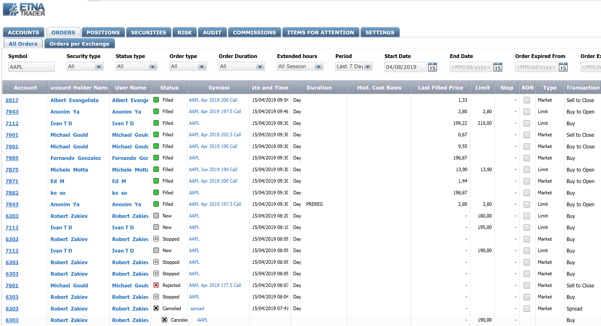
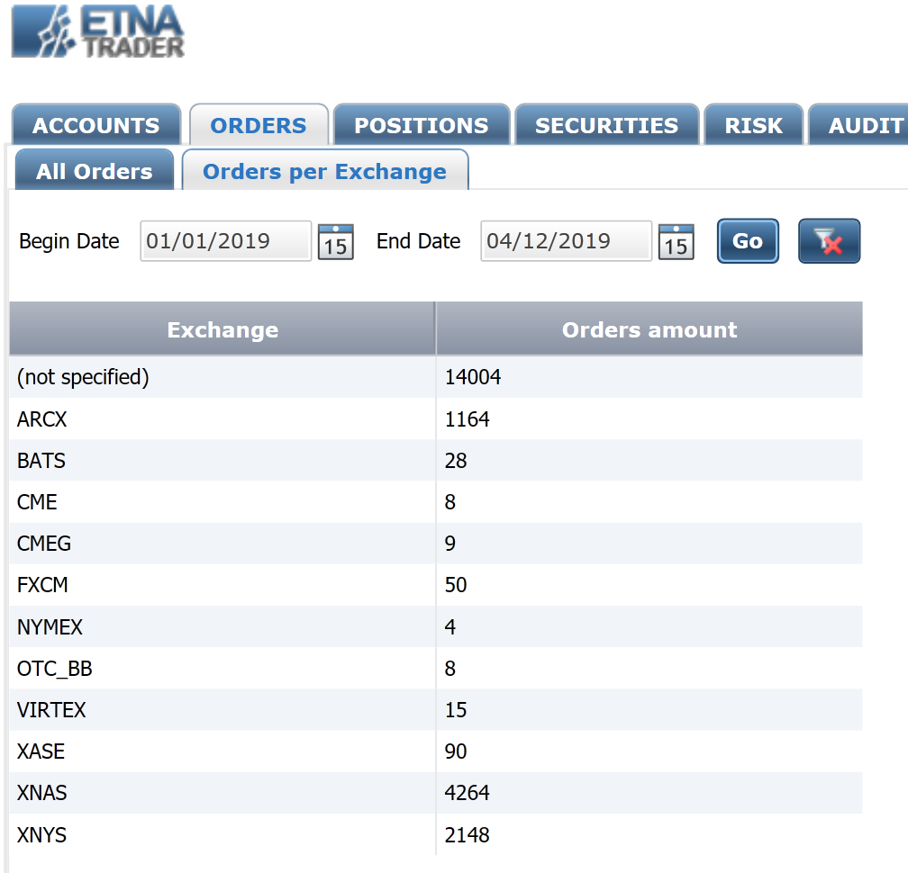
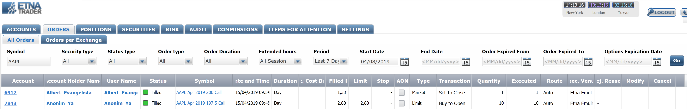
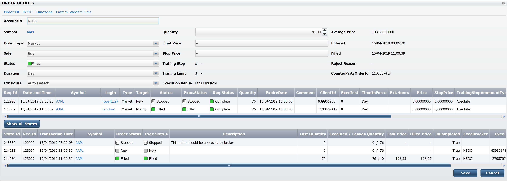
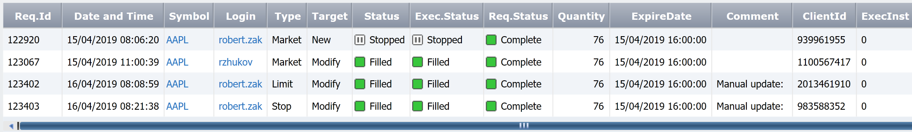
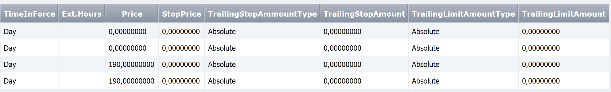
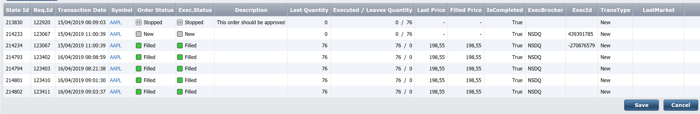

# Managing Orders

### Introduction

In ETNA Trader, all orders of all users can be monitored, modified, and cancelled in ETNA Trader's Back Office \(located at [admin.yourDomain.com](https://admin.demo.etnatrader.com)\). Unlike the Web API that allows modification of only some order parameters, the Back Office gives you full access to all order without any restrictions. For example, if the execution venue returned some corrupt information about an order, you can change this information only in the Back Office.

The Back Office also enables you to sort all orders by trading account, creation date, duration, type, quantity, etc. All in all, it's an extremely powerful monitoring tool that should be leveraged by all administrators on a regular basis.

### Inspecting Orders in ETNA Trader

Order inspection in ETNA Trader occurs on the **Orders** tab of the Back Office.

On this page you have two tabs to choose from:

1. **All orders**. This is the main tab that contains all of the company's orders.
2. **Orders per Exchange**. This tab displays the number of orders placed on each exchange during a period.

### Orders Per Exchange

**Orders Per Exchange** is the tab that displays the number of orders placed on each exchange during the specified timeframe. For example, if **Begin Date** is set to 01/01/2019 and the **End Date** is set to 01/14/2019, the table will display the number of orders placed on each exchange during the first two weeks of January.

### All Orders

**All Orders** is the main tab with detailed information about all orders placed by the traders of your company.

At the top, there's a toolbar where you can determine parameters by which the orders should be sorted:

1. **Symbol**. This is the ticker symbol of the security. For example, if it's set to **AAPL**, the table will only list orders in which the underlying security is the Apple stock. 
2. **Security Type**. This is the type of the security. Possible values: **Stocks**, **Options**, **Spreads**.
3. **Status type**. This is the execution status of the order.
4. **Order type**. This is the type of the order.
5. **Order Duration**. This is the target duration of the order.
6. **Extended Hours**. This is the target trading session of the order.
7. **Period**. This is the time frame for which the orders should be listed.
8. **Start Date**. If the **Period** drop-down menu is set to **Data Range**, this is the starting date of the target time frame.
9. **End Date**. If the **Period** drop-down menu is set to **Data Range**, this is the end date of the target time frame. 
10. **Order Expired From**. This is the earliest expiration date against which all orders will be filtered.
11. **Order Expired To**. This is the latest expiration date agains which all orders will be filtered.
12. **Option Expiration Date**. This is the expiration date of options that must be listed.

### Order Details

When you double-click on any order in ETNA Trader, you'll be presented with with the order details view which enables you to modify almost all parameters of the order. This window is significantly more powerful than order modification in the Web API \(which allows modification of only several parameters\), and therefore should be used responsibly. 

At the top of the window are the modifiable parameters of the order. The list of modifiable parameters is as follows:

1. **AccountId**. This is the ID of the trading account that was used to place the order. Changing it will re-assign this order to a different trading account.
2. **Order Type**. This is the type of the order. Changing it might also require you to change other parameters; for example, converting a market order into a limit order 
3. **Side**. This is a parameter that indicates if this is a Buy or Sell order.
4. **Duration**. This is the target duration of the order. Changing this parameter may automatically trigger \(or delay\) the execution of the order.
5. **Extended Hours**. This is the target trading session of the order. Changing this parameter might automatically suspend the order.
6. **Quantity**. This is the number of securities purchased in the order. 
7. **Limit Price**. This is the limit price of limit orders; if you convert a market or a stop order into a limit order, don't forget to specify the limit price.
8. **Stop Price**. This is the stop price of stop orders; if you convert a market or a limit order into a stop order, don't forget to specify the stop price.

#### Order Information

Below the modifiable parameters is a table that keeps a record of all modification requests that were ever made for this order:

1. **Req.Id**. This is the internal identifier of the order modification request.
2. **Date and Time**. This is the date on which the order modification request was made.
3. **Symbol**. This is the ticker symbol of the order's underlying security.
4. **Login**. This is the login of the user on whose behalf the order modification request was made. 
5. **Type**. This is the type of the order.
6. **Target**. This is the operation performed with the order.
7. **Status**. This is the status of the order \(not to be confused with the execution status\).
8. **Exec. Status**. This is the execution status of the order.
9. **Req.Status**. This is the status of request.
10. **Quantity**. This is the number of securities transacted in the order.
11. **ExpireDate**. This is the expiration date of the order.
12. **Comment**.
13. **ClientId**. This is the order ID on the execution venue.
14. **ExecInst**. These are execution instructions of this order \(it's an internal field of ETNA Trader\).
15. **TimeInForce**. This is the target lifetime of the order.
16. **Ext.Hours**. This is the target trading session for this order.
17. **Price**. This is the limit price of the order \(applicable only to limit orders\).
18. **StopPrice**. This is the stop price of the order \(applicable only to stop orders\).
19. **TrailingStopAmountType**. This is the type of the trailing stop \(**Absolute** or **Persentage**\).
20. **TrailingStopAmount**. This is the trailing amount of the trailing stop \(in percentage terms or in the currency units\).
21. **TrailingLimitAmountType**. This is the type of the trailing limit \(**Absolute** or **Persentage**\).
22. **TrailingLimitAmount**. This is the trailing amount \(in percentage terms or in the currency units\).

The last table displays all records of order modification: each modification request goes through different states and each state has its own record that is reflected in the first column:

Once you're inspecting or modifying the order, click **Save**.

