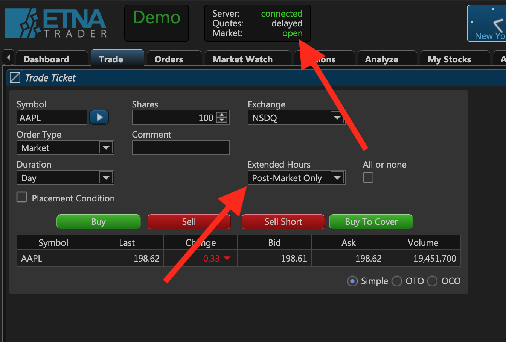
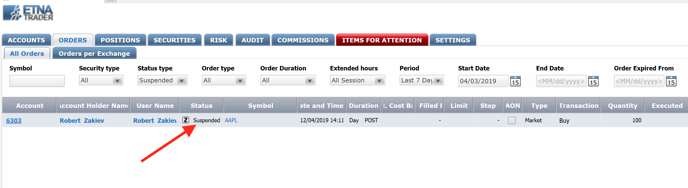
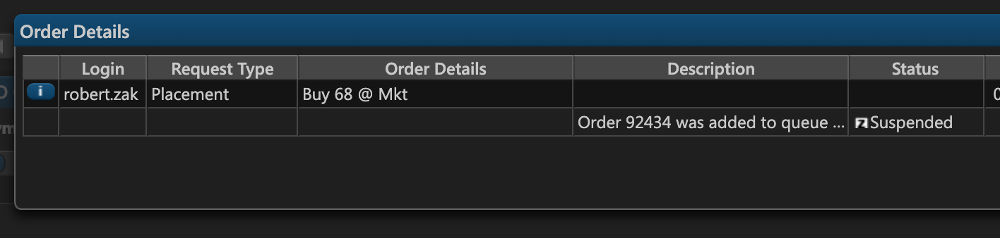
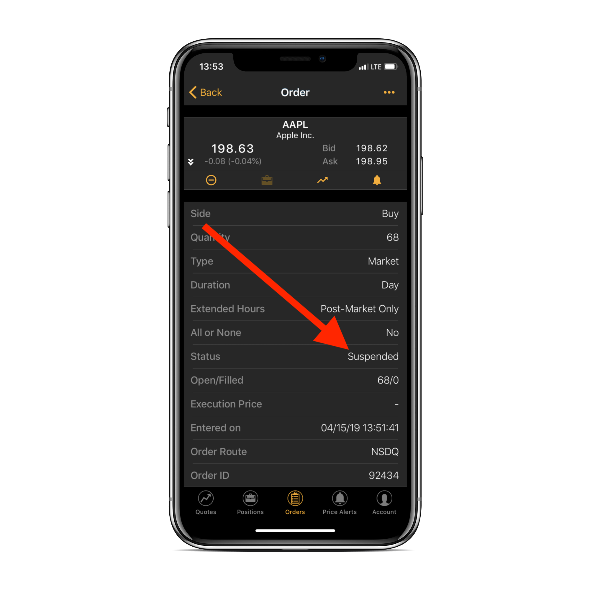

# Understanding Suspended Orders

### Introduction

Most orders in ETNA Trader are executed immediately unless some order validator suspends or rejects them. One of the reasons an order might be suspended is that the order's target trading hours do not match the current trading hours; for example, a trader place a post-market order during the regular trading hours. In this case, ETNA Trader detects that the order was placed during the regular trading hours and suspends it until the post-market session begins.

### Managing Suspended Orders in ETNA Trader

This mechanism works for all orders where the target trading session does not match the current trading session, including:

* Pre-market orders placed during the regular trading hours;
* Regular orders placed during post-market/pre-market hours;
* Pre-market orders placed during the post-market hours.

In such scenarios, the order gets suspended by ETNA Trader until the target trading session begins.

Suspended orders can be inspected in ETNA Trader's Back Office.

Meanwhile, the status of the order in the web terminal and in the mobile apps will be set to **Suspended**:

* Web terminal:

* Mobile app:

When the trading session begins, all suspended orders are placed on the execution venue in one batch. At that moment the status of suspended orders changes from **Suspended** to **New**.

### Suspended Orders and Orders Under Review

A mismatch between the target session and the current trading session is not the only reason an order can be suspended; it may also be suspended if it was sent for review to a company's administrator \(in that case the status will be **stopped**\). Feel free to take a look at our [dedicated article](../../../administrator-guide/administrators-widgets/bo-order-review/) that explains how to manage orders under review.

