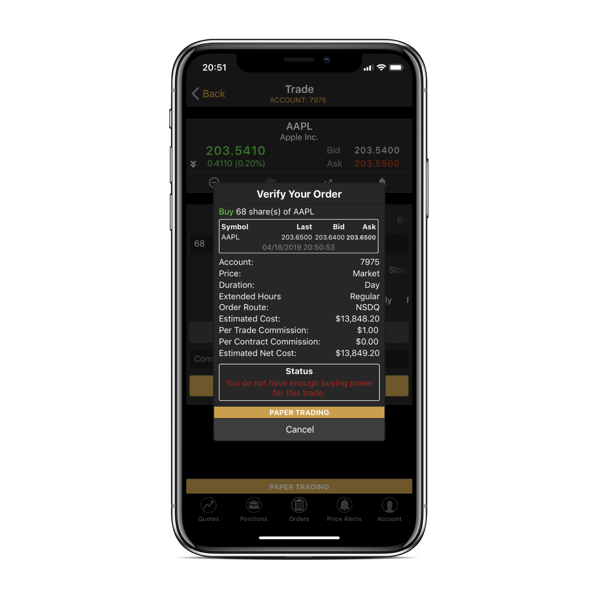

# Exploring Order Validators

### Introduction

In ETNA Trader, each transaction has to be validated by different validators to prevent unexpected incidents like purchasing a billion shares or placing an order from a trading account of a different user.  Every type of operations like placement of a new order and depositing new funds has its own spectre of validators that ensure that the operation is carried out properly without unintended consequences.

There are two types of validators: **core** validators and **custom** validators. Core validators are configured in a special configuration file \(.config\) that is set up by our [support team](mailto:support@etnasoft.com). Conversely, custom validators can be configured by the broker in ETNA Trader's Back Office located at admin.yourTradingPlatformDomain.com.

Every validator has its own priority which influences the order in which the validators are triggered. The validator with the highest priority is triggered first and the one with the lowest priority is triggered last. If an order fails even one validator, it will be rejected by the system, and the trader will see the following error message:

* Web terminal:

* Mobile app:

This article examines in detail the entire range of validators in ETNA Trader and demonstrates what happens if a validator flags an operation and determines it to be invalid.

### Multi-Leg Order Validators

The objective of multi-leg order validators is to validate legs of multi-leg orders.

| Validator | Description |
| :--- | :--- |
| StrikePriceUndefined | Triggered if the strike price for the option was not specified in the order. |
| OptionTypeUndefined | Triggered if the type of the option was not specified in the order. |
| ExpirationDateUndefined | Triggered if the expiration type of the option was not specified in the order. |
| SecurityUndefined | Triggered if the security was not set in a common stock leg. |
| IncorrectOrderQuantity | Triggered if the number of securities in the order is either lower than zero or higher than 10'000'000. |
| IncorrectTimeInForce | Triggered if the specified time-in-force parameter is not supported. |
| LimitPriceUndefined | Triggered if the limit price in a limit-order leg is not specified. |
| StopPriceUndefined | Triggered if the stop price in a stop-order leg is not specified. |
| FuturesDeniedForMlegOrders | Triggered if a multi-leg option strategy cannot have a leg with a futures contract as the underlying security. |

### Security Type Validators

The objective of security type validators is to ensure that the security type was properly specified during order placement.

| Validator | Description |
| :--- | :--- |
| UnsupportedSecurityType | Triggered if the specified type fo security is not allowed in the configuration file. |

### Account Ownership Validators

The objective of account ownership validators is to ensure that the account and its corresponding user are active and can be used to place orders.

| Validator | Description |
| :--- | :--- |
| UserDisabled | Triggered if the user to whom the trading account is bound is disabled. |
| AccountDisabled | Triggered if the trading account is disabled. |
| AccountIsNotApproved | Triggered if the trading account hasn't yet been approved by the clearing firm. |
| AccountDoesNotBelongToUser | Triggered if the used trading account does not belong to the user. |
| AssetTradingNotConfiguredForAccount | Triggered if the trading account is not permitted to trade the type of security in the order. |

### Contingent Order Condition

The objective of the `ContingentOrderExecution` validator is to reject orders in which the placement condition is invalid.

### Fat Finger Validators

The objective of fat-finger validators is to prevent traders from accidentally placing orders with extremely quantities, trade values, high price deviations, etc. For example, if a trader miscalculates the position price and attempts to purchase a billion dollars worth of securities, fat-finger validators will invalidate the transaction and prevent the catastrophe. Feel free to read our [dedicated article on fat-finger validators](../how-to-guides/back-office/configuring-fat-finger-rules.md).

| Validator | Description |
| :--- | :--- |
| FatFingersOptionsSizeExceedsMaximum | Triggered if the number of contracts in the orders exceeds the maximum number of contracts allowed.  |
| FatFingersStockSizeExceedsMaximum | Triggered if the number of securities in the order exceeds the maximum number of shares allowed. |
| FatFingersTradeBands | Triggered if the difference between order's price and the mark price is higher than allowed. Learn more [here](../how-to-guides/back-office/configuring-fat-finger-rules.md). |
| FatFingersValueExceedsMaximum | Triggered if the order value exceeds the maximum amount permitted. |

### Permission Validators

The objective of permission validators is to ensure that the traded security is allowed for trading, that short-selling is permitted for this security, etc.

| Validator | Description |
| :--- | :--- |
| TradingDeniedForAccount | Triggered if the trading account is forbidden from trading. |
| TradingDeniedForSecurity | Triggered if the target security is not tradable. |
| ShortTradingDeniedForSecurity | Triggered if the target security is not available for short-selling. |
| ShortStockTradingDeniedForAccount | Triggered if the account is forbidden from opening short positions in stocks. |
| SpreadTradingDeniedForAccount | Triggered if the trading account is forbidden from spread trading. |
| AccountMarginRuleViolation | Triggered if the trading account does not meet the margin rules. |

### Wash Trade Validator

The objective of the wash trade validator is to prevent placement of two limit orders with the same limit price but in different directions.

| Validator | Description |
| :--- | :--- |
| WashTradeAttempt | — |

### Stop-Price Validator

The objective of the stop-price validator is to ensure that the stop price of stop orders is properly specified in relation to the ask/bid price.

| Validator | Description |
| :--- | :--- |
| BuyStopOrderStopPriceLessAsk | Triggered if the stop price of a Buy/Buy-to-Cover/Buy-to-Open order is lower than the current ask price. |
| SellStopOrderStopPriceGreaterBid | Triggered if the stop price of a Buy/Buy-to-Cover/Buy-to-Open order is greater than the current bid price. |

### Short Price Below 5 Validator

The objective of the `SellShortOrderLastPriceBelow5` is to reject sell-short order in which the price of the underlying security is lower than $5.

### Cross-Zero Position Validator

The objective of a cross-zero position validator is to reconcile new positions with the existing ones and prevent possible conflicts between them.

| Validator | Description |
| :--- | :--- |
| PositionLocked | Triggered if the order is attempting to close a position locked by the clearing firm. |
| UnexpectedBuyOrder | Triggered if the order is attempting to place a Buy order for a security in which the trading account already holds short positions or has pending sell-short orders. |
| LongPositionCrossZero | Triggered if the order is attempting to place Sell order for a security in which the account already has long positions with fewer shares than attempting to sell. |
| UnexpectedBuyToCoverOrder | Triggered if the order is attempting to place a Buy-To-Cover order for a security in which the account already has long positions or has no positions. |
| ShortPositionCrossZero | Triggered if the order is attempting to place a sell-short order for a security in which the account has long positions or pending Buy orders. |
| UnsupportedOrderSide | Triggered if the order's side is unsupported or not set. |
| OcoOrderWithOppositeLegs | Triggered if legs of an OCO order are attempting to place orders in the opposite direction \(Buy and Sell\). |

### Non-Existing Position Sale Validator

| Validator | Description |
| :--- | :--- |
| UnexpectedSellOrder | Triggered if the order is attempting to place a sell order for a security in which the trading account already has short positions or has no positions. |

### Initial Margin Validator

| Validator | Description |
| :--- | :--- |
| InitialMargin | Triggered if the sum of the order's initial margin and the fee exceeds the excess of the trading account. |

### Option Level Validator

| Validator | Description |
| :--- | :--- |
| OptionLevelRestriction | Triggered if the option level of the order is not permitted for this trading account.  |

### Day Trade Pattern Validator

The objective of the day trade pattern validator is to ensure that the trading account satisfies the requirements [set forth by FINRA](http://www.finra.org/investors/day-trading-margin-requirements-know-rules). 

| Validator | Description |
| :--- | :--- |
| DayTraderPatternRestriction | Triggered if the number of day trades exceeds 3. |
| DayTraderPatternEquityBalanceShortage | Triggered  if the number of day trades exceeds and the amount of excess is lower than 25'000. |

### Order Consistency Validator

The objective of the order consistency validator is to ensure that the order is configured during properly and placing during the correct trading session.

| Validator | Description |
| :--- | :--- |
| MarketOrderIsGtc | Triggered if a trader attempts to place a market order with duration set to GTC \(Good-Till-Cancelled\) |
| ShortOrderIsGtc | Triggered if a trader attempts to place a sell-short order for a stock-like security with duration set to GTC \(Good-Till-Cancelled\). |
| AonOrderQuantity | Triggered if a trader attempts to place an All-Or-None order with a quantity less than 2 \(such orders make no sense\). |
| OrderQuantity | Triggered if a trader attempts to place an order with zero legs and quantity being less than 2. |

### Option Trade on the Expiration Date

The objective of this validator is to reject orders that attempt to increase a position in an option that expires the same day. Although, it's worth mentioning that traders can still place "Sell-to-Close" or "Buy-to-Close" orders after 1 P.M.

| Validator | Description |
| :--- | :--- |
| TradeOptionAfter1pmAtExpirationDay | Triggered if a trader attempts to place a "Sell-to-Close" or "Buy-to-Close" order for an option expiring the same say after a 1 PM |
| TradeOptionAtExpirationDayValidator | Triggered if a trader attempts to trade an option expiring the same day. |

### Non-Standard Option Validators

The objective of the non-standard option validators is to reject orders that attempt to transact non-standard options.


Positions for non-standard options can be opened in ETNA Trader's Back Office.


| Validator | Description |
| :--- | :--- |
| NonStandartOptionsValidator | Triggered if an attempt to trade non-standard options is made. |

### Option Trading Denied Validator

The objective of the option trading denied validators is to reject orders if the trading account is forbidden from option trading.

| Validator | Description |
| :--- | :--- |
| LongOptionTradingDeniedForAccount | Triggered if the trading account is forbidden from opening long positions in options. |
| ShortOptionTradingDeniedForAccount | Triggered if the trading account is forbidden from opening short positions in options. |

### Quote Price Validator

The objective of the `QuotePriceIsInvalid` validator is to reject orders if quotes for the order's underlying security are unavailable.

| Validator | Description |
| :--- | :--- |
| SnapQuoteIsInvalid | Failed to fetch snap quotes. |

### OTC Trading Validators

The objective of the OTC Trading Validators is to reject orders with Over-the-Counter securities. Traders cannot trade OTCBB and Pink securities.

| Validator | Description |
| :--- | :--- |
| OtcTradeValidator | Triggered if a traders attempts to transact an OTCBB or Pink security. |

### Price-Out-Of-Market Validator

The objective of the `PriceOutOfMarketValidator` is to ensure that the specified price in the order remains in the current bid-ask range; that is, if the price is higher than the ask price when increasing a position or lower than the current bid price when decreasing a position.

### Buying Power Validator

The objective of the `BuyingPowerValidator` is to ensure that the trading account's buying power is higher than the order's initial margin requirement.

### Complex Order Validator

The objective of the `ComplexOrderValidator` is to ensure that there are no options in the legs of a multi-leg order placed by a Cash/MarginIRA account. 

### Day Trading Excess Validator

The objective of the `DayTradingExcessValidator`is to ensure that the the trading account has sufficient equity and day trading buying power for transacting trades.

| Validator | Description |
| :--- | :--- |
| DayTradingBuyingPowerExceeded | Triggered if the day trading buying power is insufficient to place the order. |
| TooSmallEquityForDayTrading | Triggered if the trading account's margin equity is lower than $25'000. |

### Event State Validator

The objective of the `EventStateValidator` is to ensure that some  global event is in a specific state. For example, you might use this validator to ensure that an order can only be placed during the post-market session, in which case the `EventStateValidator` will first check if the global event responsible for the current trading session is set to post-market.

### Expiration Date Validator

The objective of the `ExpirationDateValidator` is to ensure that in orders with duration set to GTD \(Good-Till-Date\), the ExpirationDate is later than the current date.

| Validator | Description |
| :--- | :--- |
| InvalidOrderExpiration | Expiration date must be later than the current date. |

### Extended Hours Validator

The objective of the `ExtendedHoursValidator` is to ensure that order targeting extended hours are properly configured.

| Validator | Description |
| :--- | :--- |
| ExtendedHoursOnlyLimitOrders | Triggered if a trader attempts to place a market order during the extended hours. |
| ExtendedHoursNotOptions | Triggered if a trader attempts to place an order in which the underlying security is an option during the extended hours. |
| ExtendedHoursWrongTimeForGTX | Triggered if a trader attempts to place an order targeting the pre- or post-market sessions during the time the execution venue is closed |
| ExtendedHoursCanNotModify | Triggered if a trader attempts to modify an order during the post-market and extended hours. |

### Index Option Multi Order Validator

The objective of the IndexOptionsMultiOrderValidator is to ensure that index options are configured with the correct expiration date.

| Validator | Description |
| :--- | :--- |
| IndexOptionsOneExparyDate | Triggered if the index option has an incorrect expiration date. |

### Option Settlement Validator

The objective of the `OptionSettlementValidator` is to reject an order if:

1. The trading account's type is Cash/MarginIRA;
2. The transacted security in the order is an option;
3. The side of the order is Buy;
4. The amount of settled cash is insufficient to cover the order cost.

### Order Price Validator

The objective of the `OrderPriceValidator` is to reject orders with improperly specified stop/limit prices.

| Validator | Description |
| :--- | :--- |
| OrderPriceIsInvalid | Triggered if the specified price is invalid |

### OTO/OCO Validator

The objective of the `OtoOcoValidator` is to ensure that OTO and OCO orders are properly configured.

| Validator | Description |
| :--- | :--- |
| OTO/OCO market orders are not allowed | Triggered if the first leg of an OTO/OCO order is a market order. |
| OTO/OCO trailing orders are not allowed | Triggered if the legs of an OTO/OCO order are trailing stop or trailing stop-limit orders. |
| OCO expiration type must be same | Triggered if the legs of an OTO/OCO order are option orders with different expiration types. |
| OCO price difference should be at least {value}$. | Triggered if the price difference between the legs of an OTO/OCO order is less than 0.1 for options or 0.2 for other security types. |
| OtoOcoForex\_NonForexAreNotAllowed | Triggered if in an OTO/OCO order there's a combination of Forex and non-Forex securities.  |
| OtoOcoMarketNotAllowed | Triggered if a trader attempts to place an OCO order containing market orders. |

### Partially Filled Order Validator

The objective of the `PartiallyFilledOrderValidator` is to reject attempts at modification of a partially filled orders.

| Validator | Description |
| :--- | :--- |
| Can't modify partially filled order | Triggered if a trader attempts to modify a partially filled order. |

### Position Balance Validator

The objective of the `PositionBalanceValidator` is to ensure that positions with inappropriate values are not opened.

| Validator | Description |
| :--- | :--- |
| PositionBalanceValidator | Triggered if a new position's values exceeds the threshold value for new positions. |

### Price Precision Validator

The objective of the `PricePrecisionValidator` is to reject orders whose number of decimal places is different from the values defined for the transacted security. The default values areas follows:

1. Exceeds 2 and the price is greater than or equal to $1;
2. Exceeds 4 and the price is lower than $1.

### Time-In-Force-Validator

The objective of the `TimeInForceValidator` is to ensure that orders with the incorrectly specified time-in-force parameter are rejected.

| Validator | Description |
| :--- | :--- |
| IncorrectTimeInForce | Triggered if the specified time-in-force parameter is neither `GTC`, nor `Day`. |

### Total Initial Margin Validator

The objective of the `TotalInitialMargin` is to ensure that the equity of the trading account is sufficient to cover the initial margin requirement and the commission applicable to the order.

### Unsettled Funds Usage Validator

The objective of the `UnsettledFundsUsageValidator` is to reject orders if the available cash is insufficient to cover the order cost 

| Parameter | Description |
| :--- | :--- |
| Too much unsettled cash will be released with this order | Triggered if the available cash \(excluding the unsettled cash\) is insufficient cover the position cost. |

### Penny Pilot Validator

The objective of the `PennyPilotValidator` is to reject single-leg, OTO, and OCO orders in which the stop and/or limit price isn't divisible by a an increment defined for a certain price.

This validator divides securities into three groups:

1. **Pilot list**. Options on these CBOE-defined instruments must have a 1-cent price increment if the price is lower than $3. If the price is equal to or greater than $3, the price increment must be 5 cents.
2. **Pilot exceptions list**. Options on these instruments must have a 1-cent price increment for all prices.
3. **Other instruments**. Options on these instruments must have a 5-cent price increment if the price is lower than $3. If the price is equal to or greater than $3, the price increment must be 10 cents.

## Validator Priorities

| Validator | Priority | Consequence |
| :--- | :--- | :--- |
| pennyPilotValidator | 10 | Reject |
| dayTraderPatternValidator | 5 | Warning |
| RestrictContingentChangeOrderValidator | 5 | Reject |
| initialMarginValidator | 4 | Warning |
| DayTradingExcessValidator | 4 | Warning |
| tickSizePilotProgramValidator | 4 | Reject |
| crossZeroPositionValidator | 3 | Reject |
| sellNotExistingPositionValidator | 3 | Reject |
| optionLevelValidator | 3 | Reject |
| permissionValidator | 2 | Reject |
| washTradesValidator | 2 | Reject |
| stopPriceValidator | 2 | Reject |
| expirationDateValidator | 2 | Reject |
| storedRules \(BackOffice ORM validation rules\) | 1 | It depends |
| OtoOcoValidator | 1 | Reject |
| OrderPriceValidator | 1 | Reject |
| multiLegsSyntaxValidator | 1 | Reject |
| securityTypeValidator | 1 | Reject |
| accountOwnerShipValidator | 1 | Reject |
| fatFingersValidator | 1 | Warning |
| quantityConsistancyValidator | 1 | Reject |
| userAccountRestrictionValidator | 1 | Reject |

