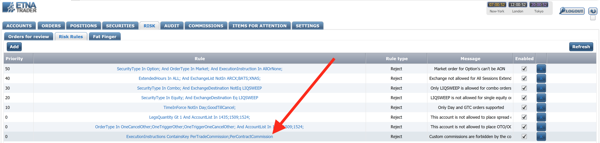
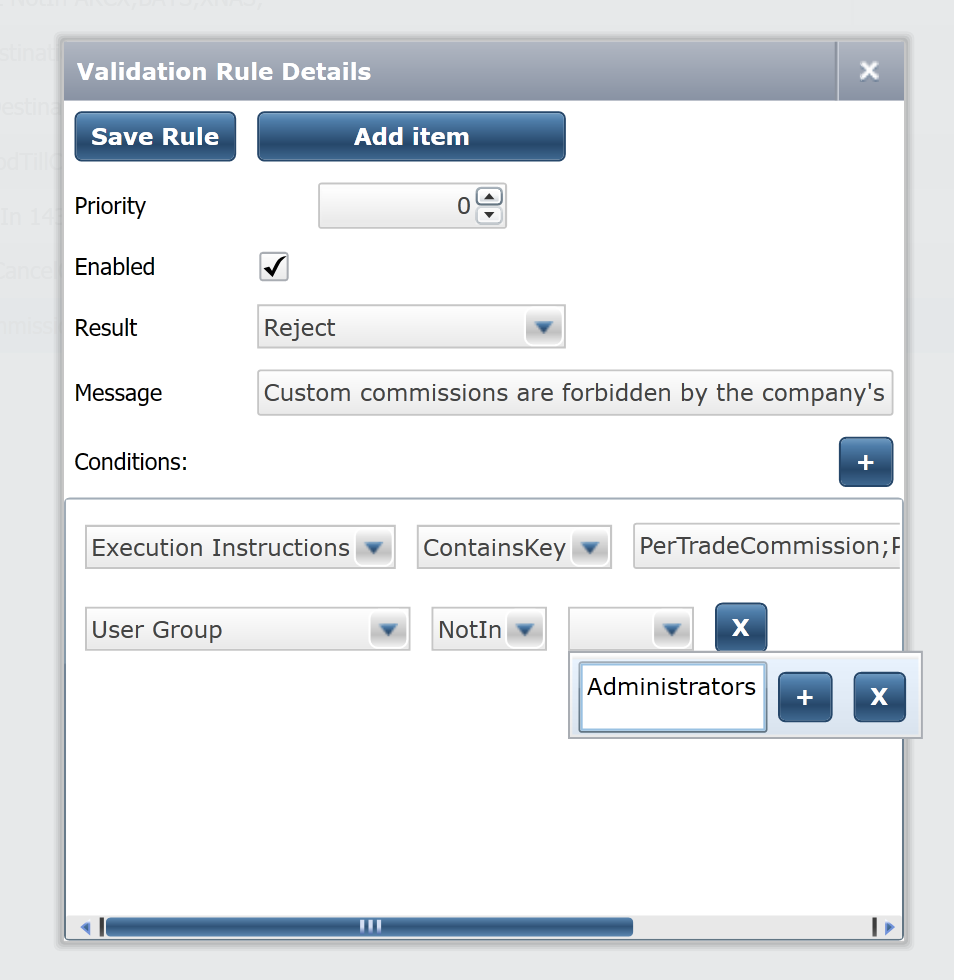
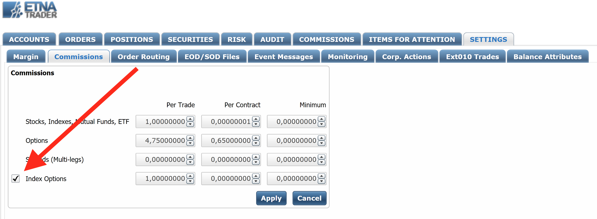
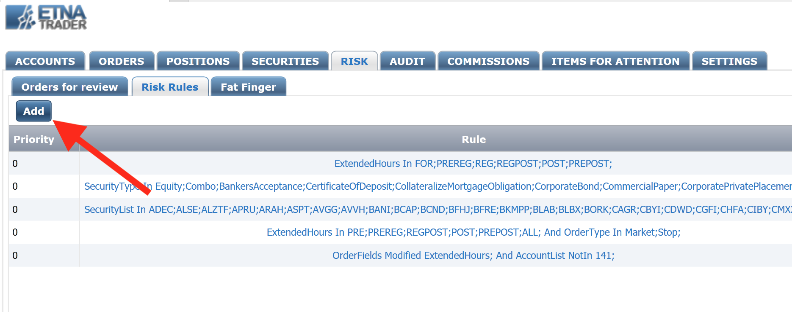
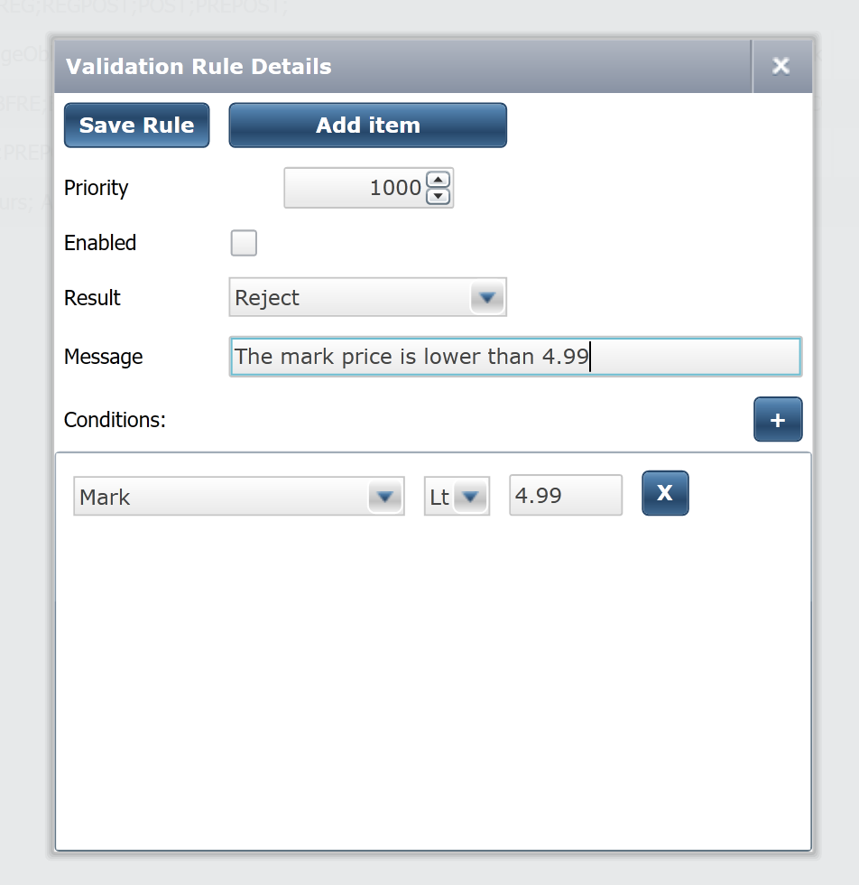

# Release 1.2.48

## Summary

ETNA Trader receives another update that brings a set of new features and improvements. In release 1.2.48, we are expanding the functionality of our Web API and introducing new features like _Buying Power Adjustment._ This release also includes minor bug fixes and various improvements.

### Web API Enhancements

One of the main highlights of release 1.2.48 is the updated Web API. Several endpoints have been extended, including order placement and position retrieval.

### Custom Order Commissions

In release 1.2.48 we have implemented custom commissions that can be applied to every order individually. Order-specific commissions have the highest priority, meaning they will override all other commissions like account-specific commissions, commission plans, etc.

Custom commissions — both per-trade and per-contract — can be specified in the new order's JSON file in the `ExecutionInstructions` parameter:

```javascript
{
  "Symbol": "AAPL",
  "Type": "Market",
  "Side": "Buy",
  "Quantity": 100,
  "ExecutionInstructions" : {"PerTradeCommission": "1", //Charging $1 for the entire transaction
                             "PerContractCommission":"1"}, //Charging $1 cent for all 100 stocks 
}
```


`PerContractCommission` is specified for all securities at once. For example, if you intend to purchase 100 Apple stocks and levy a 2-cent fee on each stock, the `PerContractCommission` should be set to "2" \($2 split between 100 stocks — 2 cents per stock\).


Custom commissions must be provided as absolute values in the dollar amount.

#### Enabling Order-Specific Commissions


Order-specific commissions are disabled by default but can be enabled in ETNA Trader's Back Office 


To enable order-specific commissions, navigate to the **Risk Rules** tab under **Risk** and disable the validation rule that rejects orders with custom commissions.



Alternatively, you can modify this rule to prohibit only non-administrators from placing orders with custom commissions.



To learn more about placing orders via API, feel free to examine our documentation:

* Trader API



* Broker API



### Position Filtering

Another improvement in Web API is the ability to filter users' positions by different criteria. For that purpose, release 1.2.48 gained a new query parameter called `filter`. For example, if you want to retrieve some user's positions that were created in a specific time period, set the filter parameter as follows:

```text
CreateDate between #2019-03-13T00:00:00# and #2019-03-17T19:00:00#
```

In response to this request, you'll receive all positions that were created between March 13th and March 17th.

To learn more about the syntax of position filtering, take a look at the following articles:

* Trader API:



* Broker API:



### Position Retrieval by Ticker Symbol

In previous versions of ETNA Trader, to list users' positions in a specific security, you had to provide the security's internal ID in the API request. To simplify the process, in release 1.2.48 we no longer require the security's internal ID; instead, you simply need to provide the security's ticker symbol under which it's listed on the exchange.

For example, this is the old endpoint for listing users' positions in the Apple stock:

```text
GET apiURL/v1.0/accounts/{accountID}/positions/4
```

As of release 1.2.48, this endpoint has been transformed into:

```text
GET apiURL/v1.0/accounts/{accountID}/positions/AAPL
```

This change should considerably simplify the process of listing users' positions in specific securities.

To learn more about listing users' positions, take a look at our API documentation:

* Trader API:



* Broker API:



### Custom Buying Power Adjustment

There are situations when at the time the order is placed, the buying power might be sufficient, but at the time the order is executed, the market price might increase a little, making the order value higher than the trader's buying power. The trader will end up with a negative cash balance, which is fine for Margin accounts but unacceptable for Cash accounts.

For example, If a trader has a Cash account with $1500, their **Buying Power** will also be equal to $1500. Let's suppose the trader wants to purchase Apple stock that is currently trading at $149. If they place a market order to purchase 10 shares, their **Buying Power** will be sufficient to cover the trade \($1490\); but if the share price jumps to $151 at the time the order is executed, the trader's Buying Power will become -$10 \($1500-$1510\). Because Cash accounts cannot have a negative cash balance, the trading account will be suspended by the clearing firm.

To solve this problem, in release 1.2.48 we're introducing the so-called **Buying Power Ratio** that enables brokers to artificially lower the buying power of Cash accounts to prevent negative cash balances. This ratio is set as a fraction of Buying Power, for example: `0.97`. In this example, the trader's Buying Power will be calculated as:

$$
$1500 * 0.97 = $1455
$$

Even though the trader has $1500, the broker allows him/her to use only $1455 for trades while the remaining $55 will serve as insurance against volatile market prices. In other words, artificially lowering buying power will prevent negative cash balances on Cash accounts and avoid account suspensions.


Buying Power Ratio is by default set to 1. If you want to modify it, contact our support team at [support@etnasoft.com](mailto:support@etnasoft.com)


### Custom Commissions for Index Options

In previous versions of ETNA Trader, brokers could configure custom commissions for almost all types of securities like stocks, indices, mutual funds, ETFs, options, spreads, etc. In release 1.2.48 we're expanding this list with a new security type — index options.

To configure a custom commission for index options, go to the Back Office \(located at [admin.yourDomain.com](https://admin.demo.etnatrader.com)\). Under **Settings**, click **Commission**.



On that page, select the **Index Options** checkbox and then proceed to specify custom commissions of three types:

1. **Per Trade**. 
2. **Per Contract**.
3. **Minimum**.

Once done, click **Apply**, and the specified commissions will be applied to all orders in which index options are transacted.

### Mark-Based Validation Rules in the Back Office

Another noteworthy feature of release 1.2.48 is the addition of mark-based validation rules in the Back Office. This might be useful to brokers who want to prevent their users from trading securities whose [mark prices](../../administrator-guide/glossary/understanding-the-mark-price.md) are lower or higher than the specified amount. For example, you can prohibit trading of securities priced lower than $5.

To configure a validation rule that sets a limit on the mark price, go to the Back Office and then navigate to the **Risk** tab. Under **Risk Rules**, click **Add**. 



Click **Add item** and select **Mark** from the drop-down menu. Then specify the required limit condition \(greater than, lower than, etc.\), and also the limit value.



Select the **Enabled** checkbox to ensure that the rule will be activated and then click **Save Rule**. From then on, whenever a trader places a new order, the mark price of the underlying security will be first validated by this rule. If the price satisfies the rule, the order will be approved; if not, the order will be rejected.

### Updated P/L Day Formula

ETNA Trader 1.2.48 improves the formula for calculating the daily profit/loss figure. From now on this figure is calculated separately for:

1. Positions held overnight;
2. Positions opened during the current trading session.

If a trading account has both overnight and intraday positions, two profit/loss figures are added together. 

To learn more about the new profit/loss formula, feel free to read our dedicated article on [trading accounts](../../administrator-guide/glossary/trading-accounts.md#p-l-day).

### Bug Fixes and Performance Improvements

ETNA Trader 1.2.48 also addresses minor bugs and includes various performance improvements.

