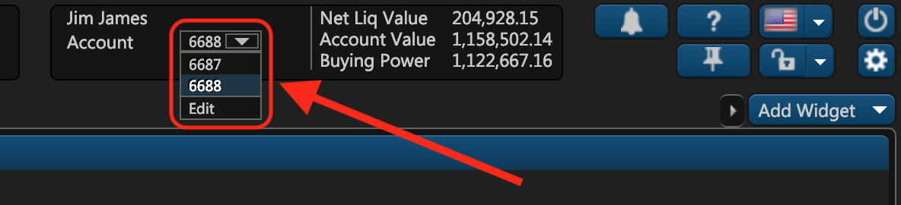

# Get Trading Account Info by ID

### Overview

This GET endpoint enables you to retrieve information about a particular trading account by providing its internal identifier in ETNA Trader in the request path. This internal identifier can be retrieved with [this method](list-all-accounts.md) that lists all trading accounts in your company. You can also view the trading accounts of a users in ETNA Trader's header:




In order to retrieve information about a particular trading account, you must use an [authorization token](../authentication/) of an administrator. Using authorization tokens of regular users will lead to the 401 status code.


There are four required parameters that must be provided in the request:

1. **Et-App-Key** \(header\). This is the unique key of your app that identifies your app when communicating with our service. It can be found it in the **BO Companies** widget. When editing the company's settings, navigate to the **WebApi** tab and look for the required key \(it could be a key for the web terminal, the mobile app, or a custom key\).
2. **Authorization** \(header\). This is the authorization token from the very first [token request](../authentication/).
3. **API version** \(path\). Unless necessary, leave it at "1.0".
4. **accountID** \(path\). This is the internal identifier of the trading account whose information needs to be retrieved.

Here's the final template for this API request:

```text
GET apiURL/v1.0/accounts/{accountID}
```

### Response

In response to this API request, you'll receive a JSON file with detailed information about the trading account:

```javascript
{
  "Id": 6688,
  "SubscriptionPlanId": 0,
  "ClearingAccount": "6688",
  "CreatedDate": "2019-02-27T16:02:08.3584933Z",
  "ModifiedDate": "2019-03-06T14:15:08.4511659Z",
  "Enabled": true,
  "IsChanged": false,
  "Cash": 953573.99,
  "Currency": "USD",
  "Status": "Approved",
  "MarginInterestRate": 0,
  "CashInterestRate": 0,
  "CloseEquity": 1157969.29,
  "OpenExcess": 1122667.16,
  "OptionLevel": 4,
  "MarginType": "Cash",
  "Permissions": "LongStock, ShortStock, LongOption, ShortOption, AllowTrade, AllowMargin, AllowOpen",
  "BaseCash": 1122667.16,
  "Sweep": 0,
  "OwnerType": "IndividualCustomer",
  "DayTradingBuyingPower": 4490668.64,
  "DayTrades": 0,
  "SmaBalance": 0,
  "HouseCall": 0,
  "MaintenanceCall": 0,
  "EquityCall": 0,
  "InitialCall": 0,
  "DayTradeCall": 0,
  "TradeDayBalance": 953573.99,
  "MoneyMarket": 0,
  "Cip": 0,
  "IsAverageAccount": false,
  "MarginEquity": 1157969.29,
  "ExcessEquity": 0
}
```

where:

<table>
  <thead>
    <tr>
      <th style="text-align:left">Parameter</th>
      <th style="text-align:left">Description</th>
    </tr>
  </thead>
  <tbody>
    <tr>
      <td style="text-align:left">Id</td>
      <td style="text-align:left">This is the internal identifier of the trading account that was provided
        in the request path.</td>
    </tr>
    <tr>
      <td style="text-align:left">SubscriptionPlanId</td>
      <td style="text-align:left">&#x2014;</td>
    </tr>
    <tr>
      <td style="text-align:left">ClearingAccount</td>
      <td style="text-align:left">This is the id of this account at the clearing firm.</td>
    </tr>
    <tr>
      <td style="text-align:left">CreatedDate</td>
      <td style="text-align:left">This is the date on which the trading account was created.</td>
    </tr>
    <tr>
      <td style="text-align:left">ModifiedDate</td>
      <td style="text-align:left">This is the date on which the trading account was last modified.</td>
    </tr>
    <tr>
      <td style="text-align:left">Enabled</td>
      <td style="text-align:left">This field indicates if the trading account is enabled.</td>
    </tr>
    <tr>
      <td style="text-align:left">IsChanged</td>
      <td style="text-align:left">&#x2014;</td>
    </tr>
    <tr>
      <td style="text-align:left">Cash</td>
      <td style="text-align:left">This is the amount of funds on the trading account that the user can expend
        on new positions.</td>
    </tr>
    <tr>
      <td style="text-align:left">Currency</td>
      <td style="text-align:left">This is the currency of the trading account.</td>
    </tr>
    <tr>
      <td style="text-align:left">Status</td>
      <td style="text-align:left">&#x2014;</td>
    </tr>
    <tr>
      <td style="text-align:left">MarginInterestRate</td>
      <td style="text-align:left">This is the interest rate applied to funds borrowed to finance margin
        positions.</td>
    </tr>
    <tr>
      <td style="text-align:left">CashInterestRate</td>
      <td style="text-align:left">&#x2014;</td>
    </tr>
    <tr>
      <td style="text-align:left">CloseEquity</td>
      <td style="text-align:left">&#x2014;</td>
    </tr>
    <tr>
      <td style="text-align:left">OpenExcess</td>
      <td style="text-align:left">&#x2014;</td>
    </tr>
    <tr>
      <td style="text-align:left">OptionLevel</td>
      <td style="text-align:left">This field indicates which operations with options are permitted on this
        account.</td>
    </tr>
    <tr>
      <td style="text-align:left">MarginType</td>
      <td style="text-align:left">This is the account type. Read more about it <a href="../../../administrator-guide/administrators-widgets/managing-users/#trading-accounts">here</a>.</td>
    </tr>
    <tr>
      <td style="text-align:left">Permissions</td>
      <td style="text-align:left">
        <p>This field lists the operations permitted on this trading account. Possible
          values:</p>
        <ul>
          <li>LongStock &#x2014; opening long positions in stocks is permitted;</li>
          <li>ShortStock &#x2014; opening short positions in stocks is permitted;</li>
          <li>LongOption &#x2014; opening long positions in options is permitted;</li>
          <li>ShortOption &#x2014; opening short positions in options is permitted;</li>
          <li>AllowTrade &#x2014; trading is permitted;</li>
          <li>AllowMargin &#x2014; trading on margin is permitted;</li>
          <li>AllowOpen &#x2014; opening positions on this account is permitted.</li>
        </ul>
      </td>
    </tr>
    <tr>
      <td style="text-align:left">BaseCash</td>
      <td style="text-align:left">&#x2014;</td>
    </tr>
    <tr>
      <td style="text-align:left">Sweep</td>
      <td style="text-align:left">&#x2014;</td>
    </tr>
    <tr>
      <td style="text-align:left">OwnerType</td>
      <td style="text-align:left">&#x2014;</td>
    </tr>
    <tr>
      <td style="text-align:left">DayTradingBuyingPower</td>
      <td style="text-align:left">This is the amount of funds that can be employed to make trades during
        a day trading session.</td>
    </tr>
    <tr>
      <td style="text-align:left">DayTrades</td>
      <td style="text-align:left">This is the number of active day trades on the account.</td>
    </tr>
    <tr>
      <td style="text-align:left">SmaBalance</td>
      <td style="text-align:left">This is the amount of funds in a special memorandum account.</td>
    </tr>
    <tr>
      <td style="text-align:left">HouseCall</td>
      <td style="text-align:left">This field indicates the amount of funds that need to be deposited into
        the account in order to prevent a house call.</td>
    </tr>
    <tr>
      <td style="text-align:left">MaintenanceCall</td>
      <td style="text-align:left">This field indicates the amount of funds that need to be deposited into
        the account in order to prevent a maintenance call.</td>
    </tr>
    <tr>
      <td style="text-align:left">EquityCall</td>
      <td style="text-align:left">This field indicates the amount of funds that need to be deposited into
        the account in order to prevent a minimum equity call.</td>
    </tr>
    <tr>
      <td style="text-align:left">InitialCall</td>
      <td style="text-align:left">This field indicates the amount of funds that need to be deposited into
        the account in order to prevent an initial call.</td>
    </tr>
    <tr>
      <td style="text-align:left">DayTradeCall</td>
      <td style="text-align:left">This field indicates the amount of funds that need to be deposited into
        the account in order to prevent a day trade call.</td>
    </tr>
    <tr>
      <td style="text-align:left">TradeDayBalance</td>
      <td style="text-align:left">This field indicates the amount of funds that need to be deposited into
        the account in order to prevent a trade day balance call.</td>
    </tr>
    <tr>
      <td style="text-align:left">MoneyMarket</td>
      <td style="text-align:left"></td>
    </tr>
    <tr>
      <td style="text-align:left">Cip</td>
      <td style="text-align:left"></td>
    </tr>
    <tr>
      <td style="text-align:left">IsAverageAccount</td>
      <td style="text-align:left"></td>
    </tr>
    <tr>
      <td style="text-align:left">MarginEquity</td>
      <td style="text-align:left">This is the portion of the equity that is reserved by the broker if margin
        operations are taking place.</td>
    </tr>
    <tr>
      <td style="text-align:left">ExcessEquity</td>
      <td style="text-align:left"></td>
    </tr>
  </tbody>
</table>### Common Mistakes

Here are some of the common mistakes that developers make when attempting to retrieve information about a trading account.

#### Requesting as a Non-Administrator

One of the most common mistakes that developers make when making this API request is to use the authorization token of a non-administrator. It's critical to understand that in order to be eligible for retrieving information about a trading account, the requester must be an administrator. Otherwise you'll receive the 401 status code with the following message:

```javascript
{
    "Message": "Authorization has been denied for this request."
}
```

So be sure to use the authorization token generated with an administrator's credentials.

#### Failing to Specify the Et-App-Key Parameter

If you specify the wrong Et-App-Key parameter or fail to include it in the header altogether, you'll get the following error:

```javascript
{
    "error": "Application key is not defined or does not exist"
}
```

