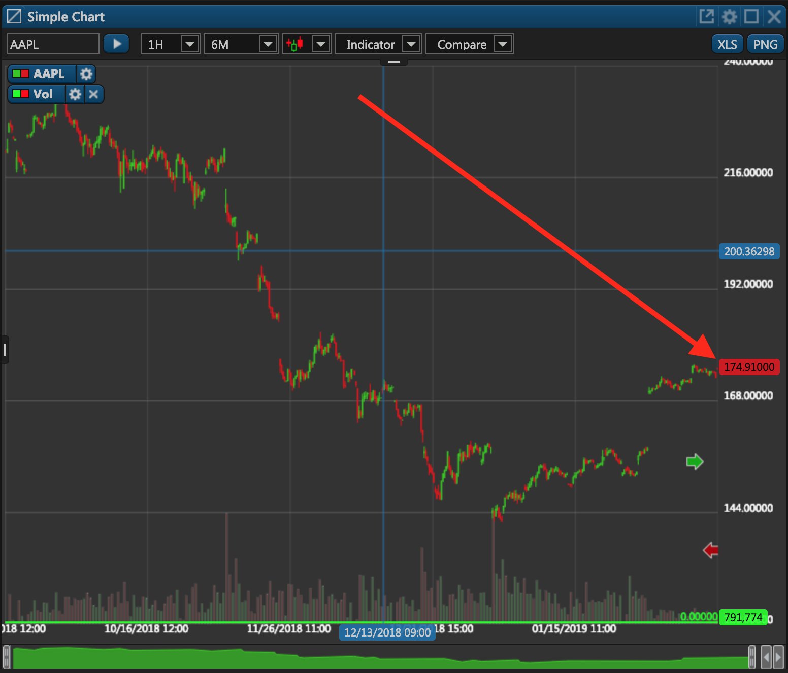

# Modify Securities

### Overview

This PUT endpoint enables you to modify an existing security's information by sending a JSON file with the updated information. Whereas the public API only permits you to retrieve information about existing securities, the private API also permits security modification. It's critical to be cautious with this procedure because providing incorrect information might lead to certain conflicts like the absence of quotes for a particular security.


In order to modify existing securities, you must use an [authorization token]() of an administrator. Using authorization tokens of regular users will lead to the 401 status code.


There are four required parameters that must be provided in the request:

1. **Et-App-Key** \(header\). This is the unique key of your app that identifies your app when communicating with our service. It can be found it in the **BO Companies** widget. When editing the company's settings, navigate to the **WebApi** tab and look for the required key \(it could be a key for the web terminal, the mobile app, or a custom key\).
2. **Authorization** \(header\). This is the authorization token from the very first [token request]().
3. **API version** \(path\). Unless necessary, leave it at "1.0".
4. **modifyModel** \(body\). This is a JSON file with the security's parameters that must be updated.

#### Request Body Sample

Following is a sample of a JSON file that contains information about the updated security.

* Required parameters

```javascript
{
  "Id": 4, 
  "Symbol": "string", 
  "AddedDate": "2019-03-04T10:09:04.543Z", 
  "ModifyDate": "2019-03-04T10:09:04.543Z", 
  "Enabled": true, 
  "AllowTrade": true, 
  "AllowMargin": true, 
  "AllowShort": true, 
  "Type": "BankersAcceptance", 
  "Source": 0, 
  "SourceId": "string", 
  "ContractSize": 0, 
  "Precision": 5, 
  "VolumePrecision": 0, 
  "Price": 100, 
  "Leverage": 0, 
  "TickSize": 0, 
}
```

* All modifiable parameters

```javascript
{
  "Id": 0,
  "Symbol": "string",
  "Suffix": "string",
  "Description": "string",
  "Exchange": "string",
  "Currency": "string",
  "BaseCurrency": "string",
  "AddedDate": "2019-03-04T10:09:04.543Z",
  "ModifyDate": "2019-03-04T10:09:04.543Z",
  "Enabled": true,
  "AllowTrade": true,
  "AllowMargin": true,
  "AllowShort": true,
  "Type": "BankersAcceptance",
  "Source": 0,
  "SourceId": "string",
  "ParentId": 0,
  "Unit": "string",
  "MarginRate": 0,
  "OptionType": "Call",
  "ExpirationType": "Regular",
  "ExpirationDate": "2019-03-04T10:09:04.543Z",
  "StrikePrice": 0,
  "SeriesId": 0,
  "UnderlyingSecuritySymbol": "string",
  "ContractSize": 0,
  "Sector": "string",
  "Industry": "string",
  "Precision": 0,
  "VolumePrecision": 0,
  "Price": 0,
  "Isin": "string",
  "Sedol": "string",
  "Cusip": "string",
  "QuoteSubscriptionKey": "string",
  "Leverage": 0,
  "TickSize": 0,
  "Name": "string",
  "ExpirationName": "string"
}
```

where:

| Parameter | Description |
| :--- | :--- |
| Id | This is the modified security's internal identifier in ETNA Trader. You can retrieve this identifier via this [API request](get-security-info-by-ticker.md). |
| Symbol | This is the ticker symbol of the modified security.  |
| Suffix | This is an internal field in ETNA Trader and it shouldn't be used by third-party developers. |
| Description | Usually this is the full name of the underlying company. |
| Exchange | This is the exchange on which the security is listed. |
| Currency | This is the currency in which the security is denominated. |
| AddedDate | This is the date on which the security was added to the database. |
| ModifyDate | This is the date in which the security's information was last modified. |
| Type | This is the type of the security. |
| Precision | This is the number of decimal places in the security's price. |
| VolumePrecision | This is the number of decimal places in the security's trading volume \(might be useful for cryptocurrencies\). |
| TickSize | This is the minimum price change of the security. For example, if this property equals 0.01 for AAPL, the minimum price change for AAPL is 0.01 \(150.67 —&gt; 150.68, but not 150.675\). For securities with the market price of less than $1, the TickSize is equal to 0.0001. |
| Enabled | This field indicated if the security is enabled and can be traded by users. |
| AllowTrade | This field indicates is the security if permitted for trading. |
| AllowMargin | This field indicates if the security is allowed to be traded on margin. |
| AllowShort | This field indicates if the security can be sold short. |
| BaseCurrency | This is the currency in which a forex instrument is denominated. |
| Source | This is an internal field in ETNA Trader. It shouldn't be used. |
| SourceId | This is an internal field in ETNA Trader. It shouldn't be used. |
| ParentId | This is the internal identifier of the underlying security of an option series. If the value is set to -1, it means that this security is not an option. |
| MarginRate | This is an internal field in ETNA Trader. It shouldn't be used by third-party developers. |
| OptionType | This is the type of the option. Possible values: Call, Put. |
| ExpirationType | This is the type of options' expiration date. Possible values: Regular, Quarterly, Weekly, Flex, Undefined, Mini. |
| ExpirationDate | This the expiration date of the option. |
| StrikePrice | This is the strike price of the option. |
| SeriesId | This is the internal identifier of the option series. If the value is set to -1, it means that this security is not an option. |
| Price | This is the security's last closing price. |
| QuoteSubscriptionKey | This is a key that ETNA Trader uses to subscribe to quotes for this security. It's an internal field and should not be used by third-party developers. |
| Leverage | This is an internal field in ETNA Trader. It shouldn't be used by third-party developers. |
| Name | This is the name of the security \(usually it's identical to the Symbol field\). |
| ExpirationName | This is the expiration name of the option. If the value is set to Jan 01 0001, it means that this security is not an option. |
| Isin | This abbreviation stands for International Securities Identification Number and it serves as a security's unique identifier. |
| Sedol | This abbreviation stands for Stock Exchange Daily Official List and it's primarily used by the London Stock Exchange and various other smaller stock exchanges.in the United Kingdom.  |
| Cusip | This abbreviation stands for Committee on Uniform Security Identification Procedures and it serves as an alternative identifier for stocks and bonds circulating in the United States and Canada. |
| ContractSize | This is the minimum number of securities that can be purchased in one trade. |

Here's the final template for this API request:

```text
PUT apiURL/v1.0/internalsecurities
```

### Response

In response to this API request, you'll receive a JSON file that contains information about the recently updated security:

```javascript
{
  "Id": 4,
  "Symbol": "AAPL",
  "AddedDate": "2019-03-02T10:09:04.543Z",
  "ModifyDate": "2019-03-04T12:15:41.3202822Z",
  "Enabled": true,
  "AllowTrade": true,
  "AllowMargin": true,
  "AllowShort": true,
  "Type": "CommonStock",
  "Source": 1,
  "SourceId": "AAPL",
  "ParentId": -1,
  "MarginRate": 0,
  "OptionType": "Call",
  "ExpirationType": "Regular",
  "ExpirationDate": "0001-01-01T00:00:00Z",
  "StrikePrice": 0,
  "SeriesId": -1,
  "ContractSize": 10,
  "Precision": 5,
  "VolumePrecision": 0,
  "Price": 100,
  "Leverage": 1,
  "TickSize": 0.01,
  "Name": "AAPL",
  "ExpirationName": "Jan 0001"
}
```

As you can see, in this sample request  we've increased the price precision from one to five. If we navigate to ETNA Trader,  we'll notice that the number of decimal places in the security's price has increased  to five.



### Common Mistakes

Here are some of the common mistakes that developers make when attempting to modify an existing security.

#### Requesting as a Non-Administrator

One of the most common mistakes that developers make when making this API request is to use the authorization token of a non-administrator. It's critical to understand that in order to be eligible for modifying existing securities, the requester must be an administrator. Otherwise you'll receive the 401 status code with the following message:

```javascript
{
    "Message": "Authorization has been denied for this request."
}
```

So be sure to use the authorization token generated with an administrator's credentials.

#### Failing to Specify the Et-App-Key Parameter

If you specify the wrong Et-App-Key parameter or fail to include it in the header altogether, you'll get the following error:

```javascript
{
    "error": "Application key is not defined or does not exist"
}
```

#### Failing to Provide All Required Parameters

Another common mistake when making this API request is failing to provide all required parameters in the request's body. In the first table of this page we have outlined all required parameters for this request, so ensure that you provide all of them; otherwise you'll receive the 500 status code and the following error message:

```javascript
{
  "message": "An error occurred while processing your request",
  "error": "Unexpected server error"
}
```

The following article covers the syntax for this API request in detail.


