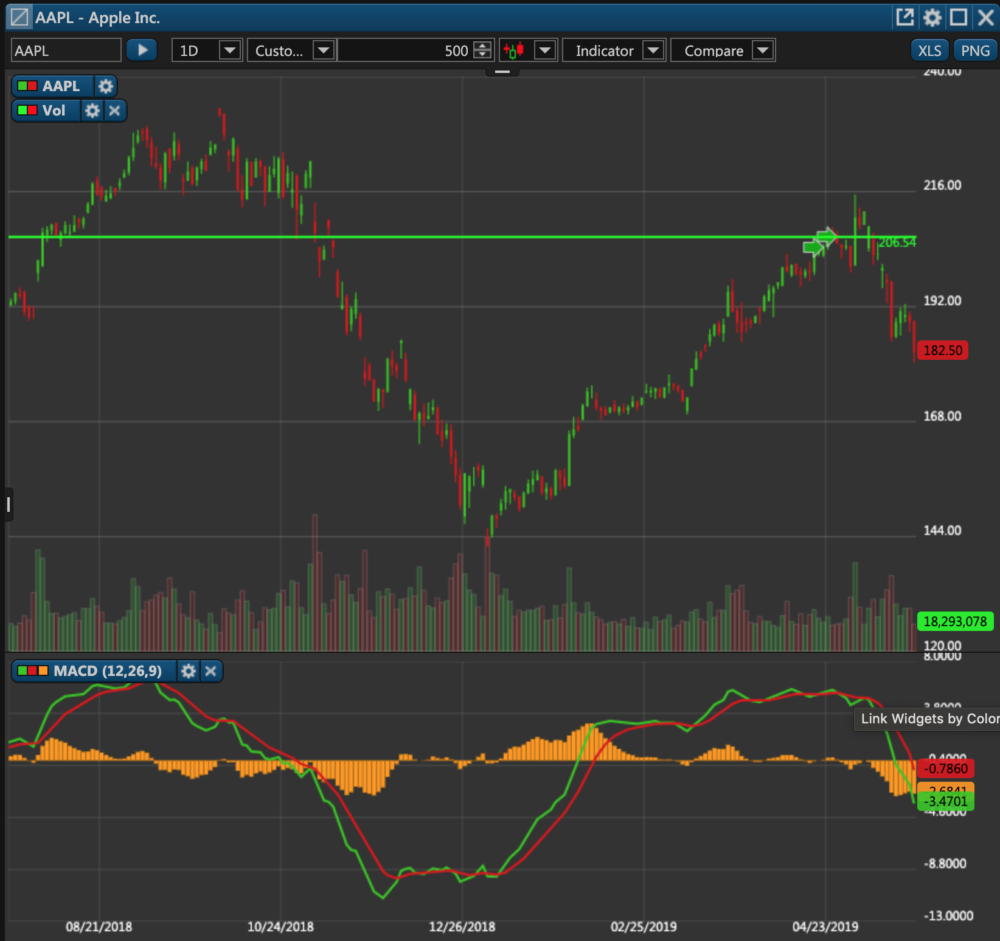

# Get Candles and Indicators for a Security

### Overview

This PUT endpoint enables you to retrieve candles and indicators for a particular security. This data includes price ranges, candles, and various other non-market data. It can de used to draw regular charts with various technical indicators.



There are four required parameters that must be provided in the request:

1. **Et-App-Key** \(header\). This is the unique key of your app that identifies your app when communicating with our service. Contact your administrator to get this key.
2. **Authorization** \(header\). This is the authorization token from the very first [token request](../../authentication/requesting-tokens/).
3. **API version** \(path\). Unless necessary, leave it at "1.0".
4. **model** \(body\). This is a JSON dictionary that contains information about the enquired security.

#### Enquired Security Syntax

Here's an example of the request body with the information about the enquired security.

```javascript
{
"Security": {
  "Symbol": "VMSFT",
  "Exchange": "VIRTEX",
  "Currency": "USD"
},
"SecurityHistorySettings": {
    "StartDate":1569902400,
    "EndDate":1570544852,
    "CandlesCount":-1, //set to -1 if candles are unnecessary
    "Period":"5m",
    "Interval":-5,
    "IncludeNonMarketData":false},
"IndicatorsHistorySettings": [{
    "Signature":"MACD|4h|false|12|26|9",
    "StartDate":1542776400,
    "EndDate":1550764844,
    "Period" : "4h",
    "Offset":5
}]
}
```

where:

<table>
  <thead>
    <tr>
      <th style="text-align:left">Parameter</th>
      <th style="text-align:left">Description</th>
    </tr>
  </thead>
  <tbody>
    <tr>
      <td style="text-align:left">Securities</td>
      <td style="text-align:left">This is an array with the enquired securities.</td>
    </tr>
    <tr>
      <td style="text-align:left">Symbol</td>
      <td style="text-align:left">This is the ticker symbol of the security under which it is listed on
        the exchange.</td>
    </tr>
    <tr>
      <td style="text-align:left">Exchange (optional)</td>
      <td style="text-align:left">This is the exchange on which the enquired security is listed.</td>
    </tr>
    <tr>
      <td style="text-align:left">Currency (optional)</td>
      <td style="text-align:left">This is the currency in which the enquired security is denominated. Possible
        values: &quot;USD&quot;.</td>
    </tr>
    <tr>
      <td style="text-align:left">Id</td>
      <td style="text-align:left">This is the internal ID of the security in ETNA Trader. You can retrieve
        this ID with <a href="../../securities/get-securitys-info-by-ticker/">this API endpoint</a>.</td>
    </tr>
    <tr>
      <td style="text-align:left">StartDate</td>
      <td style="text-align:left">This is the beginning of the period for which the data will be retrieved.
        The value must be provided in <a href="https://www.unixtimestamp.com/">UNIX Time Stamps</a>.</td>
    </tr>
    <tr>
      <td style="text-align:left">EndDate</td>
      <td style="text-align:left">This is the end of the period for which the data will be retrieved. The
        value must be provided in <a href="https://www.unixtimestamp.com/">UNIX Time Stamps</a>.</td>
    </tr>
    <tr>
      <td style="text-align:left">CandlesCount</td>
      <td style="text-align:left">This is the number of reference points for the chart. For example, if
        this parameter is set to 5, that chart will be drawn using five values.</td>
    </tr>
    <tr>
      <td style="text-align:left">Period</td>
      <td style="text-align:left">
        <p>This is the preferred time frame for the chart. Possible values:</p>
        <ul>
          <li>&quot;1m&quot;;</li>
          <li>&quot;2m&quot;;</li>
          <li>&quot;3m&quot;;</li>
          <li>&quot;5m&quot;;</li>
          <li>&quot;10m&quot;;</li>
          <li>&quot;15m&quot;;</li>
          <li>&quot;30m&quot;;</li>
          <li>&quot;1h&quot;;</li>
          <li>&quot;2h&quot;;</li>
          <li>&quot;4h&quot;;</li>
          <li>&quot;1D&quot;;</li>
          <li>&quot;1W&quot;;</li>
          <li>&quot;1M&quot;;</li>
          <li>&quot;3M&quot;;</li>
          <li>&quot;6M&quot;;</li>
          <li>&quot;1Y&quot;.</li>
        </ul>
      </td>
    </tr>
    <tr>
      <td style="text-align:left">Interval</td>
      <td style="text-align:left">
        <p>This is the required time period for the specified time period. Possible
          values:</p>
        <ol>
          <li>Candles = 0,</li>
          <li>All = -1,</li>
          <li>YearToDate = -2,</li>
          <li>Custom = -3,</li>
          <li>Day1 = -4,</li>
          <li>Week1 = -5,</li>
          <li>Month1 = -6,</li>
          <li>Month3 = -7,</li>
          <li>Month6 = -8,</li>
          <li>Year1 = -9,</li>
          <li>Year3 = -10,</li>
          <li>CustomCandles = -11,</li>
          <li>Day3 = -12,</li>
          <li>Today = -13</li>
        </ol>
      </td>
    </tr>
    <tr>
      <td style="text-align:left">Offset</td>
      <td style="text-align:left">This is the number of data points by which the technical indicator will
        be offset.</td>
    </tr>
    <tr>
      <td style="text-align:left">IndicatorsHistorySettings</td>
      <td style="text-align:left">This is a string that contains information about the required technical
        indicator.</td>
    </tr>
  </tbody>
</table>


All parameters must be provided in the body JSON; otherwise the chart data will not be retrieved.


Here's the final template for this API request:

```text
PUT apiURL/v1.0/history/symbols
```

### Sample CURL

```text
curl -X PUT --header 'Content-Type: application/json' --header 'Accept: application/json' --header 'Authorization: Bearer Token' --header 'Et-App-Key: yourKey' -d '{"Security": {"Symbol":"AAPL",
 "Exchange":"XNAS",
 "Currency":"USD"},
 "SecurityHistorySettings":
 {"StartDate":1542776400,
 "EndDate":1550764844,
 "CandlesCount":-1,
 "Period":"4h",
 "Interval":-7,
 "IncludeNonMarketData":false},
 "IndicatorsHistorySettings":[
 {"Signature":"MACD|4h|false|12|26|9",
 "Interval":-7,
 "StartDate":1542776400,
 "EndDate":1550764844,
 "CandlesCount":-1,
 "Offset":0,
 }]
 }' 'https://pub-api-et-demo-prod.etnasoft.us/api/v1.0/history/symbols'
 
```

### Response

In response to this API request, you'll receive the chart data for the specified security. Some of the response data was omitted so as to preserve space.

```javascript
{
    "SecurityHistory": [
        [
            {
                "ValuationLevels": [],
                "IsMarket": true,
                "Volume": 12111739,
                "OpenInterest": 0,
                "Time": 1542801600,
                "DateTime": "2018-11-21T12:00:00Z",
                "Open": 179.73,
                "High": 180.27,
                "Low": 177.07,
                "Close": 178.32
            },
            {
                "ValuationLevels": [],
                "IsMarket": true,
                "Volume": 10083292,
                "OpenInterest": 0,
                "Time": 1542816000,
                "DateTime": "2018-11-21T16:00:00Z",
                "Open": 178.32,
                "High": 179.26,
                "Low": 177.15,
                "Close": 177.8828
            },
            {
                "ValuationLevels": [],
                "IsMarket": true,
                "Volume": 4768150,
                "OpenInterest": 0,
                "Time": 1542830400,
                "DateTime": "2018-11-21T20:00:00Z",
                "Open": 177.89,
                "High": 178.05,
                "Low": 176.55,
                "Close": 176.76
            },
        ],
    "IndicatorsHistory": [
        [
            {
                "Date": 1550692800,
                "Values": [
                    0.812609297591649,
                    0.840680863069201,
                    -0.0280715654775516
                ]
            },
            {
                "Date": 1550678400,
                "Values": [
                    0.800153317412054,
                    0.847698754438589,
                    -0.0475454370265348
                ]
            },
            {
                "Date": 1550664000,
                "Values": [
                    0.756325454456856,
                    0.859585113695222,
                    -0.103259659238366
                ]
            },
            {
                "Date": 1550606400,
                "Values": [
                    0.641529520947387,
                    0.885400028504814,
                    -0.243870507557427
                ]
            },
            {
                "Date": 1550592000,
                "Values": [
                    0.666913190963356,
                    0.94636765539417,
                    -0.279454464430814
                ]
            },
            {
                "Date": 1550577600,
                "Values": [
                    0.641909610642443,
                    1.01623127150187,
                    -0.37432166085943
                ]
            },
            {
                "Date": 1550260800,
                "Values": [
                    0.73083362833259,
                    1.10981168671673,
                    -0.378978058384141
                ]
            },
            {
                "Date": 1550246400,
                "Values": [
                    0.808248158135854,
                    1.20455620131277,
                    -0.396308043176913
                ]
            },
            {
                "Date": 1550232000,
                "Values": [
                    0.891228184784637,
                    1.30363321210699,
                    -0.412405027322357
                ]
            },
            {
                "Date": 1550174400,
                "Values": [
                    0.982141190655824,
                    1.40673446893758,
                    -0.424593278281759
                ]
            },
            {
                "Date": 1542801600,
                "Values": [
                    -6.1285915874555,
                    -5.30108537072075,
                    -0.827506216734757
                ]
            }
        ]
    ]
}
```

where:

| Parameter | Description |
| :--- | :--- |
| IsMarket | This field indicates if the candle is positioned during the regular trading hours. If so, the value will be set to true; if not, the value will be set to false. |
| Volume | This is the trading volume for the specified period. |
| OpenInterest | This is the total number of outstanding derivative contracts that have not been settled yet \(only applicable for derivatives\). |
| Time | This is the date and time \(in ticks\) at which this particular candle was registered. |
| DateTime | This is the date and time \(in UTC time\) at which this particular candle was registered. |
| Open | This is the opening price of the security. |
| Close | This is the closing price of the security. |
| High | This is the highest price point for the security during the specified time period. |
| Low | This is the lowest price point for the security during the specified time period. |

### Common Mistakes

Here are some of the common mistakes that developers make when attempting to retrieve trading data for a particular security.

#### Failing to Specify the Et-App-Key Parameter

If you specify the wrong Et-App-Key parameter or fail to include it in the header altogether, you'll get the following error:

```javascript
{
    "error": "Application key is not defined or does not exist"
}
```

#### Incorrectly Specifying the Request Body

Another common mistake when attempting to retrieve the chart data for a particular security is incorrectly structuring the request body. It's critical that you follow the template provided above and specify all of the required parameters. Otherwise you'll receive the 500 status code and the following error message:

```javascript
{
    "message": "An error occurred while processing your request",
    "error": "Unexpected server error"
}
```

The following article covers the syntax for this API request in detail.

