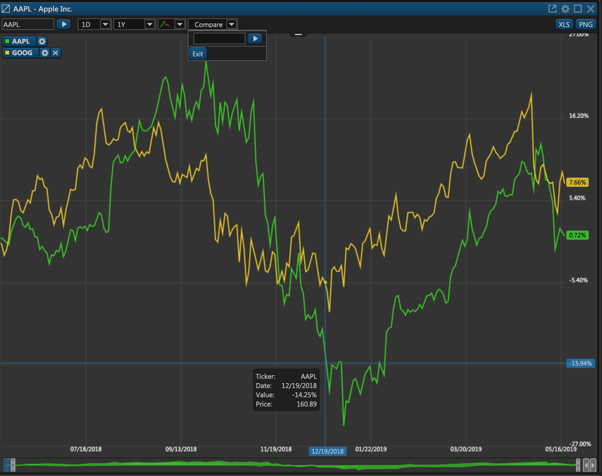

# Get Comparison Chart Data

### Overview

This PUT endpoint enables you to retrieve and compare historical trading data for a set of securities. The data includes price ranges, candles, and various other non-market data. It can be used to draw comparative trading charts as demonstrated by the following screenshot:



There are four required parameters that must be provided in the request:

1. **Et-App-Key** \(header\). This is the unique key of your app that identifies your app when communicating with our service. Contact your administrator to get this key.
2. **Authorization** \(header\). This is the authorization token from the very first [token request](../../authentication/requesting-tokens/).
3. **API version** \(path\). Unless necessary, leave it at "1.0".
4. **model** \(body\). This is a JSON dictionary that contains information about the enquired securities.

#### Enquired Securities Syntax

Here's an example of the request body with the information about the enquired securities.

* Specific period:

```javascript
{"Securities":
    [{"Symbol":"MSFT","Exchange":"XNAS","Currency":"USD","Id":6},
    {"Symbol":"AAPL","Exchange":"XNAS","Currency":"USD","Id":4}],
    "SecuritiesHistorySettings":
    {
        "StartDate":1548046800,
        "EndDate":1550755974,
        "Period":"1h",
    }
}
```

* The last n data points:

```javascript
{"Securities":
    [{"Symbol":"MSFT","Exchange":"XNAS","Currency":"USD","Id":6},
    {"Symbol":"AAPL","Exchange":"XNAS","Currency":"USD","Id":4}],
    "SecuritiesHistorySettings":
    {
        "CandlesCount":10,
        "Period":"1h",
    }
}
```

* The last n data points within a specific time period:

```javascript
{"Securities":
    [{"Symbol":"MSFT","Exchange":"XNAS","Currency":"USD","Id":6},
    {"Symbol":"AAPL","Exchange":"XNAS","Currency":"USD","Id":4}],
    "SecuritiesHistorySettings":
    {
        "CandlesCount":10,
        "Period":"1h",
        "Interval":1,
    }
}
```

where:

<table>
  <thead>
    <tr>
      <th style="text-align:left">Parameter</th>
      <th style="text-align:left">Description</th>
    </tr>
  </thead>
  <tbody>
    <tr>
      <td style="text-align:left">Securities</td>
      <td style="text-align:left">This is an array with the enquired securities.</td>
    </tr>
    <tr>
      <td style="text-align:left">Symbol</td>
      <td style="text-align:left">This is the ticker symbol of the security under which it is listed on
        the exchange.</td>
    </tr>
    <tr>
      <td style="text-align:left">Exchange (optional)</td>
      <td style="text-align:left">This is the exchange on which the enquired security is listed.</td>
    </tr>
    <tr>
      <td style="text-align:left">Currency (optional)</td>
      <td style="text-align:left">This is the currency in which the enquired security is denominated. Possible
        values: &quot;USD&quot;.</td>
    </tr>
    <tr>
      <td style="text-align:left">Id</td>
      <td style="text-align:left">This is the internal ID of the security in ETNA Trader. You can retrieve
        this ID with <a href="../../../broker-api/internal-securities/get-security-info-by-ticker/">this API endpoint</a>.</td>
    </tr>
    <tr>
      <td style="text-align:left">StartDate</td>
      <td style="text-align:left">This is the beginning of the period for which the data will be retrieved.
        The value must be provided in <a href="https://www.unixtimestamp.com/">UNIX Time Stamps</a>.</td>
    </tr>
    <tr>
      <td style="text-align:left">EndDate</td>
      <td style="text-align:left">This is the end of the period for which the data will be retrieved. The
        value must be provided in <a href="https://www.unixtimestamp.com/">UNIX Time Stamps</a>.</td>
    </tr>
    <tr>
      <td style="text-align:left">CandlesCount</td>
      <td style="text-align:left">This is the number of reference points for the chart. For example, if
        this parameter is set to 5, that chart will be drawn using five values.</td>
    </tr>
    <tr>
      <td style="text-align:left">Period</td>
      <td style="text-align:left">
        <p>This is the preferred time frame for the chart. Possible values:</p>
        <ul>
          <li>&quot;1m&quot;;</li>
          <li>&quot;2m&quot;;</li>
          <li>&quot;3m&quot;;</li>
          <li>&quot;5m&quot;;</li>
          <li>&quot;10m&quot;;</li>
          <li>&quot;15m&quot;;</li>
          <li>&quot;30m&quot;;</li>
          <li>&quot;1h&quot;;</li>
          <li>&quot;2h&quot;;</li>
          <li>&quot;4h&quot;;</li>
          <li>&quot;1D&quot;;</li>
          <li>&quot;1W&quot;;</li>
          <li>&quot;1M&quot;;</li>
          <li>&quot;3M&quot;;</li>
          <li>&quot;6M&quot;;</li>
          <li>&quot;1Y&quot;.</li>
        </ul>
      </td>
    </tr>
    <tr>
      <td style="text-align:left">Interval</td>
      <td style="text-align:left">
        <p>This is the required time period for the specified time period. Possible
          values:</p>
        <ol>
          <li>&quot;TDY&quot;;</li>
          <li>&quot;1D&quot;;</li>
          <li>&quot;1W&quot;;</li>
          <li>&quot;1M&quot;;</li>
          <li>&quot;3M&quot;;</li>
          <li>&quot;6M&quot;;</li>
          <li>&quot;YTD&quot;;</li>
          <li>&quot;1Y&quot;;</li>
          <li>&quot;3Y&quot;;</li>
          <li>&quot;ALL&quot;.</li>
        </ol>
      </td>
    </tr>
  </tbody>
</table>
All parameters must be provided in the body JSON; otherwise the chart data will not be retrieved.


Here's the final template for this API request:

```text
PUT apiURL/v1.0/history/compare
```

### Sample CURLs

```text
curl -X PUT --header 'Content-Type: application/json' --header 'Accept: application/json' --header 'Authorization: Bearer token' --header 'Et-App-Key: yourEttAppKey' -d '{"Securities": [{"Symbol":"MSFT","Exchange":"XNAS","Currency":"USD","Id":6},
 {"Symbol":"AAPL","Exchange":"XNAS","Currency":"USD","Id":4}],
 "SecuritiesHistorySettings":
 { "CandlesCount":14,
 "Period":"4h"
 } }' 'https://pub-api-et-demo-prod.etnasoft.us/api/v1.0/history/compare'
```

### Response

In response to this API request, you'll receive the chart data for the list of specified securities. Notice that trading data for the Microsoft stock comes first, and after it comes the second array with the trading data for the Apple stock.

```javascript
[
  [ //Microsoft data starts
    {
      "Volume": 43020193,
      "Time": 1548028800,
      "Difference": 0,
      "Price": 107.04
    },
    {
      "Volume": 33774774,
      "Time": 1550448000,
      "Difference": 3.66685,
      "Price": 110.965
    }
  ], //Microsoft data ends
  [ //Apple data starts
    {
      "Volume": 97088738,
      "Time": 1548028800,
      "Difference": 0,
      "Price": 157.71
    },
    {
      "Volume": 56357006,
      "Time": 1550448000,
      "Difference": 9.58722,
      "Price": 172.83
    }
  ] //Apple Data ends
]
```

where:

| Parameter | Description |
| :--- | :--- |
| Volume | This is the trading volume at the time specified in `Time`. |
| Time | This is the date and time \(in UNIX timestamps\) at which this chart data point was registered. |
| Difference | This is the difference between the price at the `StartDate` and `Price`. |
| Price | The price registered at `Time`. |

### Common Mistakes

Here are some of the common mistakes that developers make when attempting to retrieve trading data for a set of securities.

#### Failing to Specify the Et-App-Key Parameter

If you specify the wrong Et-App-Key parameter or fail to include it in the header altogether, you'll get the following error:

```javascript
{
    "error": "Application key is not defined or does not exist"
}
```

#### Incorrectly Specifying the Request Body

Another common mistake when attempting to retrieve the chart data for a set of securities is incorrectly structuring the request body. It's critical that you follow the template provided above and specify all of the required parameters. Otherwise you'll receive the 500 status code and the following error message:

```javascript
{
    "message": "An error occurred while processing your request",
    "error": "Unexpected server error"
}
```

The following article covers the syntax for this API request in detail.

