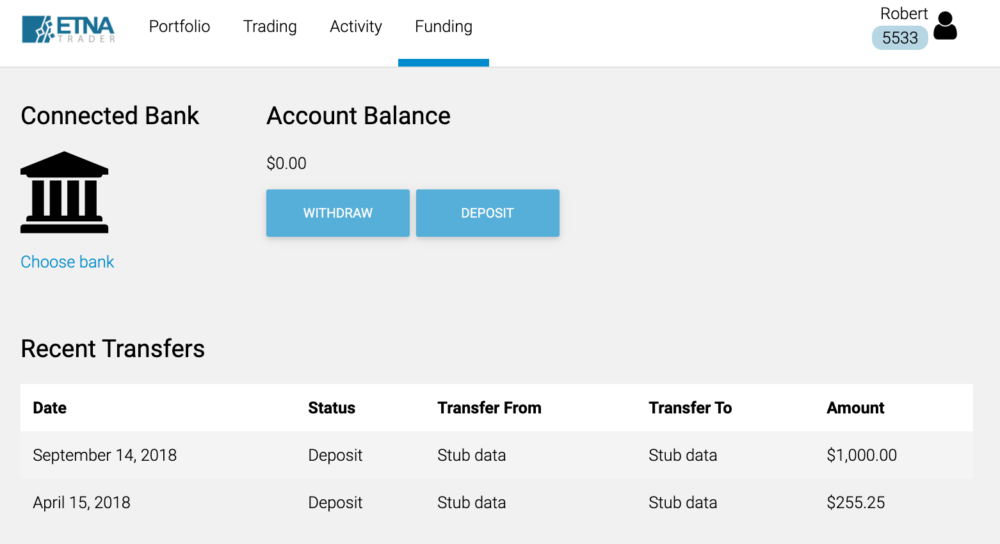
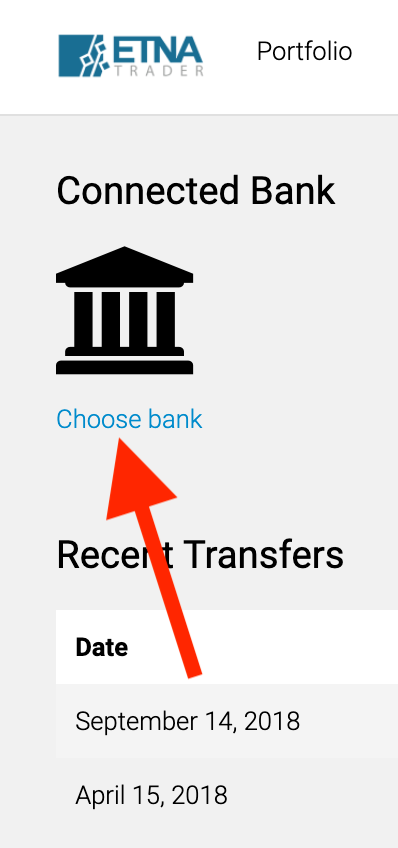
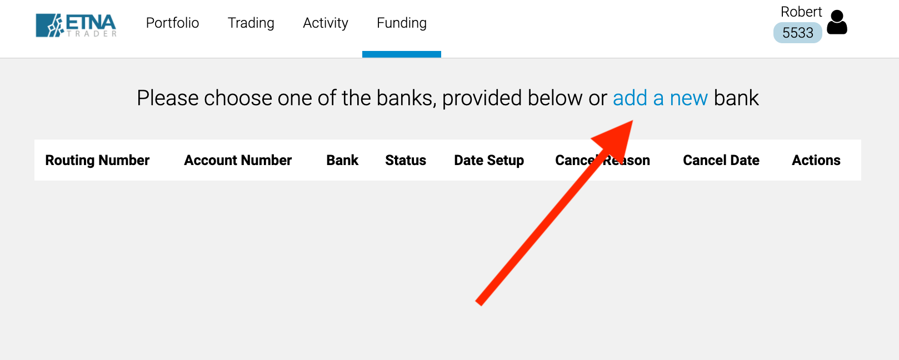
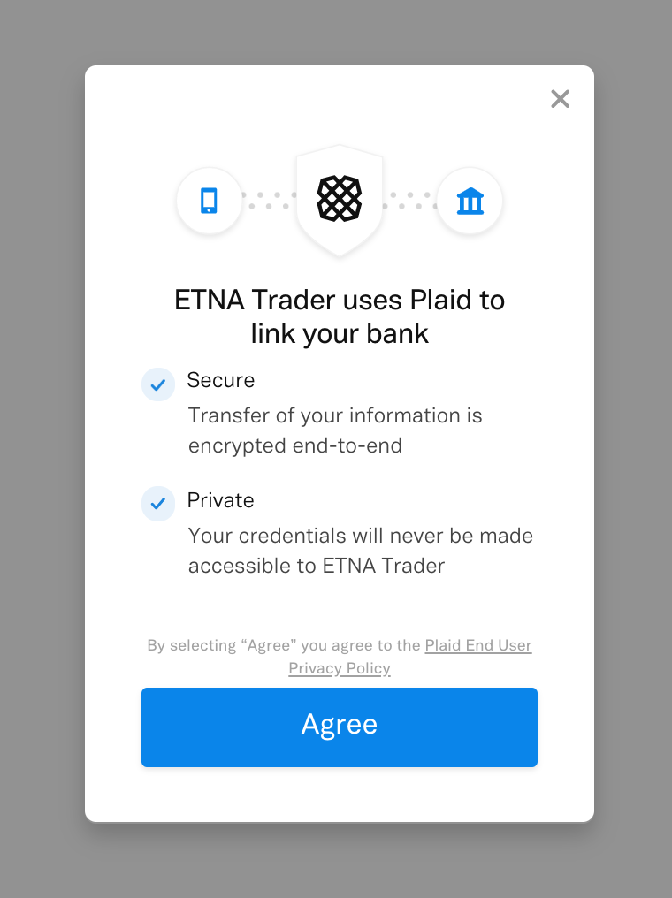
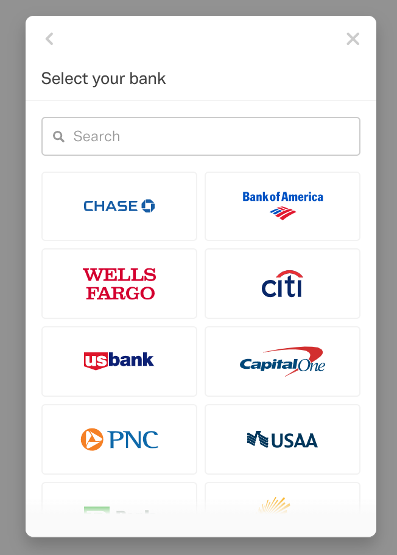
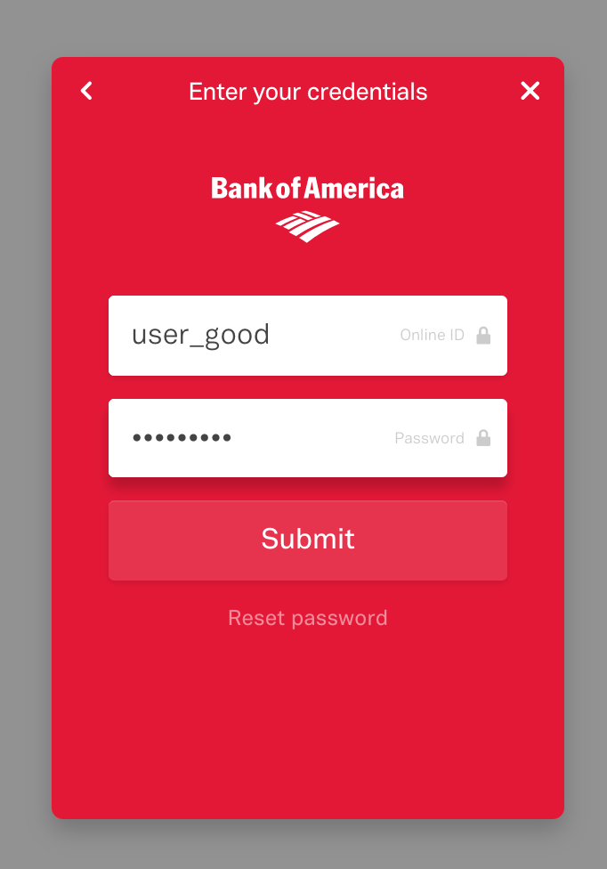
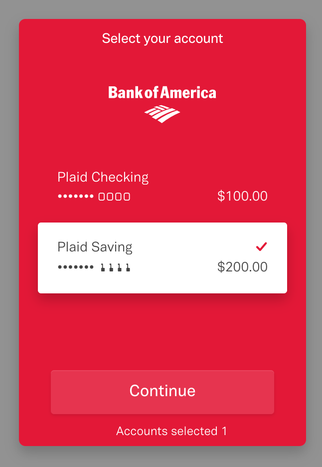

# Funding Tab

### Funding Tab Overview

The main purpose of the funding tab is to enable traders to deposit and withdraw funds to/from their banking accounts. 

However, before you can proceed to deposit or withdraw funds, first establish an ACH relationship between Digital Advisor and your banking account. To do so, click **Choose bank**.

This will re-direct you to the banking selection page where you can select a previously linked banking account or link a new one by clicking **add a new** at the top.

### Linking a New Banking Account

When you initiate linking of a new banking account, Digital Advisor will prompt the Plaid view that allows for easy and convenient establishment of ACH relationships. Click **Agree**.

Next, select your bank from the list of available banking institutions:

Next, specify your credentials and click **Submit**:

Select the target banking account and click **Continue**:

Shortly after the new ACH relationship will be established and you can proceed to deposit and withdraw funds.

