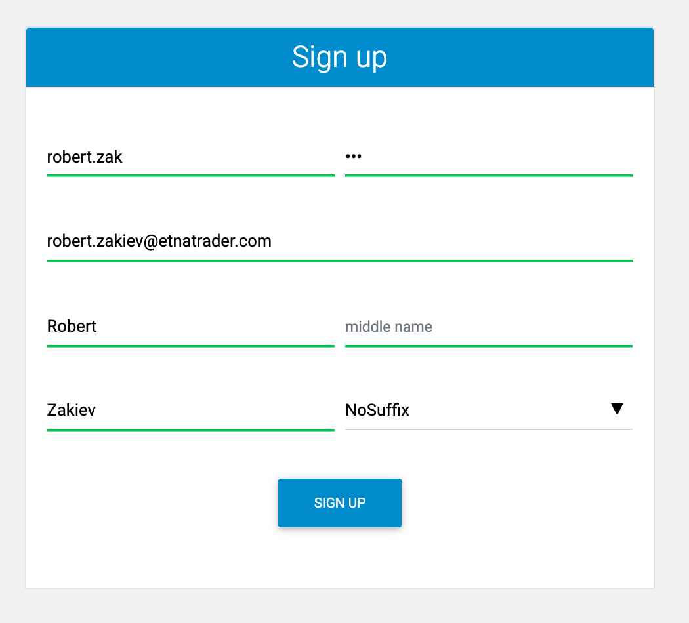

# Getting Started

### Introduction

Digital Advisor is hosted on one of your broker's subdomains. Before you proceed to use it for automatic management of your portfolio, first sign up for it. Head over to the login page and click **Sign Up**.

This will re-direct you to the sign-up page where you need to specify your personal details:

Once the form is filled out, click **Sign Up**. Afterward, you will be re-directed to Digital Advisor. If you have no active trading accounts \(perhaps you migrated from ETNA Trader\), Digital Advisor will prompt you to create a new trading account with the clearing firm that your broker has selected. Once you have submitted an account opening request, some time will pass until your account is approved by both the broker and the clearing firm.

