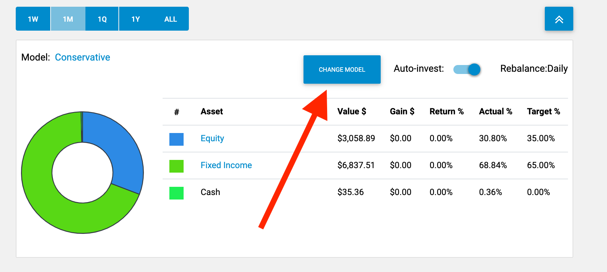

# Portfolio Tab

### Introduction

This first and main tab of Digital Advisor is called **Portfolio** and its main purpose is to give you an overview of the current state of your portfolio. It's the place where you go in order to track your performance, view the breakdown of your portfolio, and change the current investment model.

.png>)

### Portfolio Tab Overview

The top of the page contains three blocks:

1. **Balance**. This is the current market value of your portfolio (securities and cash put together).
2. **Earnings**. This is the current dollar return of your portfolio over some time period.
3. **Return**. This is the percentage return of your portfolio over some time period.

Moving downward, there's a line chart that displays the value of the portfolio over the time period specified in the picker view right below the chart.

The bottom of the page features a visual representation of the portfolio's value in the form of a pie chart. Next to it there's a table that breaks down the structure of the portfolio by asset classes. Each asset class has four corresponding parameters:

1. **Value**. The collective dollar value of all securities of this asset class in the portfolio.
2. **Gain**. The dollar return of this asset class in the portfolio.
3. **Actual**. The percentage return of this asset class in the portfolio.
4. **Target**. The expected return of this asset class in the portfolio.

### Changing the Model

To change the current investment model, click **Change Model** at the top of the portfolio block. This will bring up the investment model selection view where you can choose the model that suits your preferences and risk tolerance. Furthermore, you can enable or disable automatic rebalancing of your portfolio by clicking on the **Auto-Invest** button to the right .

