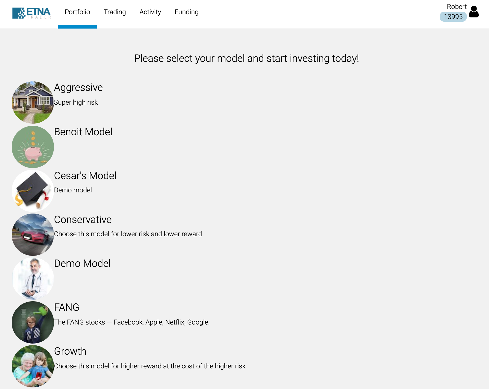
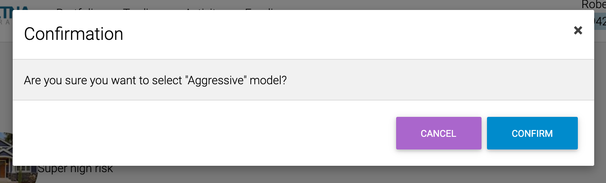

# Selecting an Investment Model

Once you have created a new trading account that was approved by the clearing firm, the next step is to select a model that suits your investment preferences and risk tolerance. These models are defined by your broker, each model representing a collection of securities with a certain target weight in the portfolio \(the weight may fluctuate within a pre-defined threshold as security prices are changing\).

When you click on a model, a confirmation window will appear, enabling you to verify that this model should be used to manage your portfolio. Click **Confirm**.

Once the model has been selected, you will immediately be re-directed to the **Portfolio** tab that gives you an overview of your portfolio: it shows the current market value of the portfolio, its returns over different time periods as well as the breakdown of the portfolio by different asset classes:

