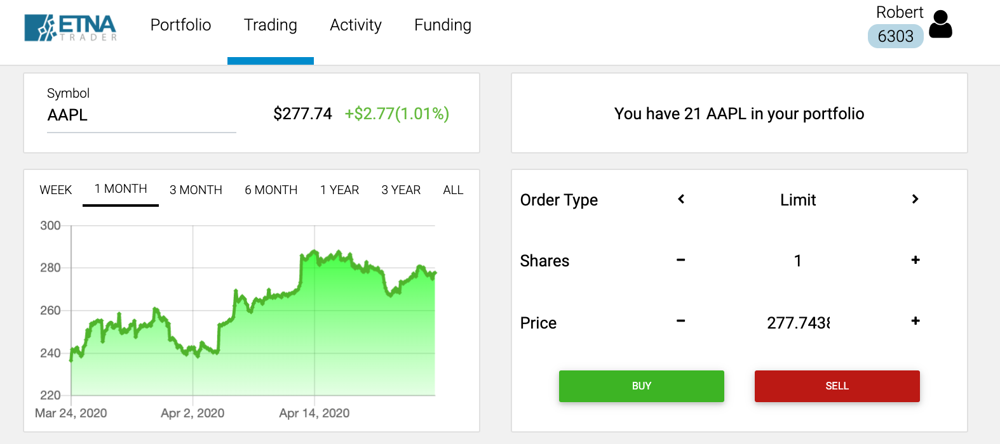
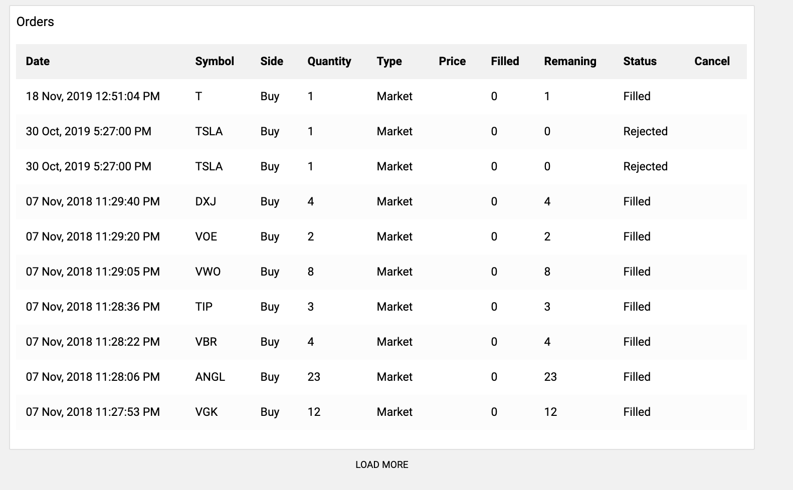

# Trading Tab

### Introduction

The main purpose of Digital Advisor is to relieve traders of manual management of their portfolios by enabling them to employ special investment models that automate the process. That said, users still have the ability to manually place orders in case they need to increase or decrease their stake in a specific security. This functionality is available on the second tab of Digital Advisor called **Trading**.

### Trading Tab Overview

The trading tab represents a grid of several blocks that facilitate placing trades and monitoring orders. The first left-most block enables you to specify the ticker symbol of the security that you would like to trade. Here you can also view the current quote of the security as well as its gains for the current trading session. 

The block on the opposite side demonstrates the number of shares of this security in your portfolio.

Moving downward, there's a chart that displays the price of the security over different time periods. This chart is interactive so you can take a closer look at the opening and closing price of the security during different trading sessions throughout the specified time period. 

On the right there's the order placement tile that enables you to configure the order. First, you can select the type of the order that you want to place: either **Market** or **Limit**. Then proceed to specify the number of shares that you'd like to buy. Finally, if you're placing a limit order, specify the limit price.

### Tracking Orders

At the bottom of the **Trading** tab there's a table that lists the most recent orders placed on the currently selected trading account along with various parameters of these orders. To reveal more orders, click **Load More** underneath the table. 

