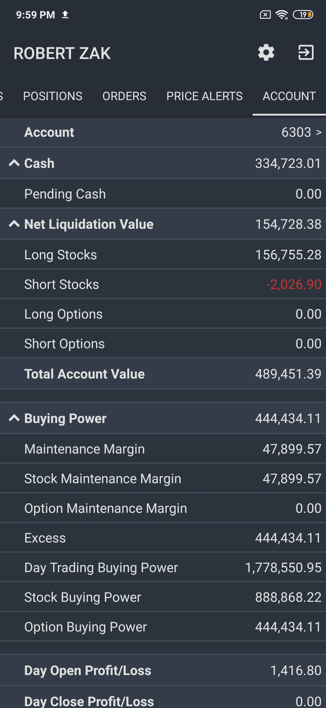
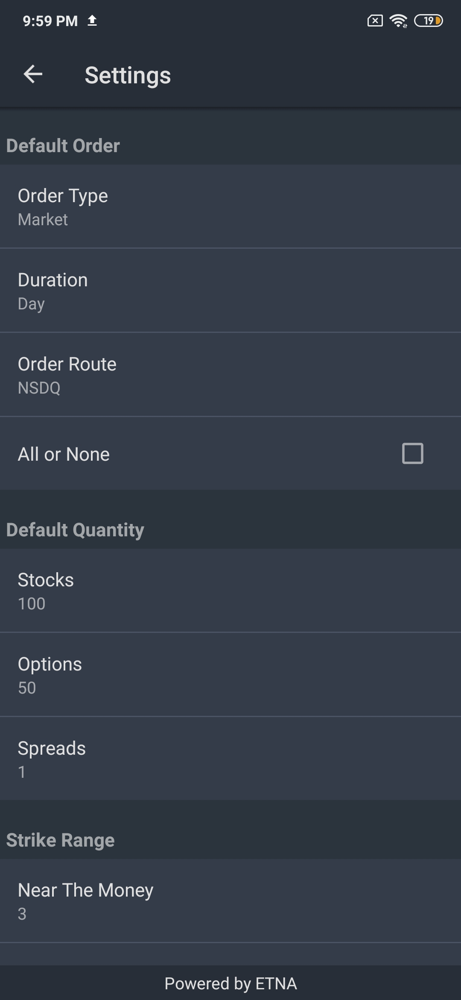

# Accounts & Settings

### Introduction

The last tab of ETNA Trader for Android is entitled **Account** and it is responsible for displaying various information about your trading accounts as well as configuration of global settings. It also enables you to switch between all of your trading accounts.

### Account View

When you open the Account tab, you immediately see the information about the currently used trading account. To switch the account, simply tap on the account's number in the first row; from there you will be able to select a different trading account.

Moving downward, there's a long table that display various parameters about the trading account, including its current cash position, the amount of pending cash, the liquidation value of the account, the market value of different security types, the buying power of the account, various profit/loss parameters, etc.

### Settings

To configure global settings, tap on the little gear icon in the top-right corner. This will bring up the settings view. Here you can configure various global settings, including the default order type, the default order duration, the default execution venue, the default order quantity, the default strike range for options, notification settings, the current theme, authentication mode, etc.

