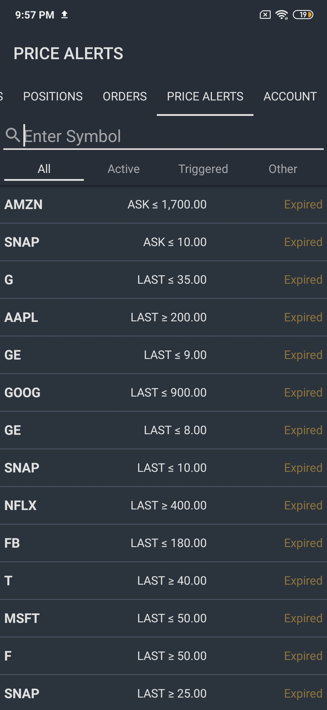
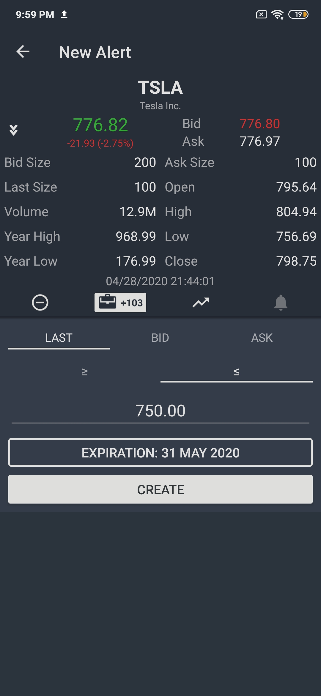

# Price Alerts

### Price Alerts Tab

The price alerts tab if responsible for management of price alerts in your trading accounts. Here you can view this list of your existing price alerts and also create new ones. The existing price alerts can also be sorted by their status by tapping on different segments of the picker view: **All**, **Active**, **Triggered**, and **Other**. 

### Creating a New Price Alert

To create a new price alert, enter the ticker symbol of the target security in the text field at the top. Select the security in the list and then proceed to configure the price alert. Four parameters can be configured when creating a new price alert:

1. **Price type**. This is the price that will be tracked by the price alert. It can be either **Last**, **Bid**, or **Ask**.
2. **Greater than or Less than**. Indicate if the price at which the alert will be executed must be lower than or equal to or greater than or equal to the specified price.
3. **Target price**. The price which, if reached, will trigger the price alert.
4. **Expiration date**. The date on which the price alert will be expired.

Once the alert is created, tap **Create**, and the price alert will become active. Once the target price is reached, you will receive a corresponding notification.

