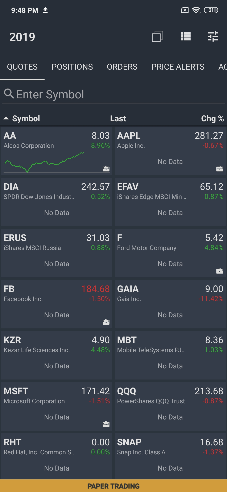
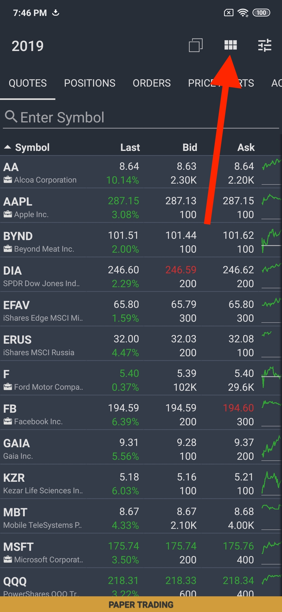
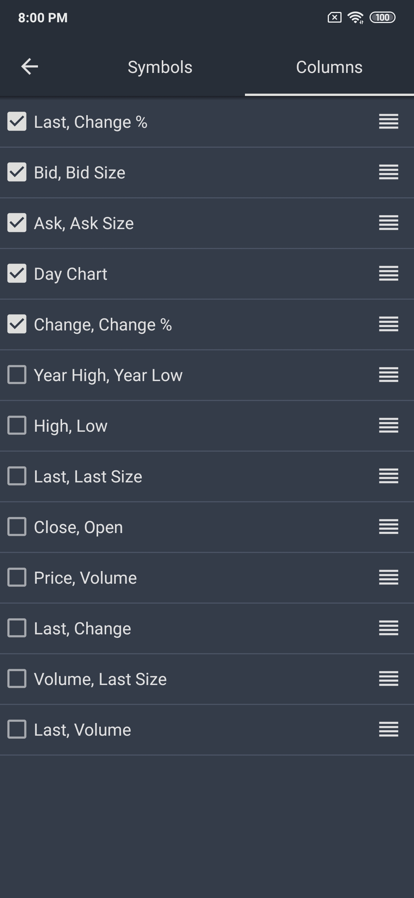
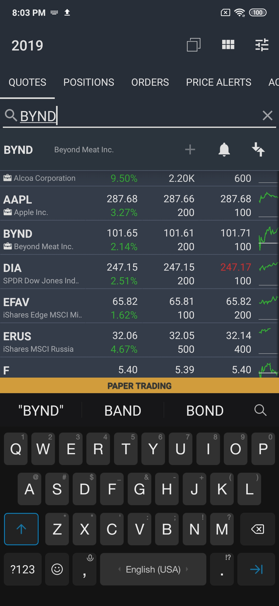
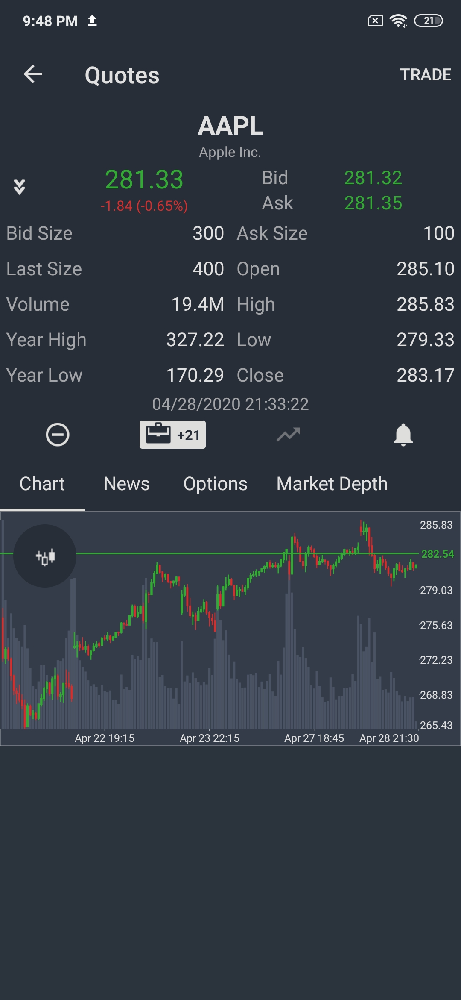
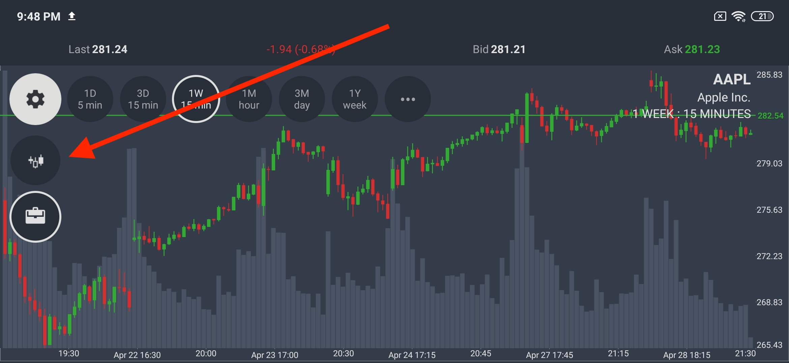
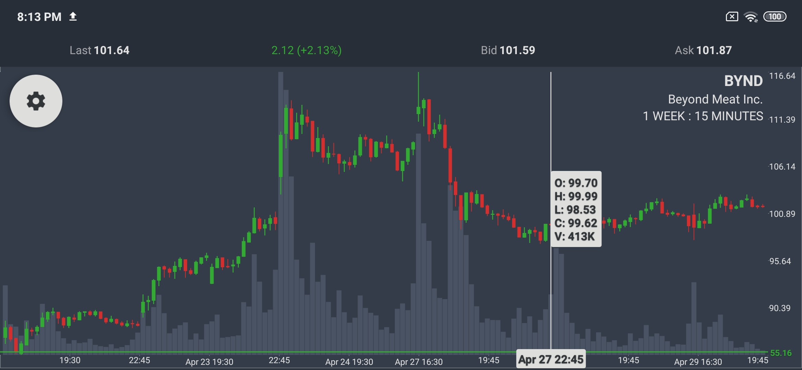

# Watchlist & Quote View

### Watchlist

The first tab of ETNA Trader for Android represents the **Quotes** view which displays the current quotes for securities of a specific watchlist. The quotes are displayed in blocks — two per row — along with mini charts and the ticker symbol of the security.

If you tap on the little rectangular icon in the top-right corner, the view will switch to the **List** mode that fits more companies into the screen and presents them in a more compact way. Further, the entire table can be sorted by each column — simply tap on the column's name to sort the data in descending order \(tap again and the order will be reversed\).

To change the active watchlist, tap on the icon in the top-left corner. The icon itself displays the total number of watchlists that this trader has.

To re-arrange the displayed content, tap of the right-most icon in the navigation bar. You'll then be presented with a window that enables you to determine what content should appear first and what content should be hidden. To the right of every list item there's a re-arrangement icon; tapping and dragging it will enable you to put all content in the right order. When done, tap on the arrow icon.

Underneath the navigation bar there's a text field entitled **Enter Symbol** that enables you to quickly look up a quote for a specific security.

For example, you can type in **SNAP**, tap on the first result of the query, and you'll shortly be re-directed to the **Quote** view with the current detailed quotes.

### Quote View

The Quote view contains pertinent information about the security and its price. In addition to the current bid and ask prices, the Quote view also contains four other segments: **Chart**, **News**, **Options**, and **Market Depth**.

### Chart View

The chart view is by far the most frequently used feature of the mobile app. Its purpose is to display different kinds of charts of the historical price data for the selected security. You can interact with the chart to get more detailed information about trade volumes, the highs and lows registered at a specific date, etc.

The chart is displayed right under the bid/ask prices. You can rotate your device to toggle the full screen mode. To switch the chart mode, tap on the gear icon in the top-left corner and under it tap on the chart mode icon.

Tapping anywhere on the graph will prompt a pop-up with a detailed account of all prices registered at the time:

* Opening price
* High for the day;
* Low for the day;
* The closing price;
* The trading volume during the trading session.

To change the preferred chart period and interval, tap on the gear icon again. On the right there will be six pre-determined frequently used templates. To specify a custom period and interval, tap on the rightmost three-dot icon and select the required parameters from the drop-down menus.

To trade the security, rotate the device back to portrait mode and in the top-right corner, tap **Trade**.

