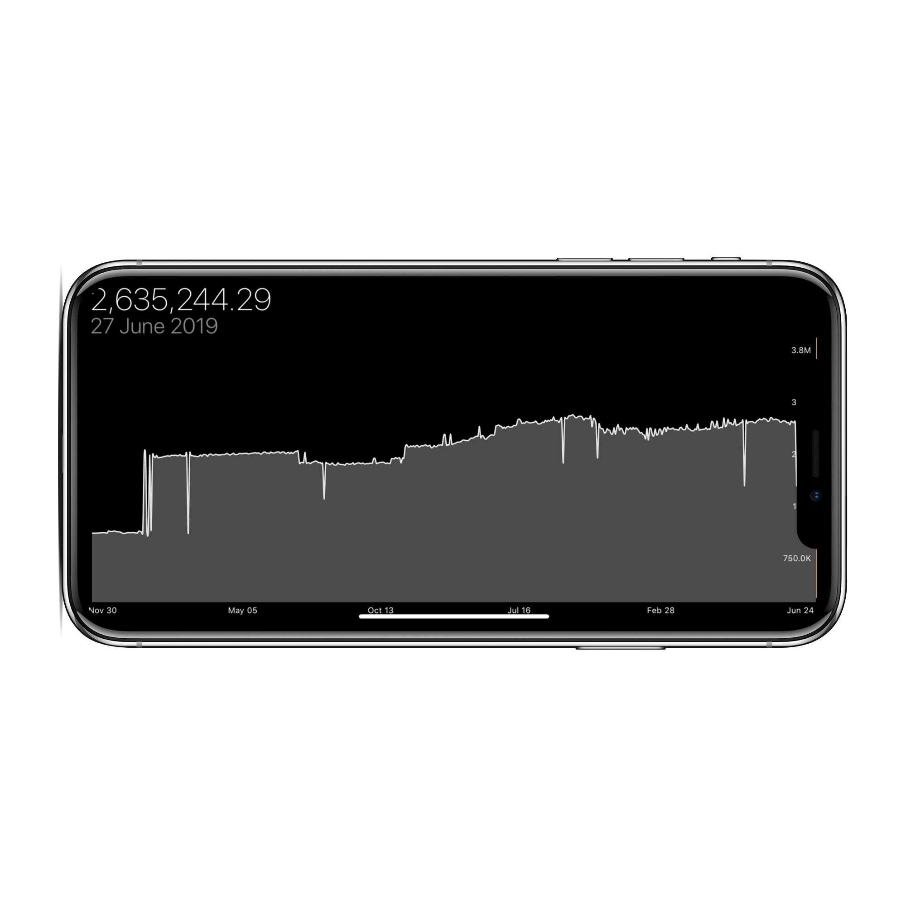
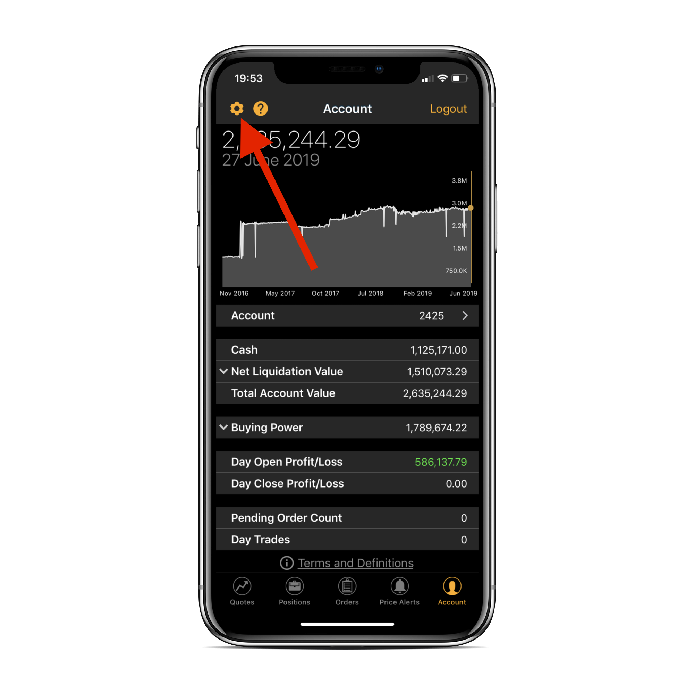
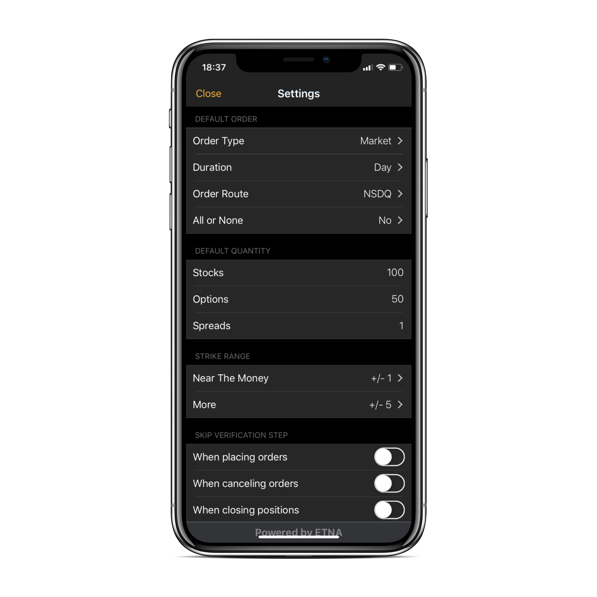
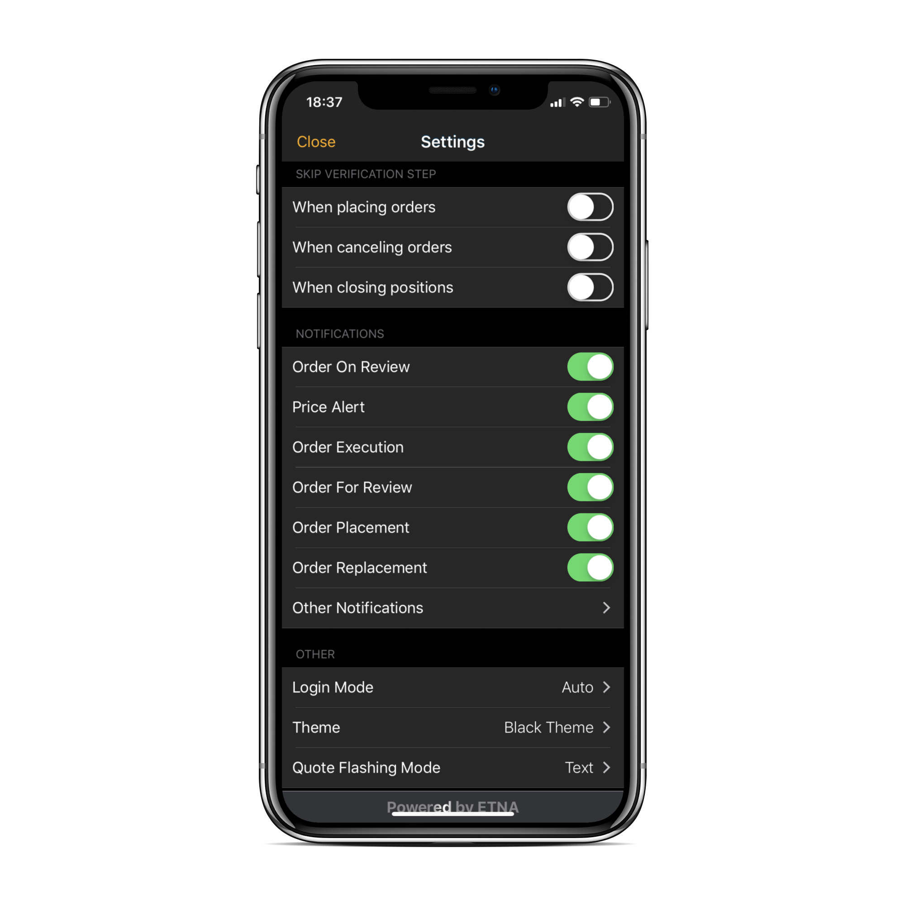

# Account View

### Introduction

The last tab of ETNA Trader for iOS — **Account** — is responsible for displaying comprehensive information about the current trading account as well as enabling you to change the app's settings. Here you can quickly glance at the current market value of the account, track the profit and loss figures, take a closer look at your current buying power, configure notifications, etc.

### Exploring the Account Tab

Once you open the Account tab, the first thing you encounter is the account value chart that displays the current market value of the trading account. Rotating the device will expand the chart to full screen, giving you a more spacious view of the historical value of the trading account.

Moving downward, here you can inspect the current cash position, account's market value, and a detailed breakdown of all positions by types:

* Long positions in stocks;
* Short positions in stocks;
* Long positions in options;
* Short options in stocks;
* Long positions in forex instruments;
* Short positions in forex instruments.

The next section covers the Buying Power available on the account, including:

* Maintenance Margin;
* Stock Maintenance Margin;
* Option Maintenance Margin;
* Excess;
* Day Trading Buying Power;
* Stock Buying Power;
* Option Buying Power.


You can learn in-depth about these terms in our dedicated article on [trading accounts](https://brokerhelp.etnatrader.com/administrator-guide/glossary/trading-accounts).


In the last two sections of the _Account_ tab you can explore the following four parameters:

1. **Day Open Profit/Loss**. This is the profit/loss for the current trading session.
2. **Day Close Profit/Loss**. This is the amount of unrealized profit or loss of the trading account at the closing of the current trading session.
3. **Pending Order Count**. This is the number of orders that have been placed but are yet to be executed.
4. **Day Trades**. This is the number of day trades that have been executed on this trading account during the last five trading sessions \(including the current one\). According to FINRA, a day trade is the purchase and sale \(or sale and purchase\) of the same security during the same trading session in a margin account.

### Configuring Settings

The app's settings can be configured on a dedicated screen by tapping on the little gear icon in the top-right corner. 

In the appeared pop-up window you can configure the following settings:

* Default Order Settings:
  * Order type \(Market, Limit, Stop, etc.\);
  * Duration \(Day, Good-till-Cancelled, etc\);
  * Order route \(the preferred execution venue\);
  * All or None \(whether or not the order should be executed in one transaction\).
* Default Order Quantity:
  * Stocks \(default number of stocks\);
  * Options \(default number of options\);
  * Spreads \(default number of spreads\);
* Strike Range \(for options\):
  * Near The Money \(upper and bottom limits in dollars\);
  * Similar to **Near the Money** but with higher upper limits and lower bottom limits.

Scrolling downward, you can configure notifications settings. Use these toggles to enable different types of notifications for different types of transactions:

* Native iOS notifications;
* SMS notifications;
* Email notifications.

The last three options enable you configure the login mode, toggle various themes, and select the quote flashing mode. 

